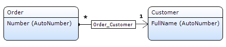
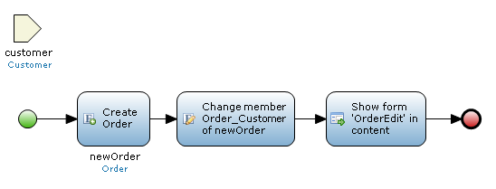

The context mechanism of the client keeps track of where the user is and has been in an application in relation to the domain model. This information can then be used to constrain the list of objects in data/template grids and to automatically set associations of objects that were created with the use of a standard New button.

{}

Since version 2.5 we provide alternatives for the context mechanism that are more explicit. We advise you not to rely on the implicit context mechanism anymore. [See below.](context-mechanism)

{}

## Constraining Grids

Let us say part of our domain model looks like the image below.

{}

{}

An order is associated with (at most) one customer, but a customer can have many orders. In a typical application you would have a data grid showing the list of customers. Double clicking a customer would take you to a page with a data view showing one customer. Additionaly, the selected customer is stored in the context for later use.

Let us say that the Customer data view also shows a data grid that is connected to the Order entity. By default this grid will show all orders of all customers will be shown here. The context mechanism can be used to constrain the orders to just the orders of the customer in the data view. By setting the 'Apply context' property to true the list of orders will be constrained. Under the hood an XPath constraint will be created for the Order grid: `[Order_Customer=42]` (assuming 42 is the internal identifier of the customer).

In general, starting from the grid entity all associations of type reference are considered and if the context contains an object of the entity on the other side of the association, a constraint is added to the grid.

## Automatically Setting Associations

Apart from constrained the list of objects, the context mechanism also automatically sets the association Order_Customer for objects that are created by using a standard New button. This ensures that the new order that is created will be associated to the customer we are looking at and thus also appear in the data grid afterwards.

Summarizing, the context mechanism can be used to constrain grids and set associations of newly created objects.

## Manipulating The Context

The context can be manipulated by using the 'Remove from context' property on several widgets, for example the data grid. This property allows you to remove specific objects from the context. This means that the fact that an object was selected earlier is 'forgotten' and grids will not be constrained based on that object.

In the example above if we remove Customer from the context on the Order data grid, all orders will be shown in that grid. The 'Remove from context' property can also be used to completely clear the context and forget everything that happened before.

## Alternatives Since Version 2.5

There are alternatives for using the context mechanism that are more explicit and easier to understand. A nested data grid (like the Order grid in the Customer data view) can be explicitly connected to the entity path Order_Customer/Order. This means that only those orders will be shown that can be reached by following this path from the selected customer. By using this alternative it is clear just by looking at the data grid which objects will shown. You do not have to think about which objects have or have not been put into the context by earlier forms and whether they will constrain the grid or not.

{}

If you use an entity path on a nested data grid, you should ensure that 'Apply context' is set to false so that the context mechanism is not also applied. False is the default value for 'Apply context' now.

{}

Apart from constraining the grid the entity path will also be used when creating new objects using the standard New button. The association used in the path will automatically be set. In the example, creating an order will automatically set the Order_Customer association of the new order to the customer in the data view.

If you want, you can achieve the same effect by hand by creating a microflow button that simulates the New button and also sets the association to the appropriate value. For the example above, the microflow would look like this:

{}

{}

The order is created, the association with customer is set and the page to edit the order is opened. Of course, you can perform additional initialization in this microflow as well.

In summary, there are more explicit ways to constrain nested grids and initialize associations of created objects.
