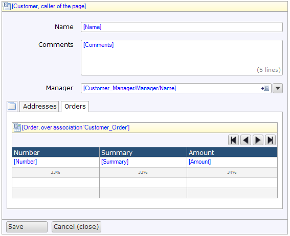

The data view is a central component in Mendix applications. It is the starting point for showing the contents of exactly one object. If, for example, you want to show details of a single customer you would use a data view to do this. The data view typically contains input widgets like text boxes with labels. In more complex screens, a data view can contain tab controls per topic (address, payment information) and data views and data grids for related objects (order history, wish list).

{}

A more advanced data view with a tab control and a data grid inside.

{}

## Components

### Data view contents area

The data view contents area is the place where all the layout and input widgets go. Often the contents area contains a table with two columns with labels on the left and input widgets on the right. Other layouts are possible as you can see in the examples above.

### Data view footer

{}

Added in version 6.7.0.

{}

The footer of the data view is the section at the bottom of the data view which often contains buttons to confirm or cancel the page. However, arbitrary widgets are allowed. The footer will stick to the bottom if the data view is the only top-level widget.

### Data view control bar

{}

The data view control bar has been converted to a normal drop zone, and renamed to 'footer' in version 6.7.0\. See [Data view footer](data-view).

{}

The control bar of the data view is the bar with buttons at the bottom of the component. By default, it contains a Save and a Cancel button but the bar can be customized. A read-only data view would typically provide only a Close button. You can add buttons with custom behavior through the use of a microflow button.

See [Data view control bar](data-view-control-bar) for a description of the buttons and their properties.

## Common properties

{}

{}

{}

{}

## General properties

### Form orientation

With this property you can specify the position of labels of input widgets inside the data view. If the orientation is horizontal labels will be placed next to input widgets. If the orientation is vertical labels will be placed above input widgets.

Note that form groups are responsive and the labels may be placed above input widgets even if the orientation is set to horizontal, depending on the viewport size. Also note that a data view with orientation vertical can not be nested inside a data view with orientation horizontal. In that case form groups will be rendered horizontally regardless of the value of the orientation property.

_Default value:_ Horizontal

### Label width (weight)

If the form orientation is set to horizontal this property can be used to specify the width of labels of input widgets inside the data view. The width is specified using column weights from the [Bootstrap grid system](http://getbootstrap.com#grid) (see [Layout Grid](layout-grid)).

_Default value:_ 3

### Close on Save/Cancel

{}

This property is removed in version 6.7.0\. Use the 'Close page' property of the [Save button](save-button) or [Cancel button](cancel-button) instead.

{}

Using this property you can specify whether you want the current page to be closed when the Save or Cancel button is clicked. After closing the current page, the client will return to the previous screen. This property only has effect for data views that are shown in the content pane (as opposed to in a popup).

For example, you have a data grid with customers and the edit button of the grid directs you to a data view in content showing the details of one customer. After clicking Save or Cancel you want the application to return to the page of the grid. In this case you want the property 'Close on Save/Cancel' to be true.

_Default value_: True

### Show footer

{}

Added in version 6.7.0.

{}

With this property you can specify whether you want the footer of the data view to be visible. The footer of nested data views is invisible by default regardless of the value of this property.

_Default value:_ True

### Show control bar

{}

The data view control bar has been converted to a normal drop zone, and renamed to 'footer' in version 6.7.0\. Use the [Show footer property](data-view) instead.

{}

With this property you can specify whether you want the control bar of the data view to be visible. The control bar of nested data views is invisible by default regardless of the value of this property.

_Default value:_ True

### Empty entity message

If this message is specified, a data view that receives no source data will show this message instead of its content. Otherwise, the data view will show its static content and disabled input widgets. This property is a translable text. See [Translatable Texts](translatable-texts).

There are number of ways a data view can end up without source data. For instance, a data view with a 'Listen to widget' data source will remain empty until an object is selected in the target grid. In this scenario, 'Empty entity message' can be used to guide the user to select an item from the grid.

_Default value:_ empty

{}

The next two screenshots demonstrate the behavior of an empty data view with and without an empty entity message:

|  |  |
| --- | --- |

{}

## Editability properties

### Editable

The editable property indicates whether the data view as a whole is editable or not. If the data view is not editable, no widget inside the data view will be editable. On the other hand, if the data view is editable, each widget can be editable or not based on its own editable property.

_Default value:_ True

### Read-only style

This property determines how input widgets are rendered if read-only. 

| Value            | Description |
|------------------|-------------|
| Control          | Widget is displayed but disabled so the value cannot be modified.
| Text             | Widget is replaced by a textual representation of the value.

*Default value:* Control

## Data source properties

The data source determines which objects will be shown in the data view. For general information about data sources, see the [data sources](data-sources) documentation page.

### Type

The data view supports the following types of data sources: entity (path), microflow and listen to widget. 

### Other properties

See the corresponding data source for specific properties:

*   [Entity (path) source](entity-path-source)
*   [Microflow source](microflow-source)
*   [Listen to list widget source](listen-to-grid-source)

### Use schema

This defines whether only the required attributes and associations for the object(s) are retrieved. This can sometimes improve your performance but it can also reduce performance because the objects can not be cached entirely. If you have custom widgets in your page and they need access to other attributes or associations, or if your next page contains other attributes or associations of the same object(s) you should not enable this. This is why the default value is false.

## Visibility properties

{}

## Related Articles

*   [Entities](entities)
*   [Associations](associations)
