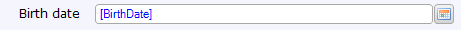

A date picker is an [input widget](input-widgets) that can be used to display and edit date/time attributes. It takes into account the language setting to display a localized calendar.

{}

This date picker allows the end-user to set the birth date of the customer.

{}

## General properties

### Date format

The date format determines whether the date picker displays the date, time, date and time, or a custom variation of the linked attribute. This does not affect how data is stored; in all cases both a date and a time will be recorded. It merely affects how the data is displayed. How the date and/or time are formatted depend on the localization of the user viewing the data.

Possible values: 'Date', 'Time', 'Date and time' and 'Custom'.

_Default value:_ Date

### Custom date format

If you choose 'Custom' as the date format (see above) this property determines how the attribute value is formatted. The custom date format is a string that allows for any combination of symbols found in the table below. Any punctuation will be rendered literally.

| Symbol | No. | Example | Description |
| --- | --- | --- | --- |
| G | 1 | AD | Era |
| y | 1..n | 2010 | Year |
| M | 1..2 | 09 | Month |
| M | 3 | Sept |
| M | 4 | September |
| w | 1..2 | 27 | Week of year |
| d | 1..2 | 12 | Day of month |
| D | 1..3 | 93 | Day of year |
| a | 1 | AM | AM or PM |
| h | 1..2 | 11 | Hour (1-12) |
| H | 1..2 | 13 | Hour (0-23) |
| k | 1..2 | 10 | Hour (1-24) |
| K | 1..2 | 0 | Hour (0-11) |
| m | 1..2 | 59 | Minute, use one or two for zero padding |
| s | 1..2 | 12 | Second, use one or two for zero padding |
| S | 1..3 | 153 | Milliseconds |
| E | 1..3 | Thu | Day of week |
| E | 4 | Thursday | Day of week |
| z | 1..3 | PST | Time zone |
| z | 4 | Pacific Standard Time | Time zone |
| Z | 4 | GMT-04:0 0 | Time zone offset |

{}

| Format | Example output |
| --- | --- |
| `EEEE d MMMM yyy G, h:mm a ss's` | Tuesday 29 March 2011 AD, 1:37 PM 48s |
| `h:mm a` | 1:37 PM |
| `yyy D KK:mm` | 2011 88 01:26 |
| `EEEE MMMM d yyy` | Tuesday March 29 2011 |
| `EEE, MMM d, ''yy` | Wed, Jul 4, '01 |

{}

### Placeholder Text

The placeholder text is shown if the date attribute is empty. It can be used to give the end user a hint as to the expected format. Note: placeholder texts will not work if a native date picker is available (e.g. iOS and Android versions 4.0 and higher).

{}

{}

## Data source properties

{}

{}

## Editability properties

{}

{}

{}

## Visibility properties

{}

## Events properties

{}

{}

{}

## Common properties

{}

{}

{}

{}

## Related articles

*   [Data view](data-view)
*   [Attributes](attributes)
