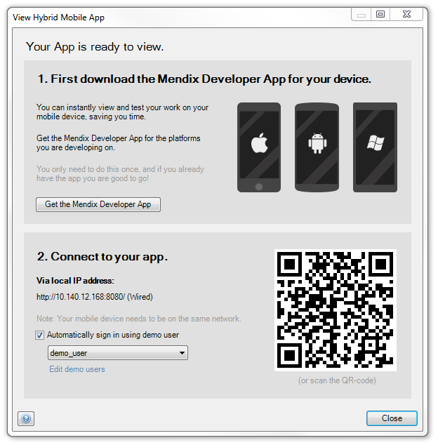

Mendix apps can simply be viewed in mobile web browsers. However, some features of mobile devices cannot be accessed through HTML and Javascript. Also, if you want to publish your app on the Apple App Store, Google Play or Microsoft Phone Store, you have to wrap your app in a native shell. We use [PhoneGap](http://phonegap.com/) to do this. PhoneGap creates a native wrapper around a web application and provides access to native functions through a Javascript API. These apps are also called 'hybrid' apps because they are a hybrid of a web and a native app. Mendix facilitates the creation of hybrid mobile apps in a number of ways.

### Mendix Developer App

While developing a hybrid mobile app, you cannot simply test it in your mobile browser because the native widgets will not work. Some of these widgets will offer an alternative implementation for when they are running in an ordinary browser; others will not work at all. To see what your application will look like inside the PhoneGap wrapper, you can use the Mendix Developer App. Via 'View app' in the toolbar or through the 'Run' menu you can reach the hybrid mobile app dialog. It shows a QR code that can be scanned with that app. This is a quick way to load your app into a PhoneGap compatible environment.

See also [this page](getting-the-mendix-developer-app) for information about how to download the Mendix Developer App.

{}

Note that your mobile device has to be on the same network as your development machine for the Mendix Developer App to work. If this is the case and the connection still fails, make sure that communication between devices is allowed in the Wifi access point.

{}{}

The Mendix Developer App does not yet support running [offline enabled](offline) apps.

{}

See also:

*   [Mobile](mobile)
*   [Getting the Mendix Developer App](getting-the-mendix-developer-app)
*   [Customizing Hybrid Mobile Apps](customizing-hybrid-mobile-apps)
*   [Packaging Hybrid Mobile Apps](packaging-hybrid-mobile-apps)
