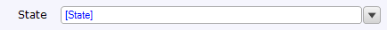

A drop-down is an [input widget](input-widgets) that can be used to display and edit enumeration attributes. It should not be confused with a reference selector, which is used to select a object with which to fill an [association](associations).

{}

 
This drop-down widget allows the end user to select the state of the customer.

{}

## General properties

{}

{}

## Data source properties

{}

{}

## Editability properties

{}

{}

{}

## Visibility properties

{}

## Events properties

{}

{}

{}

## Common properties

{}

{}

{}

{}

## Related articles

*   [Data view](data-view)
*   [Attributes](attributes)
