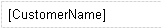

A dynamic label would be used for the same kind of attributes as a text box from the form builder. It can be used to display a text value.

{}

A dynamic label linking to a customer name.

{}

## Appearance Properties

### Style

See [Style](style)

### Render XHTML

If you set the property 'Render XHTML' to true, the attribute connected to this label is assumed to contain XHTML and will be rendered as such. This is useful when you want to incorporate rich text in a document template. This property can only be true for attributes of type String.

The contents MUST be valid XHTML to render without errors.

_Default value:_ False

### Decimal precision (only for numeric attributes)

The precision of a value is defined by the number of digits that is used to express that value. This property indicates the number of decimal places (the number of digits following the decimal point) that will be rendered in the widget.

_Default value:_ 2

### Group digits (only for numeric attributes)

For ease of reading, numbers with many digits in front of the decimal separator may be divided into groups using a delimiter. This property defines whether the end user will see these groups, or not.

_Default value:_ False

### Date format (only for attributes of type DateTime)

The date format determines whether the date part, the time part or both are shown. How the date and time parts are formatted depends on the localization of the user using the application. Alternatively, as of version 2.5.3 you can completely customize the format of the date and/or time by supplying a date format string.

Possible values: 'Date', 'Time', 'Date and time' and in 2.5.3 'Custom'.

_Default value:_ Date

### Custom date format (only for attributes of type DateTime)

If you choose 'Custom' as the date format (see above) the custom date format determines the way date and/or time are formatted. The custom date format is a string that follows the rules described in
[http://download.oracle.com/javase/6/docs/api/java/text/SimpleDateFormat.html](http://download.oracle.com/javase/6/docs/api/java/text/SimpleDateFormat.html).

{}

The custom date format
`EEE, MMM d, ''yy`
results in the following text
`Wed, Jul 4, '01`

{}

## Common Properties

{}

## Data Source Properties

### Attribute (Path)

The attribute (path) property specifies which attribute will be shown in the dynamic label.
