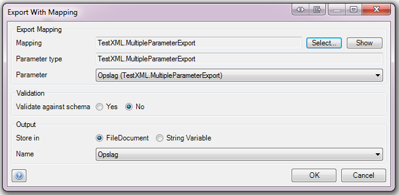

With the Export Mapping action you can export the data stored in [domain model](domain-model) entities into an XML or JSON document, or into a string variable.

{}

See [Microflow Element Common Properties](microflow-element-common-properties) for properties that all activities share (e.g. caption). This page only describes the properties specific to the action.

{}

## Action Properties

### Export mapping

The [Export Mapping](export-mappings) defines in which way the data in the [domain model](domain-model) corresponds with the XML schema or JSON structure.

{}

From Mendix 6.7.0 export mappings support flat JSON. You can select a JSON structure document in an export mapping, and you can select JSON elements that are at most one level deep. That means that you can export simple JSON objects like {"Name":"John", "Age":46}. 

{}

### Argument

If the [Export Mapping](export-mappings) requires an object as input, you can select a variable of the correct type.

{}

Validation properties are only applicable if an Export Mapping is selected that maps to XML.

{}

## Validation properties

### Validate against schema

Whether the export action should validate the outgoing XML against the schema (XSD).

Setting this setting to yes can greatly decrease performance!

_Default value:_ No

### Optional and Nillable

Elements in a schema can be optional (minOccurs=0) and/or nillable. When an empty value for an element is encountered, the server will check the schema to decide whether to exclude the element (optional) or send the element with a nil attribute (nillable). In case an empty value is encountered but the element is not optional or nillable, the server will throw an exception which the developer needs to handle themselves in the microflow. This will occur regardless of the XML validation settings. It is recommended to make sure the data that is being exported is valid according to the schema.

## Output Properties

There are two methods of storing the result of an Export Mapping action:

*   Inside a 'System.FileDocument'.
*   Inside a string variable.
