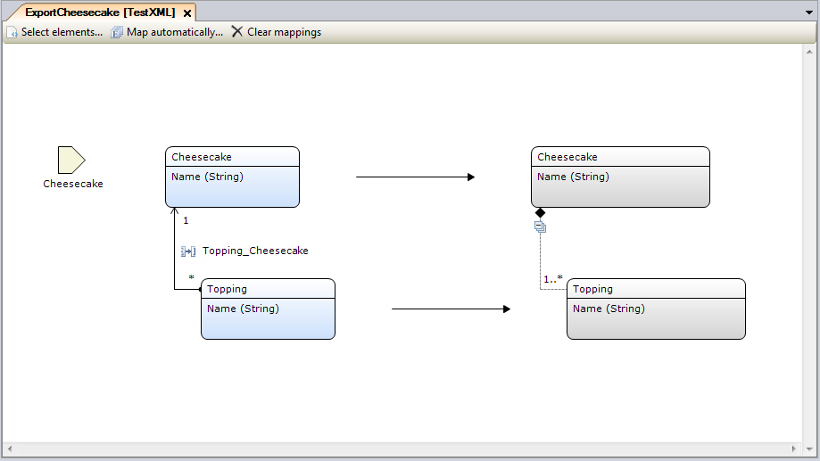
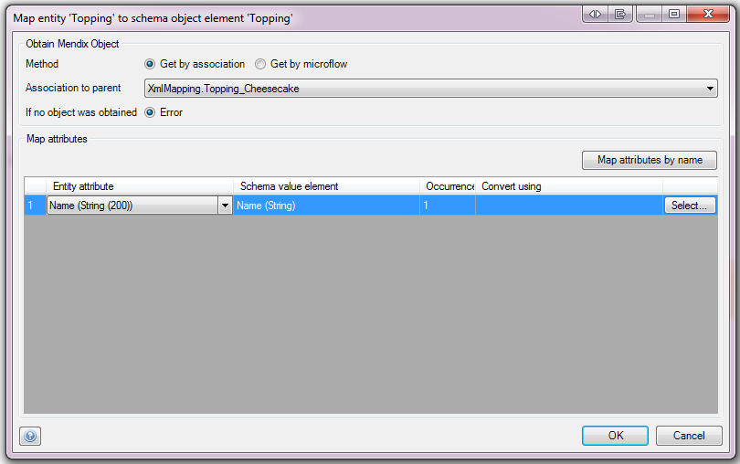
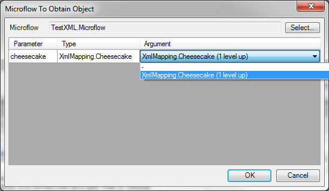
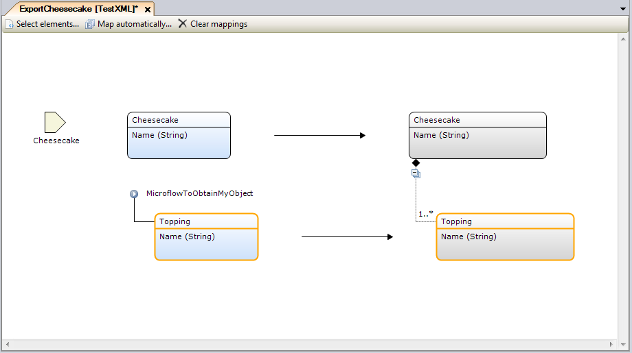
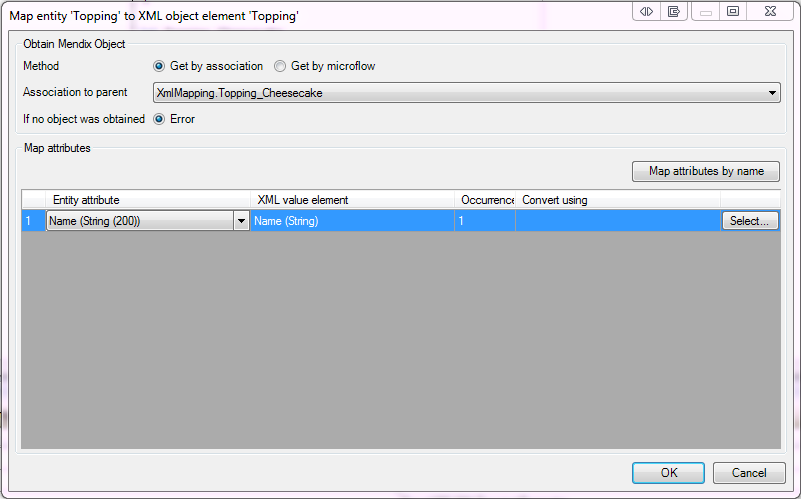
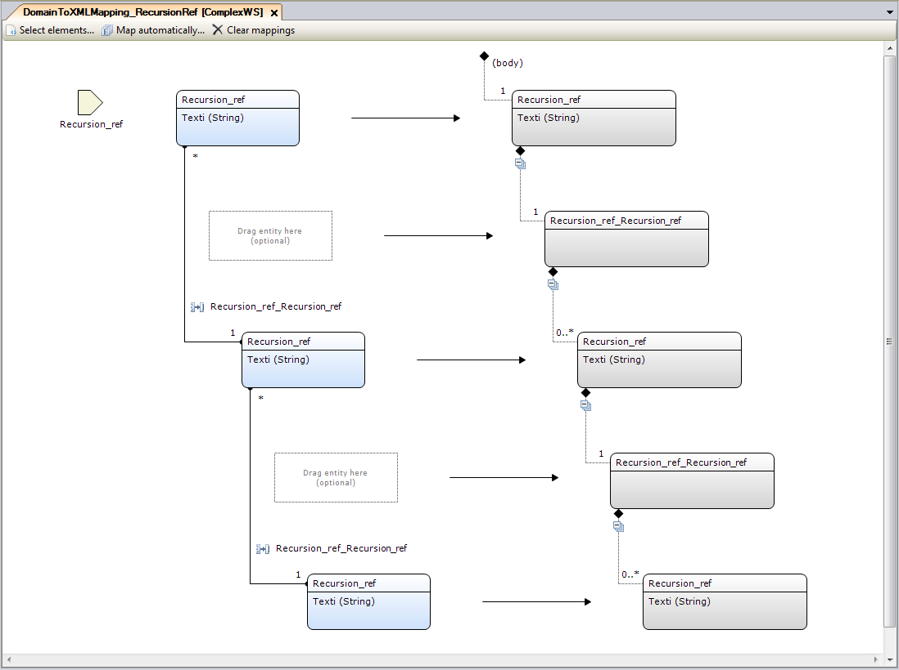

Please refer to [Mapping Documents](mapping-documents) for an introduction.

{}

From Mendix 6.8.0, JSON Structure is fully supported in export mappings.

{}

## Obtaining objects in Export Mappings

Figure 1 shows an example of an Export Mapping document in which two elements from a schema are selected using the [Select Elements](select--elements) dialog. The entity Cheesecake (on the left) was dragged into the mapping to map to the Cheesecake element (on the right) and the entity Topping was mapped to the Topping element.

**Figure 1**

Having defined what entities map to which schema elements, you need to configure how the actual Mendix objects that are to be exported, should be obtained when the Export Mapping is invoked. The root level element (in this case Cheesecake) is the parameter for an Export Mapping and is therefore passed directly to the Export Mapping when it is invoked. How the other Mendix objects in the mapping should be obtained needs to be configured.

### Obtaining an object by association

Firstly, as is shown in figure 1, it is possible to get the objects over an association with the parent object. In the example the Topping objects that need to be exported will be fetched at runtime using the Topping_Cheesecake association. It is possible to edit the mapping element by double clicking the Topping entity (left) or the Topping schema element (right). The window in figure 2 will be shown.

**Figure 2**

### Obtaining an object by using a microflow

In this window you can choose to either get the object by association with the parent (figure 3) or by microflow (the map attributes section is discussed in the "Mapping attributes in Export Mappings" section below). If you choose to obtain the object by microflow you can pass any of the parent objects to that microflow as arguments to help determine what object you should return. The window in which this is configured is shown in figure 3.

**Figure 3**

When you choose to obtain an object by microflow, this is shown in the **Export Mapping Document** as depicted in figure 4.

**Figure 4**

Finally, the user can also define what should be done when the chosen method to obtain the Mendix object (by association or by microflow) fails. The first option is to throw an error and abort the mapping. The microflow that called this mapping should then handle this error. Alternatively, if the minimum occurrence of the schema element that is being mapped to is zero it's possible to skip the creation of the element. The export mapping will continue for the remainder of the elements.

## Mapping attributes in Export Mappings

For each value element that the complex schema element encompasses, an attribute needs to be mapped from the entity. These properties are not applicable for choice or inheritance elements, because they do not contain value elements. Configuring how to map the attributes is done in the window depicted in figure 5, which is shown after double clicking a specific mapping element.

**Figure 5**

### Entity Mapping Properties

| Property | Description |
| --- | --- |
| From attribute | The attribute in the domain entity that should be mapped to the element. |
| To value element | The XML element that will be filled. |
| Occurrence | Displays how often the element may occur. This can be "0..1" or "1", depending on if it is required or not. If the value is empty and the minimum required occurrence of the element is 0 (as specified by the schema) the creation of the element will be skipped. In the case you want to never map a value to an optional element, simply disable it in the "Select elements..." dialog. |
| Convert Using (optional) | A Microflow to convert the value before performing export. |
| Map attributes by name | If this button is clicked, an effort is made to match attributes by name. A dialog appears reporting what has been changed. |

{}

It is possible to implicitly convert Mendix Decimal data type to xs:float type. In this case, it is possible that resulting value will lose precision.

{}

## Optional mapping elements 

For some selected schema elements defining an Entity is optional. This is the case when the schema element:

*   does not contain any attributes,
*   has a maximum occurrence of 1 (maxOccurs="1"),
*   is not a choice element or contained by a choice element, and 
*   is not an inheritance element or contained by an inheritance element. 

An example of this is shown in figure 6.

 
**Figure 6**

From Mendix 6.8.0, when no object is defined for the optional mapping, the element will always be created.
