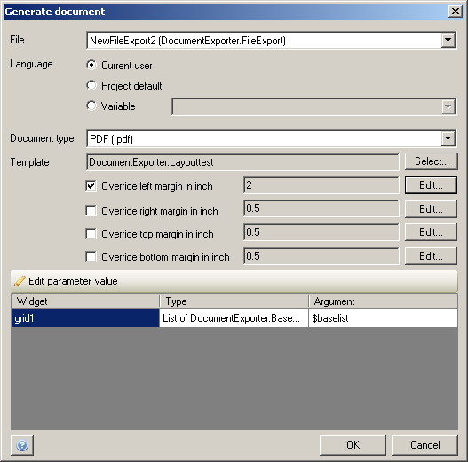

The generate-document action can be used to create a document based on a [template](document-templates).

{}

Generate document

{}{}

See [Microflow Element Common Properties](microflow-element-common-properties) for properties that all activities share (e.g. caption). This page only describes the properties specific to the action.

{}

## Input Properties

### File document

The file document that will contain the generated document. It should be an object of entity System.FileDocument or a specialization thereof.

## Action Properties

### Language

The language in which the titles and labels of the document should appear.

| Option | Description |
| --- | --- |
| Current user | Use the language of the current user. |
| Project default | Use the default language that is specified in the [Project Settings](project-settings). |
| Variable | Use the language stored in the selected variable. The variable should be of type System.Language. |

_Default value:_ Current user

### Document type

The document type specifies the type of the generated document.

| Option | Description |
| --- | --- |
| HTML | Generate a document in HTML format. |
| PDF | Generate a document in PDF format. |
| Word 2007 | Generate a document in Word 2007 format. |
| Word 2003 | Generate a document in Word 2003 format. |
| Rich-text format | Generate a document in Rich-text format. |
| ODT | Generate a document in Open Office (ODT) format. |

### Template

Template defines which [document template](document-templates) is used to generate the file. Depending on the template being used one or more arguments need to be specified. For each top-level data grid and data view objects of the correct type need to be passed to the template. The value of the argument can be entered using microflow expressions.

### Override margins

Here you can set custom margins for your documents that can be defined at runtime.
