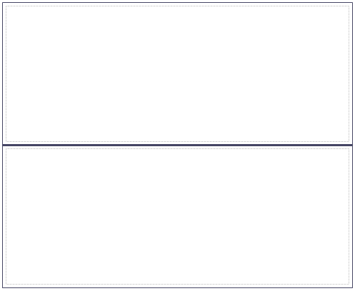

The horizontal split pane is deprecated since version 5.18.0 in favor of the more powerful [Scroll Container](scroll-container).

A horizontal split pane creates a region that is split in two by a horizontal divider. In the client the divider can be dragged up and down by the end user.

{}

An empty horizontal split pane.

{}

## Common Properties

{}

{}

{}

## General Properties

### Splitter position

This property determines the initial position of the dividing line in percentages. The default value of 50 will place the line exactly halfway the split pane.

_Default value:_ 50

### Animated resize

This property indicates whether re-sizing, by dragging the divider, is visualized in real time.

_Default value:_ False

### Height

The height property determines the height of the split pane. A height of 0 will set the pane's height to the default defined in the theme.

_Default value:_ 0
