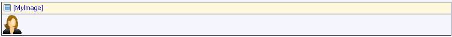

An image viewer can be used to display an image or its thumbnail.

{}

This image viewer shows the product image.

{}

An image viewer must be placed in a data view or template grid.

## Common properties

{}

{}

{}

## Data source properties

### Entity (path)

The entity (path) property specifies which entity will be shown in the image viewer. It starts in the data view entity and must end in System.Image or a specialization thereof. If the data view entity itself is (a specialization of) System.Image you can use this entity on the image viewer as well.

## Events

### On click

This property specifies what happens when the image is clicked:

| Value | Meaning |
| --- | --- |
| Do nothing | Nothing happens. |
| Call microflow | The specified microflow is executed. |
| Enlarge | The image is shown at full size. |

_Default value:_ Do nothing

### Microflow (in the case 'Call microflow')

This property specifies the microflow that will be executed when the image is clicked.

### Microflow settings (in the case 'Call microflow')

The on click settings specify what parameters will be passed to the microflow, whether to show a progress bar or not, and more.

See [Starting Microflows](starting-microflows).

## General properties

### Default image

This is the image that is displayed if no image is uploaded.

{}

_Default value_: Percentage

{}

_Default value_: 100

{}

_Default value_: Auto

{}

_Default value_: not applicable

{}

### Show

This property indicates whether the generated thumbnail is shown or the full image.

_Default value:_ Thumbnail

## Visibility properties

{}

## Related articles

*   [Data view](data-view)
*   [Entities](entities)
