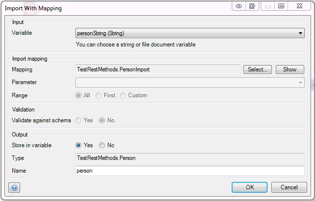

With the Import Mapping Action you can import the data stored in a XML or JSON document into [domain model](domain-model) entities.

## Input Properties

### File document

The input variable can either be a string variable or a file document variable. The contents should have an XSD or JSON representation.

It the variable is a file document, it should be an object of entity 'System.FileDocument' or a specialization thereof.

## Action Properties

### Import mapping

The [Import Mapping](import-mappings) defines how to transform the XML or JSON string (or file document) to objects.

{}
Importing from JSON is available since Mendix 6.6.0.
{}

### Parameter

If the selected mapping requires a parameter, you can choose it here.

### Range (if the mapping returns a list)

The range determines how many objects are mapped and returned.

| Range | Meaning |
| --- | --- |
| All | Map and return all objects. |
| First | Map and return only the first object. The result of the action will be a single object instead of a list. |
| Custom | Map and return a given number of objects (limit). The limit is a microflow expression that should result in a number. |

{}

Validation properties are only applicable if an Import Mapping is selected that maps from XML.

{}

## Validation properties

### Validate against schema

Whether the import action should validate the incoming XML against the schema (XSD).

Setting this setting to yes can greatly decrease performance!

_Default value:_ No

## Output Properties

### Store in variable

Choose whether to store the result of the import in a variable.

### Type

The type of the output variable.

### Name

The name for the variable that will hold the result of the import.
