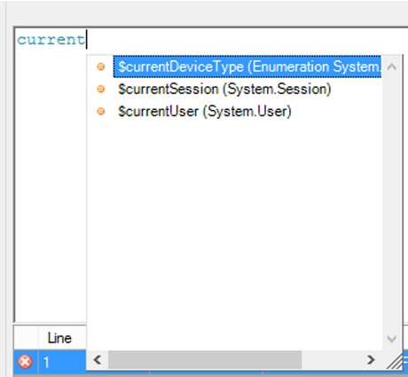

## ISession.getData() API usage

{}

Only for Mendix 5.21 and higher.

{}

The Mendix Runtime has an (Java) API to store Java objects into the Session. By using `ISession.getData()` to store those objects, they get a Session scope (lifetime) and could be accessed in the subsequent requests (in combination with `ISession.retain()` and `ISession.release()` calls, depending on if the object has associations with objects which should not be garbage collected). With the introduction of Cluster support for the Mendix Runtime this API is deprecated and not supported in cluster mode. `ISession.getData()` only allows the object to be stored in memory on a particular Mendix Runtime instance, other instances will have no knowledge about this. This API will remain working for non-clustered setups (for backward compatibility reasons, but all of `ISession.getData()`, `ISession.retain()` and `ISession.release()` have been deprecated now).

The alternative solution for this API is to store the data in a Mendix Entity. This can be a persistent entity or non-persistent entity. They can be easily retrieved and stored by associating entities with the `System.Session` entity. When the `IsClustered` configuration option is enabled, `System.Session` instances are stored into the database, so that they are available for every Runtime instance (and hence also the associated objects are stored in the state). The same approach can be used with one instance of the Mendix Runtime (when `isClustered` disabled). In this case `System.Session` instances are automatically added to the state to make sure they are not garbage collected.

In microflows the `$currentSession` variable has been introduced, so that a reference to the current session can be easily obtained. When an object needs to be stored its association can be set to `$currentSession` and when the object needs to be retrieved again `$currentSession` can be used as a starting point from which the desired object can be retrieved by association. The associated object can be designed in such a way that it meets the desired needs.

E.g. one can add `Key` and `Value` members to a `Data` entity associated with `System.Session` (and have constants for key values).

The `Value` values can easily be obtained by performing a find on the `Key` values of a list of `Data` instances.

