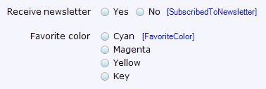

The radio buttons widget is an [input widget](input-widgets) that can be used to display and edit boolean and enumeration attributes.

{}

These radio buttons are used to indicate whether the user wants to receive the newsletter (boolean, rendered horizontally) and to select his/her favorite color (enumeration, rendered vertically).

{}

## General properties

### Orientation

This property defines whether the radio buttons are rendered horizontally or vertically.

_Default value:_ Horizontal

{}

{}

## Data source properties

{}

{}

## Editability properties

{}

{}

{}

## Visibility properties

{}

## Events properties

{}

## Common properties

{}

{} 

{} 

{}

## Related articles

*   [Data view](data-view)
*   [Attributes](attributes)
