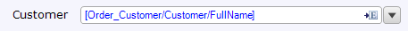
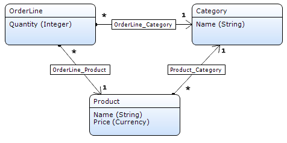
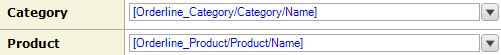
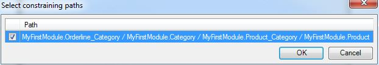

The reference selector is an [input widget](input-widgets) that can be used to display and edit [associations](associations).

{}

This reference selector allows you to select a product for your orderline.

To use a reference selector you need a many-to-one association in the domain model.

{}

The reference selector is similar to a [drop-down](drop-down) except that it allows users to choose from a list of objects with which to fill an association rather than items listed in an enumeration. The selector requires you to choose an entity with which the parent object shares a reference. It will also require you to choose which attribute from that referenced entity you wish to display in the selector.

{}

If you only want to _display_ information, you can also use the text box. This has the added advantage that you can follow more than one association step.

{}

## General properties

### Select using

The reference selector allows the end user to select objects by using either a drop-down or a pop-up page. If you choose to select using a page, the drop-down functionality will be replaced with a button to the right of the widget that will open a selection pop-up.

| Value | Description |
| --- | --- |
| Page | Select the reference using a pop-up page. |
| Drop-down | Select the reference using a drop-down. |

{}

The advantage of a selecting using a drop-down is that it is very efficient; no page needs to be opened. The advantage of selecting using a page is that the end user can search the objects. If there are a lot of objects (say, more than 20) to select from, selecting using a page is advisable.

{}

_Default value:_ Drop-down

### Select page

The select page property determines which page is opened when the select page button is used. This page can be used to select associated objects from the list of all possible objects. This page should contain a data grid, template grid or list view connected to the same entity as the input reference set selector.

See [Opening Pages](opening-pages). Note that opening select pages in content is prohibited.

{}

You can generate a new page to show by right-clicking the widget and selecting 'Generate select page...'.

{}

{}

{}

### Go-to page

The go-to page gives end users quick access to a more detailed overview of the object being selected. This property determines which page is shown to the user. The page should contain a data view with the same entity as the one that is selected by the reference selector.

### Go-to page settings

These settings specify how the page is opened.

See [Opening Pages](opening-pages) for more details.

## Formatting Properties

### Decimal precision (only for numeric attributes)

The precision of a value describes the number of digits that are used to express that value. This property indicates the number of decimal places (the number of digits following the point).

_Default value:_ 2

### Group digits (only for numeric attributes)

For ease of reading, numbers with many digits before the decimal separator may be divided into groups using a delimiter. This property determines whether or not such a delimiter is used. Which delimiter is used depends on the language of the end user.

_Default value:_ No

### Date format (only for attributes of type date and time)

The date format determines whether the reference selector displays the date, time, date and time, or a custom variation of the linked attribute. How the date and/or time are formatted depend on the localization of the user viewing the data.

_Default value:_ Date

### Selectable objects properties

The properties in the category 'Selectable objects' determine the objects out of which the end user can make a selection. There are two, mutually exclusive, ways of influencing the selectable objects:

1.  A microflow returns the list of selectable objects.
2.  The list of objects is determined automatically taking into account the context mechanism and the properties that influence that mechanism.

### Microflow

If a microflow is selected, the microflow will be called to compute the list of objects that the reference selector will show. A microflow can only be used if the selection is made using a drop-down.

{}

Note that the other properties in this category have no effect when using a microflow!

{}

### Microflow settings

In the microflow settings you can specify what parameters to pass to the microflow.

### XPath constraint

With the XPath constraint you can add a manual constraint to limit the list of objects that can be selected. This XPath constraint will be added to the constraints that are generated by the [context mechanism](context-mechanism).

{}

The XPath constraint `[InStock = true()]` on a reference selector for products will ensure that only products that are in stock are selectable.

{}

This property has no effect if a microflow is used to fill the reference selector.

### Constrained by

A reference selector can be constrained by one or more paths. This is typically used to make one reference selector dependent on another. For example, in page where you can edit an order line, a product selector can be constrained by a category selector. After selecting a category, the product selector is constrained by this category and shows only products in the category.

{}

_Domain model_

In the domain model the order line has associations of type reference to both category and product. In this form, these can be edited with two reference selectors. The third association, from product to category, describes the relation between those two entities. Such a 'triangle' shaped part of the domain model is what makes constraining possible.

_Form_

The page has two reference selectors, one for category and one for product. The one for product is constrained by the path through the domain model that forms the triangle.

{}

This property has no effect if a microflow is used to fill the reference selector.

### Apply context

The property 'Apply context' indicates whether the context mechanism will be used to constrain the list of selectable objects. See [Context Mechanism](context-mechanism) for more information.

This property has no effect if a microflow is used to fill the reference selector.

_Default value:_ False

### Remove from context

The property 'Remove from context' allows you to remove specific entities from the context. This change in the context has effect on the list of objects that you can select from.

This property is useful if you want the application to 'forget' the fact that for example a customer was selected and to show all orders of all customers instead of only the orders of the selected customer. See the [Context Mechanism](context-mechanism) for more information.

This property has no effect if a microflow is used to fill the reference selector.

### Sort order

The sort order specifies the order in which the items in the reference selector are shown. You can sort on multiple attributes in both directions (ascending and descending). If no sort order is specified, the reference selector sorts on the displayed attribute.

_Default value:_ No sort order

## Data source properties

### Attribute path

The attribute path specifies which attribute of an associated entity is shown in the reference selector. The path must follow one association of type reference starting in the entity of the data view.

{}

Order_Customer/Customer/Name will allow the end user to select a user from a list of user names.

{}{}

Keep in mind that even though you connect an attribute to the reference selector you are actually selecting an object. The attribute is just there to provide a visualization of the object. In this respect, the reference selector is different from other widgets like check boxes and text boxes. In those widgets you edit the value of the attribute. In the reference selector you edit an association of type reference.

{}

{}

## Editability properties

{}

{}

{}

## Visibility properties.

{}

## Events properties

{}

## Common properties

{}

{}

{}

{}

## Related articles

*   [Data view](data-view)
*   [Entities](entities)
*   [Associations](associations)
