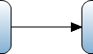

A sequence flow is an arrow that links events, activities, splits and merges with each other. Hereby it defines the order of execution. Microflows always flow in one direction where elements follow each other up one by one. Splits always lead to one direction so it is not possible that multiple flows take place simultaneously.

{}

When you have two activities that you want to link together a sequence flow is used.

{}

## Behavior Properties

### Condition value

Condition value describes which direction should be followed based on the outcome of an [exclusive split](exclusive-split) or an [inheritance split](inheritance-split).
