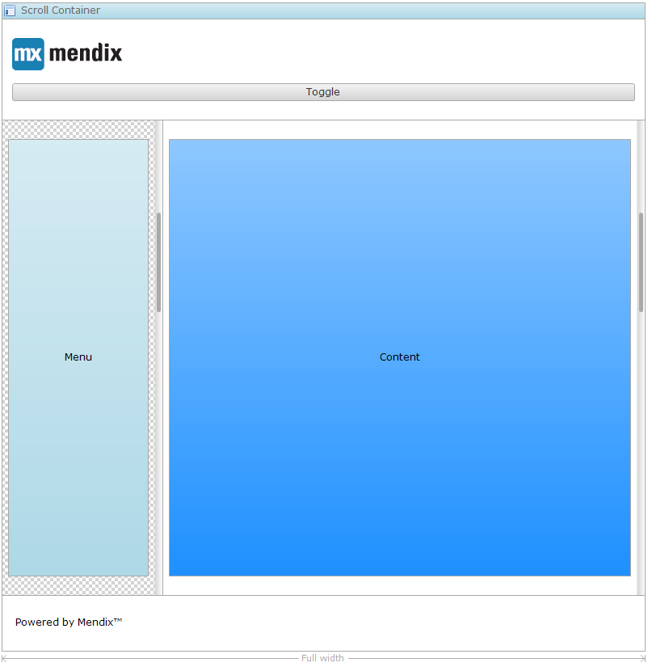

Pressing the sidebar toggle button will make a region of a [scroll container](scroll-container) appear or disappear. This makes it possible to create sidebars (for example, a menu on a mobile phone that is hidden by default and can be shown by clicking the button). See the image below for an example layout that used the sidebar toggle.

{}

The sidebar toggle used to include settings to govern which layout region was toggled and how the transition was visualized. These configuration options were moved to the [scroll container region](scroll-container-region) to improve transparency in Mendix 6.10.

{}

## General Properties

{}

{}

{}

{}

## Common Properties

{}

{}

{}

{}

## Visibility Properties

{}
