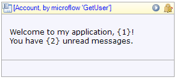

The text widget shows text which can optionally contain parameters. Every parameter is replaced with the value of the attribute it refers to. The text widget is the recommended way to show text to the user.

{}

Text widget placed in a data view, showing a greeting message to the user.

{}

If you start typing in any empty container the Modeler will automatically generate a text widget to display your text.

## General properties

### Text template

Text template defines the text that will be shown. The template can contain parameters that are written as a number between braces, e.g. {1}. The first parameter has number 1, the second 2 etcetera. Note that to use template parameters the widget must be placed in a context of an entity, e.g. inside a [data view](data-view) or [list view](list-view).

### Parameters

For each parameter in the template you define an attribute of the context entity or a referred entity of which the value will be inserted at the position of the parameter.

### Render mode

The render mode determines how the text will be shown in the web browser.

| Value | Description |
| --- | --- |
| Text | The text will be rendered inline with the previous/next texts on a page ( tag in HTML) |
| Paragraph | The text will be rendered as a separate paragraph (
 tag in HTML) |
| Heading 1 | The text will be rendered as a large heading (<h1> tag in HTML) |
| ... | ... |
| Heading 6 | The text will be rendered as a small heading (<h6> tag in HTML) |

_Default value:_ Text

## Visibility properties

{}

## Common properties

{}

{}

{}
