Activities represent the actions that are executed in a microflow.

The following types of activities are available:

## Object Activitities

Object activities can be used to create and manipulate objects. The [domain model](domain-model) defines the object types ([entities](entities)) that can be used.

| Graphic | Name | Description |
| --- | --- | --- |
| [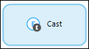](cast-object) | [Cast object](cast-object) | Cast object can be used in combination with an [inheritance split](inheritance-split) to use the [specialized](entities) members of the object. |
|  | [Change object](change-object) | Change object can be used to change the members of an object. This can be done with or without commiting and with or without events. |
|  | [Commit object(s)](committing-objects) | Commit object(s) can be used to commit the changes to one or more objects. |
| [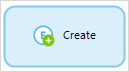](create-object) | [Create object](create-object) | Create object can be used to create an object. |
| [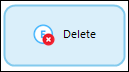](deleting-objects) | [Delete object(s)](deleting-objects) | Delete object can be used to delete an object. |
|  | [Retrieve](retrieve) | Retrieve can be used to get one (or more) associated objects of another object. Furthermore the activity can also get one (or more) objects directly from the database. |
| [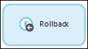](rollback-object) | [Rollback object](rollback-object) | Rollback object can be used to undo changes (that have not been committed) that were made to the object in the part of the microflow preceding the activity. Furthermore it deletes objects that have been created but have never been committed. |

## List Activitities

List activities can be used to create and manipulate lists of objects.

| Graphic | Name | Description |
| --- | --- | --- |
|  | [Aggregate list](aggregate-list) | Aggregate list can be used to calculate aggregated values such as the maximum, minimum, sum, average and total amount of objects over a list of objects. |
| [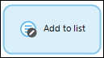](change-list) | [Change list](change-list) | Change list can be used to change the content of a list variable. |
|  | [Create list](create-list) | Create list can be used to create a (empty) list variable. |
| [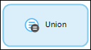](list-operation) | [List operation](list-operation) | List operation can be used to combine or compare two list with objects of the same entity. |

## Action Call Activities

Action call activities can be used to call another microflow or to call a Java action.

| Graphic | Name | Description |
| --- | --- | --- |
| [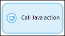](java-action-call) | [Java Action call](java-action-call) | Java Action call can be used to call a Java action. Arguments can be passed to the action and the result can be stored in a variable. |
|  | [Microflow call](microflow-call) | Microflow call can be used to call another microflow. Arguments can be passed to the microflow and the result can be stored in a variable. |

## Variable Activitities

Variable activities can be used to create or change a variable within a microflow.

| Graphic | Name | Description |
| --- | --- | --- |
| [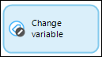](change-variable) | [Change variable](change-variable) | Change variable can be used to change the value of a variable. |
| [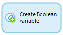](create-variable) | [Create variable](create-variable) | Create variable can be used to create a new variable. |

## Client Activitities

Client activities can be used to have the web client of your application perform an action, such as showing a different page or downloading a file.

| Graphic | Name | Description |
| --- | --- | --- |
| [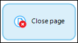](close-page) | [Close page](close-page) | Close page closes the pagethat is opened last by the user that calls the microflow where this activity is used in. |
|  | [Download file](download-file) | Download file can be used to enable the browser to download a specific file. The user, that calls the microflow where this activity is used in, gets a download popup or the file is shown directly in the browser. |
| [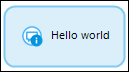](show-message) | [Show message](show-message) | Show message can be used to show a blocking or non-blocking message to the user that calls the microflow where this activity is used in. |
| [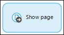](show-page) | [Show page](show-page) | Show page can be used to show a page to the user that calls the microflow where this activity is used in. |
|  | [Validation feedback](validation-feedback) | Validation feedback can be used to display a red text below a widget that displays an attribute or association. |
| 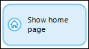 | [Show home page](show-home-page) | Show home Page can be used to navigate to the home page for the current user. |

## Integration Activitities

See [Microflow Activities](microflow-activities).

## Document Generation Activitities

| Graphic | Name | Description |
| --- | --- | --- |
|  | [Generate document](generate-document) | Generate document can be used to create a document of a certain type based on a [template](document-templates). |
