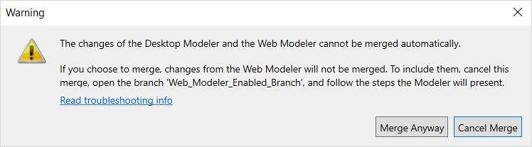
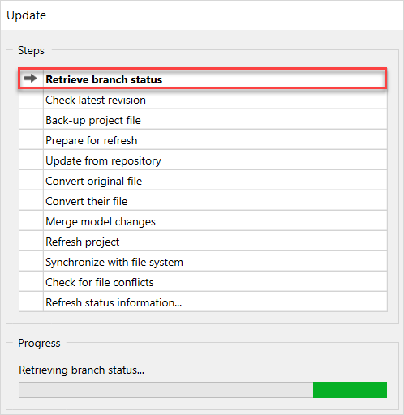
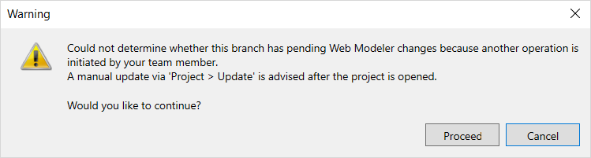

## 1 Introduction 

{}

Collaborative development with Studio is only available if your project has Mendix version 7.23.3 or above. For projects that have Mendix version 7.23.2 and below, see [Sync Studio & Desktop Modeler](sync-webmodeler-desktopmodeler). 

For information on how to migrate from the old sync process to collaborative development, see [Migration From the Sync Process to Collaborative Development](collaborative-development-migration).

{}

Collaborative development allows users to share model changes with each other. This document is will help you to troubleshoot issues that may occur during the process of sharing changes with Studio.

## 2 Concepts

For concepts and definitions, see section [Concepts](version-control#concepts) in *Version Control*. 

## 3 Studio Is Out of Sync {#out-of-sync}

Normally, Studio working copy is synchronized with the Desktop Modeler when the Desktop Modeler user updates or commits. However, if a commit or an update happened outside the Desktop Modeler (using Tortoise SVN or any other version control tool), Studiois temporary out of sync. In this case you will get a warning:

You can do one of the following:

1.  **Merge** (recommended)–  the Desktop Modeler will try to merge the unsynchronized changes from Studio automatically. Your local changes (if any) will be combined with Studio changes. The changes from Studio are stored in an automatically created branch to ensure that there no changes lost in the process. The branch is visible in the branch line manager. This process can result in one of the following:  

	a.  If the merge process finishes successfully (without conflicts) the created branch is merged to your working copy and you get Studio changes. You need to review the merged changes and commit them to get Studio and the Desktop Modeler in sync again. And afterwards you can delete the automatically-created branch. 

	b. If there are any merge conflicts found in the process, you need to resolve them and commit the changes afterwards. Once you resolve the conflicts and commit the changes, you can delete this automatically-created branch. 

	

2. **Resolve Later** –  the changes can be merged later. In the meanwhile, changes from Studioand the Team Server development line will not be kept in sync. In this case, the dialog will appear again when committing/updating/merging changes. 

## 4 Failed Merging the Desktop Modeler and Studio Changes 

When the Studio-enabled branch with the commit outside the Desktop Modeler is being merged with a different line, you will see the following message:

You can choose one of the following:

1.  **Cancel Merge** (recommended) – you can cancel the process and try to synchronize with Studio first. Do the following: 
	a.  Open Studio-enabled development line 
	b.  The warning described in section [The Desktop Modeler & Studio Are Out of Sync](#out-of-sync) will be displayed. 

	 

	c. Click **Merge** to synchronize the changes with the Studio. 

	d. Open the previous branch and do the merge again. 

2. **Merge Anyway** – the merge will continue without changes from Studio. In this case only the changes from the Desktop Modeler will be included. The Desktop Modeler and Studio will be out of sync, and you will need to resolve this issue later. See section [The Desktop Modeler & Studio Are Out of Sync](#out-of-sync)

## 5 The Repository Service Is Unavailable

During the **Update** operation, changes are requested from Studio and integrated into the current project.  There is an additional step **Retrieve branch status** in the update process. During this step, Studio changes are retrieved. 

If there are network or service issues, the Desktop Modeler will not be able to contact the repository service and a warning message is displayed:

You can do one of the following:

1. **Cancel** (recommended) – the operation will be cancelled, you can try again later, when the network problems are solved 

2. **Proceed** – the update process will continue, but the changes from Studio will not be retrieved. The Desktop Modeler and Studio will be out of sync, and you will need to resolve this issue later. See section [3 The Desktop Modeler & Studio Are Out of Sync](#out-of-sync)

## 6 Another Operation Is in Progress

When your team members initiate a blocking operation (commit/update/merge Studio enabled branch/switch Studio enabled branch), and at the same you initiate a blocking operation as well, and you will see the dialog below:

You can do one of the following:

1. **Cancel** (recommended) – the operation will be cancelled. We recommend you to do an update in a few minutes so that you get the latest changes and your working copy and the Studio will be in sync
2. **Proceed** – the update process will continue, but the changes from Studio will not be retrieved. The Desktop Modeler and Studio will be out of sync, and you will need to resolve this issue later. See section [The Desktop Modeler & StudioAre Out of Sync](#out-of-sync)

## 7 Read More

* [Version Control](version-control) 
* [Collaborative Development in Studio](/studio/general-collaborative-development)
* [Migration From the Sync Process to Collaborative Development](collaborative-development-migration)
