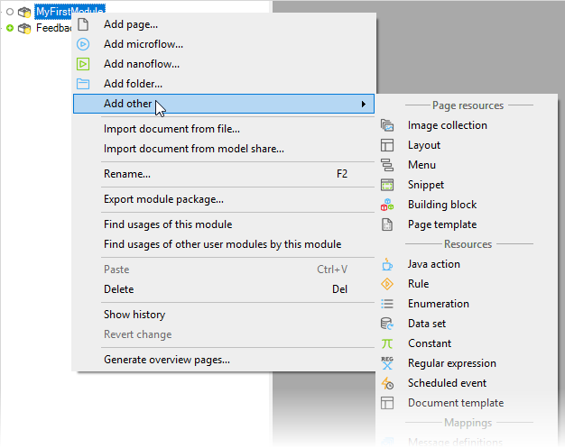

## 1 Introduction

The Mendix Desktop Modeler is the most powerful tool for creating, viewing, and editing your Mendix applications. This category describes the various features of the Desktop Modeler, including document templates, the domain model, microflows, modules, pages, and security.

For more introductory information, see [Desktop Modeler Overview](desktop-modeler-overview)

## 2 Main Documents in This Category

Your Mendix app is called a project in the Modeler. An app consists of different types of items, such as pages and microflows. These are generically referred to as documents, and they are stored in modules and folders.

To add a document to your app, right-click the destination module or folder in the Modeler's **Project Explorer**:

The following documents in the **Desktop Modeler** category of the *Mendix Reference Guide* describe the documents you can add:

* [Pages](pages)
* [Microflows](microflows)
* [Nanoflows](nanoflows)
* [Images](images)
* [Layouts](layout)
* [Menus](menu)
* [Snippets](snippet)
* [Building blocks](building-block)
* [Page templates](page-templates)
* [Java actions](java-actions)
* [Rules](rules)
* [Enumerations](enumerations)
* [Datasets](data-sets)
* [Constants](constants)
* [Regular expressions](regular-expressions)
* [Scheduled events](scheduled-events)
* [Document templates](document-templates)
* [Message definitions](message-definitions)
* [JSON structures](json-structures)
* [XML schemas](xml-schemas)
* [Export mappings](export-mappings) and [import mappings](import-mappings)
* [Consumed app services (deprecated)](consumed-app-services) and [consumed web services](consumed-web-services)
* [Published REST services](published-rest-services), [published web services](published-web-services), [published OData services](published-odata-services), and [published app services (deprecated)](published-app-services)

## 3 Other Documents in This Category

The following documents provide additional information about using the Desktop Modeler

* [Data Types](data-types)
* [Dialog Boxes](dialogs)
* [Domain Model](domain-model)
* [Integration](integration)
* [Modules](modules)
* [Projects](project)
* [Security](security)
* [Translatable Texts](translatable-texts)
* [XPath](xpath)
