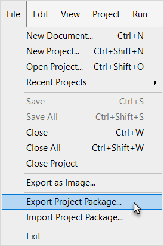
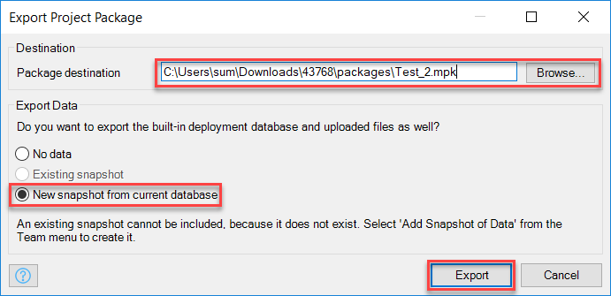

## 1 Introduction
In this how-to, you will learn how to export a Mendix project package (*.mpk*) from the Mendix Modeler. You can export a project package for backup purposes or to share it with other Mendix developers. This is useful if you want to give someone the entire app, or if you  need to provide a test app when submitting a ticket.

Project packages can be imported again into a new app using the [Import Project Package dialog box](import-project-package-dialog).

**This how-to will teach you how to do the following:**

* Export a Mendix project to a Mendix package file
* Exclude data from the export
* Include data in the export

## 2 Exporting a Project Package

Mendix project packages can be exported to a Mendix package file (*.mpk*). To download a project package, see the sections below.

### 2.1 Exporting with No Data

You can choose to include data from the built-in database in the Mendix package. To download a package without data, follow these steps:

1. Open your project in the Mendix Modeler.
2. Go to **File** and select **Export Project Package...**:

	

4. Select the **Package destination** (the default location is a folder named *packages* inside the project directory).
5. In the **Export Data** section, select **No data**.
6. Click **Export**.

The package will be exported to the selected package destination.

### 2.2 Exporting with a Snapshot

There are two snapshot options in the export dialog box:

* **Existing snapshot** – will include the existing database snapshot in the export
	* This option is only available when a snapshot is already present
	* Snapshots can be created via **Project** > **More Versioning** > **Add Snapshot of Data**
* **New snapshot from current database** – will create a new snapshot from the database and include it in the export
	* This option becomes available after you run the app locally at least once, because a local database will be created when running the app for the first time.

To export with a snapshot, follow these steps:

1. In your app project in the Modeler, select **File** > **Export Project Package**:
2. Select the **Package destination**.
3. Select **New snapshot from current database**.
4. Click **Export**.

