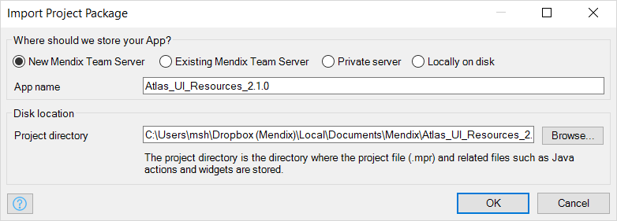

## 1 Introduction

To create a new app from a Mendix project package (*.mpk*) file, you need to import an app package. The new app can either be stored in a version control server or locally on disk.

To open this dialog box,  go to **File > Import App Package**, browse to the *.mpk* file, and then open it.

## 2 Where Should We Store Your App?

Use this setting to select the location where you want to store your app. This can be the [Team Server](#team-server), a [private server](#private-server) (an SVN server other than the Team Server), or a [local disk](#local).

### 2.1 Mendix Team Server {#team-server}

When uploading the app to the [Mendix Team Server](team-server), you can choose between creating a new repository, or uploading to an existing one.

#### 2.1.1 New Mendix Team Server

If you select to store your app in a new Mendix Team Server, a new Team Server app will be created. You need to enter the name for the new Team Server app and repository in the **App name** field. 

#### 2.1.2 Existing Mendix Team Server

If you want to use an existing repository, select the app in the **Team Server App** option.

{}

This only works when the existing repository is empty.

{}

### 2.2 Private Server {#private-server}

In the **App repository address** field, enter the address of the repository you want to upload your app to.

{}

This option is only available when support for other servers is enabled in **Edit** > **Preferences** > **Advanced** > [Enable private version control](preferences-dialog#enabled).

{}

### 2.3 Locally on Disk {#local}

If you select this option, the app will be stored on the local disk of the computer that is  running Desktop Modeler.

{}

Select this option if you do not need to upload the new app to a version control server. 

{}

## 3 Disk Location

Use this field to choose the directory where the project files of the app will be stored. If version control is enabled, the suggested name includes ends with **-main** to indicate this will be the main development line of the app.

## 4 Read More

* [Export Project Packge dialog](export-project-package-dialog)
