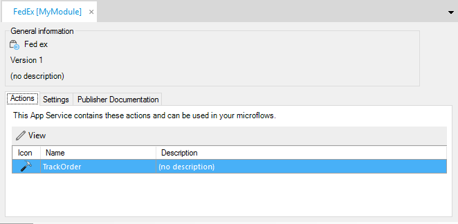
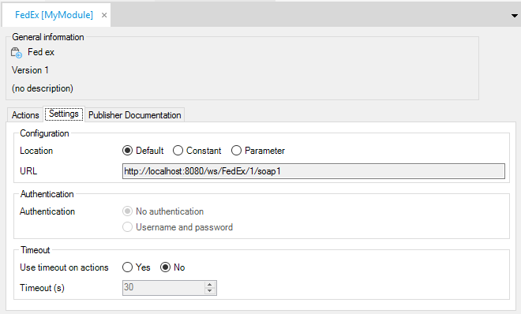

In the settings screen, you see the version of the app service, its icon and a short description. Three tabs are selectable: 'Actions', 'Settings' and 'Documentation'.

## Actions

With this tab, an overview of provided microflow actions is provided. With each action, an Icon, a Caption and a Description is shown. In the microflow toolbox, each action will show the icon and the caption as the name of the action. This name will also be seen when used in a microflow.

## Settings

The tab 'Settings' contains the location of the app service and the authentication method.

### Configuration

You can change the default location of the app service by introducing a Constant with a URL to the location.

### Authentication

Authentication method is shown. As a consumer, you are not in charge of this and therefore you cannot change this.

### Timeout

This timeout applies to all actions provided by the app service. If the app service action does not reply within the specified time (seconds), an error is created. Standard error handling in microflows can be used to define what to do in case of a timeout.

## Publisher Documentation

This tab shows the documentation that is provided by the supplier of the app service.
