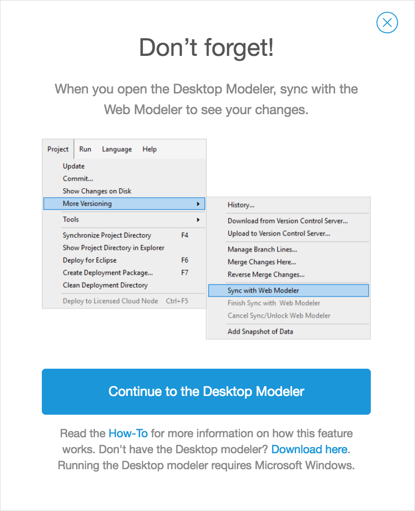
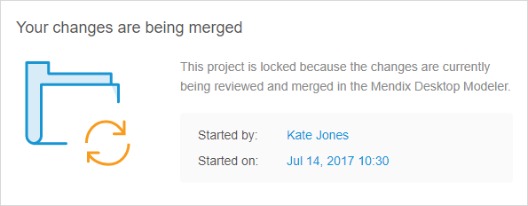
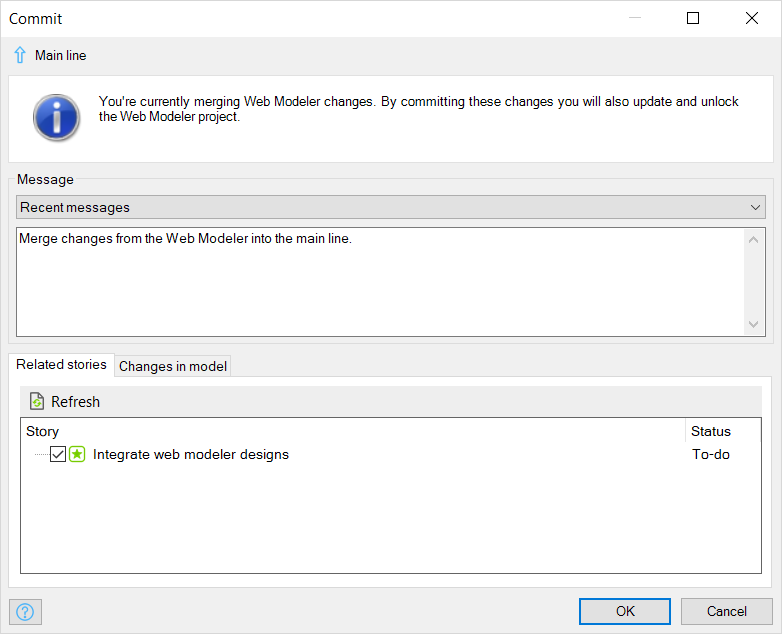

## 1 Introduction

{}

The sync process is available for apps with Mendix version 7.23.2 and below. If your project has Mendix version 7.23.3 and above, see [Collaborative Development](collaborative-development).

{}

If you have created your app in the Web Modeler, you can extend the functionalities of the app by modeling them in the Desktop Modeler.

To do that, you must sync the app from the Web Modeler with the Desktop Modeler. This document will explain the following:

* Downloading the app from the Web Modeler into the Desktop Modeler
* Syncing the Desktop Modeler with the Web Modeler
* Committing changes from the Desktop Modeler to the Web Modeler
* Locking/unlock the Web Modeler while the Desktop Modeler is working on the app

## 2 Prerequisites

To sync the Web Modeler with the Desktop Modeler, your project must be Mendix version 7.5.0 through 7.23.2. 

## 3 Syncing the Web Modeler with the Desktop Modeler

To sync the Web Modeler with the Desktop Modeler, follow these steps:

1.  Open the information menu in the Web Modeler and click **Edit in Desktop Modeler**:

    

2.  In the pop-up window, click **Continue to the Desktop Modeler** to launch the Desktop Modeler. Optionally, click the **Download here** link to download and install the latest Desktop Modeler and retry afterwards.

    {}
    {}

3.  When the Desktop Modeler has started, in the top menu, click **Project**, select **More Versioning**, and then click **Sync with Web Modeler**.  Note that if you have uncommited changes in the Desktop Modeler, click **Commit** before syncing with the Web Modeler.

    

4. The latest updates from the Web Modeler will now be retrieved and merged into your model. When there are no Web Modeler changes received, all changes from the Desktop Modeler will be synced to the Web Modeler. The sync process is then finished and both Modelers are ready to continue modeling.

When the progress is finished and there are changes received from the Web Modeler, you will receive an information pop-up message that the Web Modeler has been locked for the time that you are reviewing the changes.

If a user is working in the Web Modeler while another user is reviewing the changes in the Desktop Modeler, the user working in the Web Modeler will get a pop-up message saying that the Web Modeler has been locked for the time that the changes are being reviewed in the Desktop Modeler.

You can now review the changes and any merge conflicts in the **Changes** pane in the Desktop Modeler.

When you are done, click **Project**, select **More Versioning** and click **Finish sync with Web Modeler**.

A **Commit** dialog box will appear for you to commit the changes you have made. Enter the changes, and then click **Ok**.

{}
{}

{}
If you do not have anything to commit, you can also click **Cancel sync/Unlock Web Modeler** instead of **Finish sync with Web Modeler**. The Web Modeler will be unlocked.
{}

## 4 The Inner Process of the Desktop Modeler & Web Modeler Synchronization

Synchronization of the Web Modeler with the Desktop Modeler is a multi-step process. The steps described below take place after clicking **Sync with Web Modeler** in the Desktop Modeler:

### 4.1 Desktop Modeler Commit Check

A check is performed on whether all changes in the Desktop Modeler have been committed. This is to ensure that those changes are safe on the Team Server before the syncing process begins.

### 4.2 Locking the Web Modeler

The Web Modeler is then locked so that no new changes can be made while synchronizing with the Desktop Modeler. The lock will be released after finishing or cancelling the synchronization process.

### 4.3 Committing the Web Modeler Changes

The changes for the Web Modeler cannot simply be committed to the main line, because the Web Modeler working copy might be based on an older revision of the main line. In order to commit, the Web Modeler would need to update first, which could result in conflicts that cannot be handled by the Web Modeler.

Therefore, the changes in the Web Modeler are committed to a special branch. This branch is created from the revision on which the Web Modeler working copy is based. In this way, the Web Modeler can commit its changes without conflict.

The special branch is "hidden" by storing it in the **mergebranches** folder in the repository instead of the normal **branches** folder. You can find the folder through the repository browser of TortoiseSVN.

{}
At this point, both the Desktop Modeler changes and the Web Modeler changes are safely on the Team Server. If everything else fails, there is enough information to recover both sets of changes.
{}

### 4.4 Merging the Changes

A merge is initiated to merge the changes from the special branch containing the Web Modeler changes to the main line. After the merge, you can review the changes that were merged in the **Changes** pane of the Desktop Modeler. Also, if there are conflicts, you can select which changes to keep.

### 4.5 Finishing the Sync

Once you are happy with the changes and all conflicts are resolved, you can finish the synchronization. This will commit the merged Web Modeler changes to the main line. The end result is that both the Desktop Modeler changes and the Web Modeler changes are in the main line.

### 4.6 Unlocking the Web Modeler

The Web Modeler is then unlocked, and it will be up-to-date with the latest changes from the Desktop Modeler.

## 5 Troubleshooting

If the synchronization process is interrupted in some way, you can try the following manual steps to return to a consistent state:

1. Close the project in the Desktop Modeler.
2. Open the project folder in the Windows File Explorer.
3. Right-click the white background and select **TortoiseSVN** > **Revert**.
4. Select all the changes and revert them.
5. Right-click the background again and select **TortoiseSVN** > **Update**.
6. Right-click the background and choose **TortoiseSVN** > **Merge**.
7. Choose **Reintegrate branch** and click **Next**.
8. Use the **...** button to select the special branch in the **mergebranches** folder (there should be only one).
9. Click **Next >** and then **Merge**.
10. It is expeced that will be a conflict on the *mpr* file. Select **Resolve later**.
11. Open the project in the Modeler.
12. The Desktop Modeler will recognize that there are model changes to merge. Select **Merge the changes**.
13. Resolve the model conflicts, if any.
14. Click **Finish sync with Web Modeler**. If that button is not available in the **Changes** pane in the Desktop Modeler, select **Commit** instead.
15. Check whether the Web Modeler is unlocked. If not, you can initiate a new sync with Web Modeler to achieve this.

## 6 Read More

* [Version Control](version-control)

