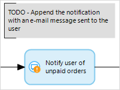

{}
 For the Simplified Chinese translation, click [中文译文](https://cdn.mendix.tencent-cloud.com/documentation/refguide8/annotation.pdf).
{}

## 1 Introduction

An annotation is an element that can be used to put comments to a flow.

In the example below, you use a **Show message** activity to warn end-users about unpaid orders with a pop-up message in the client. Later you want to extend this warning with an e-mail message send to the user. You can use an annotation as a reminder and put it above the current activity.

## 2 Common Properties

### 2.1 Caption

For details, see [Common Properties](microflow-element-common-properties).

## 3 Annotation Flow {#annotation-flow}

An annotation flow is a connection that can be used to link an annotation to a flow object(s).

For example, this is an annotation flow linking an annotation and a **Microflow call** activity:

