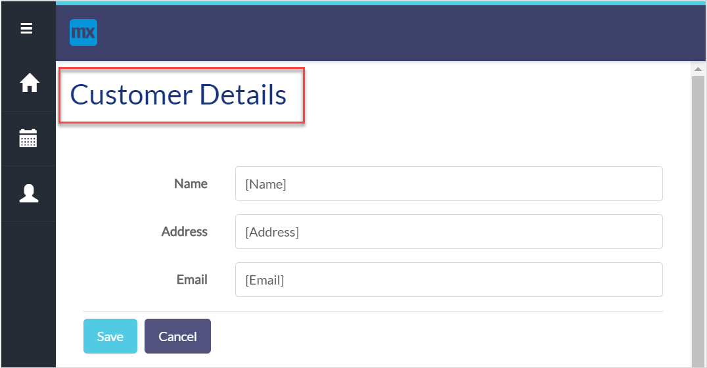

{}
 For the Simplified Chinese translation, click [中文译文](https://cdn.mendix.tencent-cloud.com/documentation/refguide8/common-widgets.pdf).
{}

## 1 Introduction

Common widgets category contain widgets that are commonly used. This category contains the following widgets:

*  [Text](text) – displays a text that can contain parameters:

    

*  [Image](image) – displays static image:

    

* [Label](label) – displays static text (the functionality of this widget is outdated, we recommend using the label property of [input widgets](input-widgets) or a text widget instead) 

*  [Snippet Call](snippet-call) – allows you to use a snippet on another snippet, a page, or a layout

    

*  [Page Title](page-title) – displays page title set in [page properties](page-properties#title)

    

## 2 Performing Basic Functions

{}

## 3 Read More

* [Page](page)

* [Pages](pages)

  
