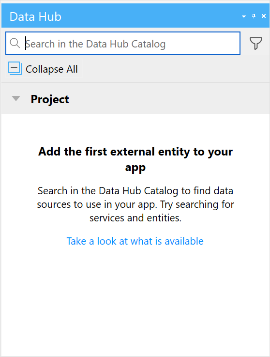
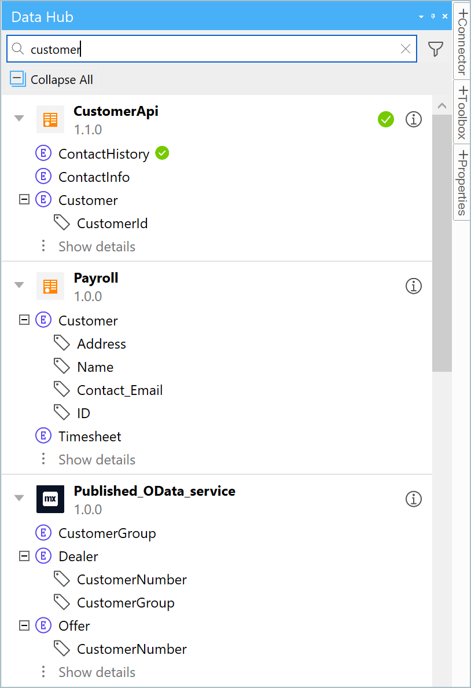
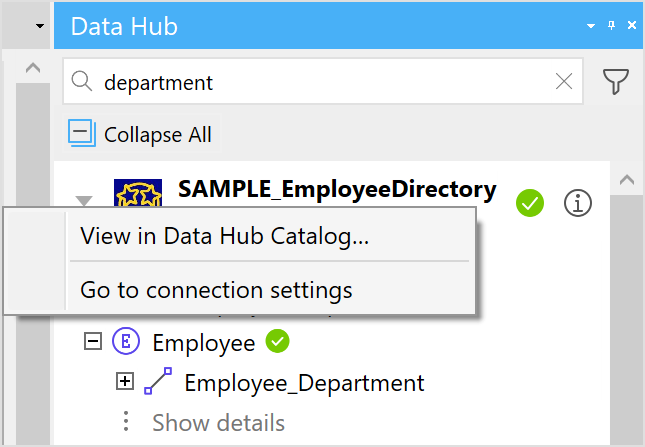
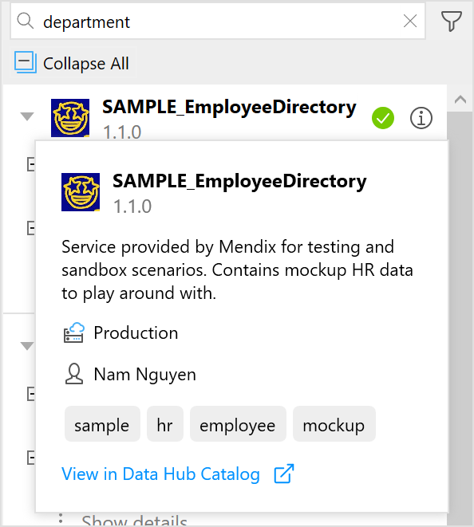

{}
 For the Simplified Chinese translation, click [中文译文](https://cdn.mendix.tencent-cloud.com/documentation/refguide8/data-hub-pane.pdf).
{}

## 1 Introduction 

[Mendix Data Hub](/data-hub/) enables integration of available data sources from the different applications in an organization into your Mendix apps. This means that new apps can be created using shared datasets that are registered in the [Data Hub Catalog](/data-hub/data-hub-catalog/). In Studio Pro, this is possible using the integrated functionality of Data Hub Catalog through the **Data Hub** pane.

{}
You need a license to use Data Hub in Studio Pro. For further information see [Data Hub License](consumed-odata-service-requirements#license-limitations).
{}

You can search in the Data Hub Catalog through the **Data Hub** pane to discover data sources that you can use in your project. Via this pane you can add the entities that are exposed in the registered OData services—called **Data Sources** in Data Hub—into your app's domain model. These entities are called [external entities](external-entities) and are different because they enable the connection to the data associated with the entities in the originating app.

{}
In the Data Hub Catalog, registered published services are referred to as *data sources* and exposed entities will show the **Entity set** name and are called *datasets.*
{}

To display the **Data Hub** pane, click **View** > **Data Hub**:

{}{}

## 2 Data Hub Pane in the Domain Model

The Data Hub pane is used to search the Data Hub Catalog for entities that can be dragged and used in your app and also display the external entities and the associated services that are consumed in your current model

### 2.1 Data Hub Search

{}{}

The following functionality is available in the pane:

* [Search](#search) – Enter a search string of alphanumeric characters to search in the Data Hub Catalog. The search will be performed on services, entities, attributes, associations, and descriptions in the Catalog.

* [Filter](#search) – By default, the search will be performed on assets in the **Production** environment. Click the **Filter** icon to  **Show development environments** such as **Test**, **Acceptance**, and the Mendix free app environment **Sandbox** in the search.

* [Search results](#viewing) – The search results displays all elements in the catalog that satisfy the search string. For each "hit" the information that is displayed includes the service name, service version, environment that the service was deployed to, and the elements matching the search string. If attributes or associations satisfy the search criteria, they are displayed. You can drag from the search results into your domain model and they are displayed as [external entities](external-entities):

  Services and the entities that are currently being used in the current domain model are indicated with a green check-mark in the search results.

### 2.2 Data Hub Project Pane

When no search string has been specified in the **Data Hub** pane, the **Project** pane is displayed. This shows the consumed services and the external entities used in the current project. The list of entities, associations and attributes for the consumed services are shown as for the search results:

{}{}

To add entities to your project model, see [Adding an External Entity to a Project](external-entities#adding-external-entities).

## 3 Searching the Data Hub Catalog {#search}

As you enter a search term, all the items in the Data Hub Catalog satisfying the search string are listed in the search results. This will include words in the service, entity and attribute descriptions which are not displayed in the the Data Hub pane. Further information see the [Data Hub Catalog asset details](/data-hub/data-hub-catalog/search#search-details).

### 3.1 Wildcard Search
You can perform a wildcard search by entering `*` in the search area.

{}
The search strings must be a minimum of 3 alphanumeric characters. Punctuation cannot be used as part of the search term except for the wildcard character `*` to perform an "empty" search in the Data Hub Catalog. You cannot use the wildcard in combination with other characters. For further details, see [How to Search for Registered Assets](/data-hub/data-hub-catalog/search).
{}

### 3.2 Service Environments
By default, the search will be performed on assets in the **Production** environment. To include all other environments such as **Test**, **Acceptance**, and the Mendix free app environment, **Sandbox** in the search, click the **Filter** icon and check **Show development environments**:

{}{}

{}
When the **Show development environments** is checked, all subsequent searches results will also include those in non-production environments.
{}

## 4 Information in Search Results and Project Pane {#viewing}

The following information is displayed.

### 4.1 Services

The search results and Project pane will show the following at a service level:

* **Service name**

*  **Application icon** for the service (for example, Mendix, SAP, Siemens Teamcenter, or as shown in the screenshots above, custom icons)

* **Service version**

*  **Environment name** for non-production environments

	{}Only the names of non-production environments are displayed. Services in the **Production** will not show an environment name. {}

* **Green check-mark** if the service or entity is consumed in the project. If you right-click a consumed service, you can do the following:

  {}{}

  * **View in Data Hub Catalog** – click this to go to the **Data Source Details** page in the Data Hub Catalog
  * **Go to connection settings** – click this to open the [consumed OData service](consumed-odata-service) document

*  **Blue** **Update Service** icon to indicate that there is another version of the consumed service available in the Data Hub. Click to update the service that is consumed in the project to the contract that is now available:

	

	{}If there is an OData Service update available, then the entities that are listed are those that are available in that version of the OData service. These entities will be "grayed-out" to indicate that they cannot be dragged into the domain model as the *current* contract that is consumed in the project does not have these entities. You will have to update the contract to the version shown in the search results by clicking the **Update**. arrow. {}

  {}The version number that is shown for the OData service is the latest one that is available in the Data Hub Catalog at the service endpoint—in the example above version 1.0.11 of **Theatre_service** is currently consumed in the project, but version **1.0.12** is now available in the Data Hub Catalog. The search results display the entities available in the new service (also showing one that is locally consumed) however they are greyed-out and cannot be selected until the local service is **Updated** to this one.{}

* **Information icon** to view further details for the service and a link to go directly to the [Service Details](/data-hub/data-hub-catalog/search#search-details) screen in the Data Hub Catalog:

  {}{}

### 4.2 Entities, Attributes, and Associations {#association-attributes}

Entities, attributes and associations that satisfy the search string are listed in the search results.

For any service in the list, you can click **:Show details** to see the full list of the exposed entities and the associations and attributes for that service.

{}The associations and attributes that are not supported in your Mendix model are shown as non-selectable (gray) and will not be included when you drag them into the domain model.{}

{}{}

### 4.2.1 Entity
If you right-click an entity and select **View in Data Hub Catalog**, it will take you to the entity details page in the [Data Hub Catalog](/data-hub/data-hub-catalog/).

If you right-click a consumed entity and **Go to entity**, it will take you to the entity in the domain model.

### 4.2.2 Associations

The associations that are exposed in the services are listed before attributes in alphabetical order. You can click on the **+** to see the entity that the association is with.

**Mulitple association**s between the same entities are shown before single associations.

In the following example the entity **Customer** has multiple associations with the entity **Order** however, these associations are not supported and cannot be used in your model"

{}{}

### 4.2.3 Attributes

Attributes for a service are listed in alphabetical order. If you right-click an attribute of a consumed entity and **Go to attribute**, it will take you to the attribute in the domain model.

In the above example, there are two attributes, **Addresses** and **FavoriteColors** which are not supported and therefore will not be included in your model:

{}{}

##  5 Read More

* [Data Hub Catalog](/data-hub/data-hub-catalog)
* [External Entities](external-entities)
* [Consumed OData Service](consumed-odata-service)
* [How to Consume Registered Assets](/data-hub/data-hub-catalog/consume)
