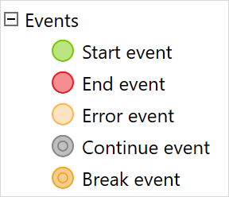

{}
 For the Simplified Chinese translation, click [中文译文](https://cdn.mendix.tencent-cloud.com/documentation/refguide8/events.pdf).
{}

## 1 Introduction

Events are elements that are displayed as circles on a flow of your microflow and are usually placed at the end or the beginning of the flow:

{}

{}

For example, they are used to start or end your microflow, to break an iteration in a loop, or continue this iteration, depending on the type of the event. All of the events can be used both in a microflow or nanoflow, except for the error event. 

You can add the following events to your flow:

* [Start Event](start-event) – indicates the beginning of your microflow or nanoflow 

* [End Event](end-event) – defines where the flow stops

* [Error Event](error-event) – defines where the microflow will stop and throw an error

* [Continue Event](continue-event) – used in loops to stop the current iteration and start the iteration of the next object

* [Break Event](break-event) – used in loops to exit the loop and continue with the rest of the flow