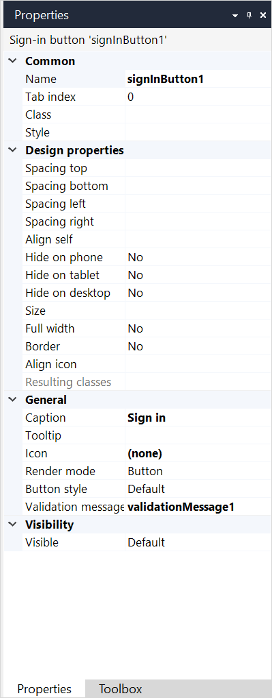

{}
 For the Simplified Chinese translation, click [中文译文](https://cdn.mendix.tencent-cloud.com/documentation/refguide8/sign-in-button.pdf).
{}

{}The **Sign-in button** is not supported on native mobile pages.{}

## 1 Introduction

The **Sign-in button** sends a user's login ID and password to the server for authentication:

Any errors are displayed in a [validation message widget](#validation-message-widget) or in a pop-up window. 

The **Sign-in button** should be placed on a page together with a [Login ID text box](login-id-text-box) and a [Password text box](password-text-box).

## 2 Properties

An example of sign-in button properties is represented in the image below:

{}
{}

Sign-in button properties consist of the following sections:

* [Common](#common) 
* [Design Properties](#design-properties)
* [General](#general)
* [Visibility](#visibility)

### 2.1 Common Section {#common}

{}

### 2.2 Design Properties Section {#design-properties}

{}

### 2.3 General Section {#general}

Most properties of a sign-in button are the same as properties of button widgets. For more information on button properties in the **General** section, see the [General Section](button-properties#general) in *Button Properties*.

#### 2.3.1 Validation Message Widget {#validation-message-widget}

**Validation message widget** is a specific property of a sign-in button. It defines the [Validation message widget](validation-message) that displays authentication failure messages on a page. If no widget is selected in this property, authentication failure messages will be displayed in a pop-up window:

Default: *None*

### 2.4 Visibility Section {#visibility}

{}

## 3 Read More

* [Page](page)
* [Login ID Text Box](login-id-text-box)
* [Password Text Box](password-text-box)
* [Validation Message](validation-message)