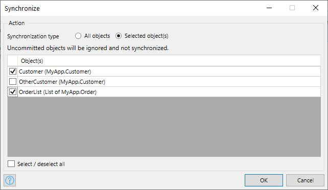

{}
This activity can only be used in **Nanoflows**.
{}

## 1 Introduction

The **Synchronize** activity can be used to synchronize your data between your device and the server.  The Synchronize action has two modes:

### 1.1 Synchronize All Objects

{}

{}

This mode synchronizes the whole local database. The server database is updated with the changes from the local database. The local database is updated with the latest data from the server, including the file contents.

The behavior of this mode can however be configured through the [**Synchronization configuration**](offline-first#customizable-synchronization).

### 1.2 Synchronize Selected Object(s)

{}

{}

This mode synchronizes objects partially, based on a selection:

{}

{}

With this mode, only the selected objects or lists are synchronized. The synchronization is bi-directional, 
meaning both the server database and the local database is updated for the selected object(s).

If the selected object is new, and not committed to the local database, it will be ignored during synchronization.

If the selected object has local changes, the following steps are performed:
1. Update the server database with the changes from local database.
2. Update the local database from server database. This is useful in case the selected object has calculated attribute(s) or has been modified in a before/after event handler microflow.

If the selected object is originated from server (not created on the device), and it no longer exists on the server, (or inaccessible due to the access rules), the local changes are not applied and the object is removed from the local database. In this case the value of the variable in the nanoflow for that object becomes `empty`. The server stored the discarded changes in `System.SynchronizationFailure` entity to prevent data loss.

If the selected object does not have any local changes, synchronization updates the local copy from the server database. If the object was deleted or no longer accessible due to the access rules, the object is removed from the local database.

## 2 Properties

The **Synchronize** activity properties consists of the following sections:

* [Action](#action) 

* [Common](#common)  

	{}{}

## 3 Action Section {#action}

The **Action** section of the properties pane shows the action associated with this activity.

## 4 Common Section {#common}

{}

## 5 Read More

* [Activities](activities)
* [Offline-first](offline-first)
