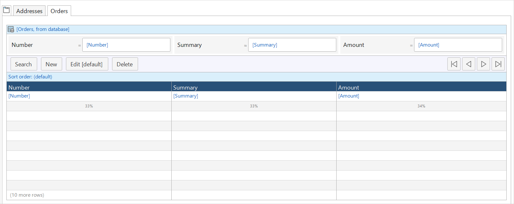

{}
 For the Simplified Chinese translation, click [中文译文](https://cdn.mendix.tencent-cloud.com/documentation/refguide8/tab-container.pdf).
{}

## 1 Introduction

Tab containers are used to show information categorized into tabs. This can be very useful if the amount of information that has to be displayed is larger than the amount of space on the screen.

## 2 Properties

An example of tab container properties is represented in the image below:

{}
{}

Tab container properties consist of the following sections:

* [Common](#common)
* [Design Properties](#design-properties)
* [Visibility](#visibility)

### 2.1 Common Section {#common}

{}

### 2.2 Design Properties Section {#design-properties}

{} 

### 2.3 Visibility Section {#visibility}

{}

## 3 Tab Page {#tab-page}

A tab container contains one or more tab pages where you place widgets. For example, a tab page can contain a grid of orders.

### 3.1 Tab Page-Specific Properties

#### 3.1.1 Default Tab Page

**Default tab page** defines which tab is displayed when the page is opened. If no tab is set as the default one, the first tab page will be shown. 

Default: *False*

#### 3.1.2 Refresh on Show {#refresh}

**Refresh on show** indicates whether the contents of the tab page should be refreshed when the tab page is shown. Set this property to *No* if you know that nothing will affect the information on the tab page.

Default: *True*

{}
This property is not supported on native mobile pages.
{}

## 4 Read More

* [Page](page)
* [Container Widgets](container-widgets)
* [Properties Common in the Page Editor](common-widget-properties)
