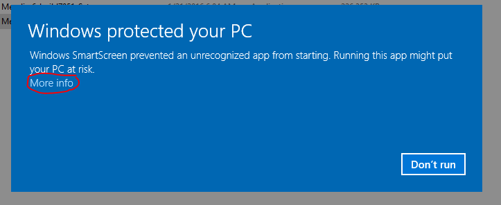
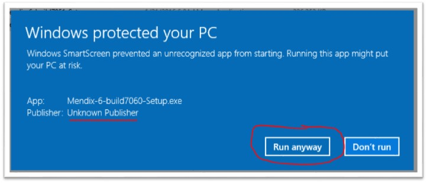

## 6.1.0

**Release date: January 5, 2016**

{}

### New features

*   Support for viewing all images on offline pages.
*   Support for reference selectors on offline pages.
*   Support for showing data over an association of one step on offline pages for input widgets and dynamic captions.
*   Support for executing long running microflows for clustered runtimes. The result of the long running microflow is now stored into the database, so that another runtime instance can fetch the result and send that to the client. This behaviour is also applied to non-clustered runtimes.
*   User Interface changes in Mapping Documents (see [Mapping document improvements in Mendix 6](https://www.mendix.com/blog/mapping-document-improvements-mendix-6)).
    *   XML-to-Domain mapping has been renamed to Import Mapping.
    *   Domain-to-XML mapping has been renamed to Export Mapping.
    *   Import Mapping document has a new icon.
    *   In Import Mappings, entities are shown on the left side, XML mappings on the right side (reversed)
    *   On the XML side of mappings (right side), a diamond symbol is used to indicate inclusion of elements.
    *   On the left hand side of mappings (left side), a better representation of the domain model is shown:
        *   Associations are drawn if they are used (Export Mapping) or set (Import Mapping), along with multiplicities and directions.
        *   Entity generalizations are drawn by open headed arrows (for Inheritance or Choice mapping elements)In Import Mappings, the optional parameter entity is drawn in the mapping, and associations that are set to the parameter entity.
    *   If an Import Mapping has an incoming parameter entity, a parameter symbol is drawn next to the entity.
    *   In an Export Mapping, the parameter symbol is drawn next to the root entity (because that entity always servers as a parameter in Export Mappings).
    *   Selection of mapping elements have been made more consistent. If you select an entity in the mapping, the corresponding XML element is selected as well. If you select an entity attribute, the corresponding XML element/attribute is selected as well.
    *   Object mapping forms have been made more logical. The form appears after double-clicking on a mapping element.
    *   For an Import Mapping, 3 steps have been made clear: (modeler-1) how to obtain a Mendix object (a. create a new object, b. find by key, c. find by microflow), (modeler-2) optionally set an association to a parent entity and (modeler-3) map individual XML mappings. Above the arrow in the Import Mapping document, it is shown how the object is obtained (a, b, or c) with a corresponding icon. The association to parent entities are only drawn if they are actually set).
    *   For an Export Mapping, there are 2 steps: (modeler-1) how to obtain the Mendix object (a. find by association, b. find by microflow). Step (modeler-2): map individual XML elements.
    *   Enumeration value can now be mapped automatically to an xsd:string and vice versa.
    *   The performance has been significantly improved.
*   In the 'Select Elements' dialog, the checking behavior has been changed. Now, it only automatically checks the required child nodes of the node the user checks (previously, the required parent nodes will also get selected automatically).
*   Web service request parameters of type Inheritance can be selected as request part for export mappings. In the 'Select Elements' dialog of an export mapping, Inheritance type parameters can be selected in the 'Request part' section. Similarly, in a 'Call web service' microflow action, export mappings for individual request parameters can be selected in the Advanced Mapping section of the request body tab.
*   "Map automatically" has been improved, to handle XML inheritance and entity generalization. It works in both Export Mappings and Import Mappings.
*   Support for XML inheritance in advanced mappings. (Ticket 205799, 205861, 205878, 205937, 462772)
*   Directly open "Select elements" when creating a new import or export mapping. (Ticket 205174)
*   User defined Java actions can use request parameter from OData logins. (Ticket 463400)

### Improvements

*   The CSRF token is made available in Java actions by calling getCsrfToken() on ISession. (Ticket 463207)
*   Handle optionality and nillability for choice element children when exporting domain model to XML. Only optionality is supported for the choice element themselves (see [XML Choice in mapping documents](/refguide6/xml-inheritance-and-choice#xml-choice)).
*   Occurrences for choice element and inheritance element are now represented correctly in mapping document. Old project will be converted automatically to the correct representation. (see [XML inheritance by extension in mapping documents](https://www.mendix.com/blog/xml-inheritance-extension-mapping-documents) for more information)
*   Auto-fix support from the consistency error when users are required to reselect the elements.
*   The minOccurs and maxOccurs for choice option elements are now reflected correctly in the Schema document.
*   The simple mapping option for webservice call actions is disabled if the XML schema contains choice or inheritance elements.
*   The advanced mapping option for webservice call actions is disabled if root in the XML Schema is an inheritance element or when the root contains a choice element as a direct child.
*   Introduce consistency error when the parent type of an attribute is not selected in export mapping.
*   New page templates for login pages and wizards.
*   New page template for select pages for mobile applications.
*   The context-menu of the grid control bar shows all types of buttons. The buttons that are not allowed based on the data source type are marked as such.

### Fixes

*   Fixed the issue that when more than 10 users were created in sandbox environments, no users could sign in anymore.
*   Fixed an issue where in a Microflow a list is retrieved, counted and returned at the end of a Microflow. The Microflow was previously erroneously optimized to a count query in the database. (Ticket 335178)
*   Fixed truncation of messages larger than 1024 bytes when the syslog is used for Mendix Business Server logging. Big message are now sent in chunks of 1024 bytes to the syslog. (Ticket 33960)
*   Fixed query execution exception due to an incorrect runtime start-up cycle. The issue was introduced in 5.21 and was occurring only when security was disabled. Thus, this had no impact on production applications.
*   Fixed an issue in setting a custom configuration value for "UploadedFilesPath". Because of a race condition, the custom value was sometimes not picked up by the module which handles uploads to the local filesystem. (Ticket 463877)
*   Fixed the issue where Web service request parameters that were mapped to Mendix list types caused a runtime exception.
*   Fixed the issue with conversion of a project that contains excluded mapping documents in the project. (Ticket 416284, 387305)
*   Attributes on primitive types are handled correctly in 'Select Elements' dialog, and selecting primitive types in the mapping document highlights the corresponding mapped entity attribute. (Ticket 338118)
*   Fixed issue where an XSD reference in a WSDL section was not deployed correctly (Ticket 463626)
*   Fixed the context mechanism properties "Apply context" and "Remove from context".
*   Fixed listening data view not updating the first time after navigating to the same page. (Ticket 463595)
*   Fix the flickering of the sidebar transition during navigation to another page. (Ticket 304502)
*   Notify the user if the cache bust is not configured in index file of the theme. (Ticket 370276)
*   Datepicker stores non-localized date as localized value (Ticket 463941, 463938)

### Known Issues — Important note for Windows 8.x and Windows 10 users

When installing Mendix 6.1.0 on Microsoft Windows 8.x or Windows 10, you might get a warning from Windows that the Mendix installer is marked as "Unrecognized app".

**Solution**

1\. You’ll have to click on the '_more info_' text to continue.

2\. You can continue the installation by clicking '_Run anyway_'

Windows will notify that the publisher is "Unknown Publisher". This however is not the case. It has to do with increased security on those Windows distributions.

<u>Installing the Mendix Modeler is completely safe.</u>

From the next Mendix Modeler version onwards, this message should not appear.
