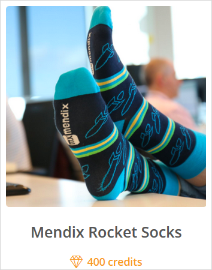

These release notes cover changes to the app project management functionality and other features of the [Mendix Developer Portal](/developerportal/index).

{}
For release notes on Mendix Cloud and deployment options, see [Deployment](deployment).
{}

## 2020

### July 28th, 2020

#### Fixes

* We fixed an issue where email notifications on [feedback](/developerportal/collaborate/feedback) items were not sent under certain circumstances.

### July 13th, 2020

#### Improvements

* We increased the performance on opening the buzz page.
* We changed the default avatar of a user profile from the Mendix logo to an industry standard user-icon.

#### Fixes

* We fixed a bug where, under certain circumstances, the "View App" was disabled even though it should have been enabled.

### June 28th, 2020

#### Improvements

* We implemented the second increment in renaming the default **End-user** App Team role to [Guest](/developerportal/company-app-roles/index#app-team-roles).

#### Fixes

* We fixed an issue where it was possible to change the end date of a closed Sprint.

### June 15th, 2020

#### Improvements

* The [new Stories UI](/developerportal/collaborate/stories) has been improved with various sections. The [old Stories UI](/developerportal/collaborate/stories#old) will be made unavailable soon. We encourage you to turn your tasks that are still available in the old Stories UI into new stories before the old UI is inaccessible.
* We improved performance on story-related actions such as drag-and-drop and status changes on large app projects with many deleted items.
* We renamed the default **End-User** App Team role to [Guest](/developerportal/company-app-roles/index#app-team-roles) to better distinguish App Team roles from app user roles.
* We removed the list appearance of the [My Company's Apps](/developerportal/apps-list/#my-company-apps) page.

#### Fixes 

* We fixed a bug where the background did not display properly on mobile browsers.
* We fixed a bug where changes to a story title or description were saved when clicking **Cancel**.

### May 27th, 2020

#### Improvements

* When you [delete a story or task](/developerportal/collaborate/stories#deleting) on the [Stories](/developerportal/collaborate/stories) page, it is now irreversibly removed from the system.
* We removed the ability to revert story-related changes in an app project's history.
* We removed the ability to delete several stories at once on the **Stories** page.
* We simplified story maintenance by preventing nested tasks.
* We removed the read-only permission on the stories board to bring the Developer Portal in line with industry standards.
* We made small improvements in the look and feel of the Developer Portal.

#### Fixes

* We fixed a bug where the calendar icon on date/time input fields was not displayed properly.
* We fixed a bug where the star icon on your [favorite app projects](/developerportal/apps-list/#favoriting) was not displayed properly.

### May 22nd, 2020

#### Improvements

* The [Stories](/developerportal/collaborate/stories) template functionality has been replaced with the **Clone** functionality in the [new UI option (beta)](/developerportal/collaborate/stories#story-actions).

### May 7th, 2020

#### Improvements

* We added a new story action called **Clone** to the new beta UI. For more information, see the [New UI Option (Beta)](/developerportal/collaborate/stories#story-actions) section of *Stories*.

### February 21st, 2020

#### Improvements

* We fixed an issue where [favorited apps](/developerportal/apps-list/#favoriting) still showed up in the favorites view on the [My Apps](/developerportal/apps-list/) page after being deleted.
* We made performance improvements to the **My Apps** page.
* We fixed an issue where the description field did not expand properly when creating a new [story](/developerportal/collaborate/stories).

### February 6th, 2020

#### Improvements

* We implemented a new design for the [Create App](/developerportal/#buzz) flow.
* When creating a new app, you can now search through templates for feature demos, academy training apps, and ready-made apps.
* After selecting an app template, you can now choose a nice icon for your app project.

## 2019

### December 23rd, 2019

#### Improvements

* We made minor improvements to the process of creating a new app.

#### Fixes

* We fixed an issue where you were redirected to the **Comments** page from the **Stories** page.

### December 18th, 2019

#### Improvements

* We made some minor improvements to the style of the [Stories](/developerportal/collaborate/stories#story-actions) beta version. This release fixes issues regarding batch actions.

### December 13th, 2019 

#### Improvements

* We redesigned the [Stories](/developerportal/collaborate/stories#story-actions) page with a brand new UI and improved stability. The new UI can be accessed by clicking **Enable new UI**. This is a [beta version](/releasenotes/beta-features/).

### December 5th, 2019

#### Improvements

* We made some minor styling improvements on [Buzz](/developerportal/collaborate/buzz).

### November 21st, 2019

#### Fixes

* We fixed an issue that prevented the **Edit in Studio Pro** functionality in the Developer Portal from opening Studio Pro.

### November 1st, 2019

#### Improvements

* We introduced the ability to [favorite](/developerportal/apps-list/index#favoriting) app projects from the **My Apps** page and to filter on favorite apps. This is helpful when you have a large number of Mendix apps.

### September 24th, 2019

#### Improvements

* We fixed an issue that would prevent users from inviting email addresses that contain capital letters.
* We fixed an issue that occasionally triggered an error message during signup.
* We made various small performance improvements on the Developer Portal.

### September 19th, 2019

#### Launchpad Removal & App User Management Update

* We removed the old launchpad page, as we have moved to a new SSO architecture. The old URL `launchpad.mendix.com` now links to your [My Apps](/developerportal/apps-list/) page.
* We moved the App User management functionality of the launchpad to the **General** app settings in the Developer Portal. For more information, see the [Managing App Users](/developerportal/settings/general-settings#managing-app-users) section of *How to Manage General App Settings*.

### August 9th, 2019

#### App User Management Improvements 

* We redesigned the UI for managing app users and improved the performance of loading manageable app environments and users.

### July 25th, 2019

#### Fixes

* We fixed an issue where updates to decimal constants in the Developer Portal were limited to 2 decimal places. This has been increased to 8 decimal places. (Ticket 85507)

### May 10th, 2019

#### Support Improvements

* We have changed the way you request a license for a new app. You can now request a license using the [Request New App Node](https://newnode.mendix.com/) app. Other requests should continue to be made through the [Support Portal](https://support.mendix.com).

### May 2nd, 2019

#### UI Improvements

* With the beta release of Mendix Studio and Mendix Studio Pro (Mendix version 8), we have updated all mentions of *Web Modeler* to *Mendix Studio* and *Desktop Modeler* to *Mendix Studio Pro* across the Developer Portal.

### April 8th, 2019

#### Webhooks Available

* We have added the ability to create webhooks for your app projects. These webhooks can be configured to send information when sprints change and/or stories change. For more information, see the [Managing Webhooks](/developerportal/settings/general-settings#webhooks) section of *How to Manage General App Settings* as well as [Webhooks](/apidocs-mxsdk/apidocs/webhooks-sprints) in the *API Documentation*.

### April 5th, 2019

#### Fixes

* We fixed an issue with the Developer Portal where the memory utilization was not optimized and could cause system instability. This change does not affect memory utilization by customer apps.

### March 15th, 2019

#### Fixes

* We fixed an found issue where you were not able to change your password on the **Password Has Expired** page. (Tickets 80828, 80882, 80884, 80888, 80997, 81005)
* We fixed an issue with retrieving stories in the Desktop Modeler. (Tickets 80618, 80623, 80636, 80665, 80685, 80705, 80726, 80738, 80780, 80833, 80834, 80854, 80866, 80935, 81008)
* We fixed an error that occurred when importing stories from Excel in certain situations.
* We fixed an issue where you unable to invite referrals to the Mendix Platform.

### March 14th, 2019

#### Fixes

* We fixed an issue that sometimes caused the Technical Contact information to be hidden on the app's *General* page in the Developer Portal. (Tickets 70285, 77387, 80269, 80929)

### March 7th, 2019

#### Fix

* When building a mobile application package for a new project, the default for permissions is now *disabled*. These are the set of permissions that a mobile (Phonegap) app requires and, previously, all permissions were enabled for new projects by default. This caused Push Notifications to fail if no further configuration was provided.

### March 6th, 2019

#### Feedback & Support

* We removed the [Mendix Feedback](/appstore/widgets/mendix-feedback) widget from the Developer Portal. If you want to report an issue or ask a question, please submit a ticket at [Mendix Support](https://support.mendix.com).

### January 3rd, 2019

#### Fixes

* We have updated the links to the tutorials in Mendix welcome email, so that new users of our platform can be guided better. (Ticket 77158)
* We have fixed integration issues that affected some Developer Portal users while managing application members. (Ticket 77386)

## 2018

### December 12th, 2018

#### Improvements

* We improved the performance of the **My Apps** page for users who are a member of a large number of App Teams.
* We updated the look and feel of the **My Company's Apps** page to be more in line with the **My Apps** page.
* We improved the look and feel of the emails that are being sent by the Developer Portal.

#### Fixes

* We fixed the broken deep link to the **Stories** page of your apps.

### December 1st, 2018

#### Fixes

* We fixed an issue that sometimes caused the team member with the [Technical Contact](/developerportal/company-app-roles/technical-contact) role to be hidden on the **Node Permissions** tab of the **Security** pages. (Tickets 69085, 69150, 69419, 69440, 69458, 69585, 69592, 69783, 69884,70131,70228, 70285, 76152)

### November 14th, 2018

#### Mendix Shop

* The [Mendix Shop](https://mendixshop.mendixcloud.com) is open for business! This is a web shop where you can spend the credits you have gained by completing various [challenges](/developerportal/mendix-profile/#challenges). The shop has cool products like Mendix t-shirts, socks, and sweatbands, so be sure to check it out.

	{}
	{}

### November 1st, 2018

#### Improvements

* We made improvements in the communication between the Web Modeler and the Developer Portal.

### October 17th, 2018

#### Fixes

* We fixed a memory leak problem that caused Developer Portal to have longer response times.
* We addressed and fixed an issue that caused some Developer Portal users to see empty dialog boxes instead of error message content. (Tickets 67626, 69363)

### October 16th, 2018

#### Fixes

* It is now possible to go to a Mendix community member's new [Mendix Profile](/developerportal/mendix-profile/index) directly from the [Buzz](/developerportal/collaborate/buzz) and [People](https://sprintr.home.mendix.com/link/people) pages. (Ticket 69702)

### October 11th, 2018

#### Improvements

* The Mendix Profile in the Developer Portal has been merged with the Community Profile. For more information, see [Mendix Profile](/developerportal/mendix-profile/index).
* Several UX updates were made to Developer Portal pages:
  * The [My Apps](https://sprintr.home.mendix.com/link/myapps) page has been redesigned, and you can now toggle your app list views.
  * The **App** > **General** page has been redesigned.
  * The [People](https://developer.mendixcloud.com/link/people) overview has been redesigned. The same view on Mendix community members is available in the [Connections tab](/developerportal/mendix-profile/index#connections) of your Mendix Profile.

### October 1st, 2018

#### Web Modeler Improvements

The Web Modeler can now be enabled for all types of apps. You can do this on the **Settings** > **General** page of your app. If you have a licensed app, you will also need to choose your [deployment](/developerportal/deploy/) environment.

#### Fixes

* For a while, the **Show activity for** filter buttons on the company **Buzz** page were broken and displayed nothing. They now work again.

### September 10th, 2018

#### Improvements

* An application created through our APIs now has the Web Modeler enabled if the template on which the app is based is suitable for use in the Web Modeler.

#### Fixes

* We have loosened an unnecessarily strict constraint on email domains during signup. You can now sign up with email domains with single-character sub-domains. (Tickets 68210 , 68386)

### June 26th, 2018

#### Improvement

* We implemented the new Mendix header.

### May 23rd, 2018

#### Improvements

* Company Admins can now export three reports to Excel: active users, app permissions of active users, and apps. This enables managing users and their permissions at scale.

#### Fixes

* The **Revisions** tab on the **Story Details** page now shows the avatar of the committer instead of the app's avatar.

### May 8th, 2018

#### Improvements

* You can now assign colors to your labels on the **Stories** page: Mendix Blue, Firetruck Red, Goldfish Orange, and Tulip Green.
* The **Story Details** page now has a new tab that shows the revisions related to the story.

#### Fixes

* On the **Feedback Details** page, the **Move to app** drop-down menu is visible again.
* Special characters like `&` are now displayed correctly in the subject of **Buzz** notification emails.
* The green call-to-action button in Buzz notification emails will now also work in Outlook for Windows. (Ticket 63452)
* If there is a lot of activity in a Buzz thread, each notification email now displays the correct thread history, instead of each email containing the same comments.
* We fixed two documentation links.

### April 9th, 2018

#### Fixes

* It is now possible to assign an empty value for application constants that have string as the data type.
* The loading pop-up window text shown while retrieving branches is now fixed.
* The bug that prevented some users from viewing the list of running requests of their applications is now fixed.
* The bug that prevented users from deactivating their projects is now fixed.

### March 16th, 2018

#### Improvements

* We changed the browser title from "Mendix App Platform" to **Mendix Platform** to be consistent with our messaging and documentation.
* Hybrid mobile improvements: you can now generate icons and splash screens, add custom loader and error images, and add custom HTML and CSS. We also added a new theming section for minor color tweaks.

#### Fixes

* The **Deploy** and **Operate** deep links were not available in the **Security** menu for user groups without monitoring access. This has been fixed.

### February 15th, 2018

#### Improvements

* We introduced a beautiful new design for the notification emails you receive when someone replies to your **Buzz** posts.

#### Fixes

* We addressed an issue that prevented the **Daily Digest** email from being sent.

### January 25th, 2018

#### Improvement

* It is now possible for you to change the technical contact of your applications by yourself.

## 2017

### October 20th, 2017

#### Improvements

* We improved the error handling. Much more user-friendly feedback messages are provided in case of an error.

### September 29th, 2017

#### Fixes

* We fixed an issue where a user who signed up to Mendix would get an error page in Internet Explorer and Microsoft Edge.

### September 28th, 2017

#### Fixes

* We fixed a problem where Team Server branches that were committed without the Mendix Modeler were hidden in the Developer Portal.
* We fixed a problem where changing an access restriction profile could display a wrong error about having more than 1 certificate in use.

### September 25th, 2017

#### Improvements

* We changed the link at the bottom of our notification mails to point to a page where you can unsubscribe from these emails.

### September 20th, 2017

#### Improvements

* It is now possible to accept invitations and confirm signups on mobile devices.
* The Security page for an application (Settings > Security) will now also show the company of an app team member, making it easier to identify external user accounts. (Ticket 51296)

#### Fixes

* Deleting a document will no longer delete the corresponding discussion thread. Instead, a note that the previously uploaded document was deleted will be added to the discussion thread. Conversely, it is no longer possible to delete a discussion thread that has comments with uploaded documents. (Ticket 46480)
* Updated the Excel import functionality with various fixes and security improvements.

### August 14th, 2017

#### Fix

* We fixed an issue where users with Microsoft browsers would get an error page after signup instead of automatically continuing to the Developer Portal.

### August 11th, 2017

#### Fixes

* We fixed an issue where Desktop Modeler users couldn't submit feedback items.
* We fixed an issue where team member names in the **Node Security** screen were empty and only visible after a refresh.

### August 2nd, 2017

* Company Admins can invite users to all the apps within their company. (Ticket 51296)
* Company Admins can export a list of all company members from the **Members** page. (Ticket 52683)
* Technical Contacts can access the **Node Permissions** page, even when they don't have app admin rights. (Tickets 51315, 53088, 54081)
* The Stories API and Feedback API return sprints, stories, and feedback items in the same order as shown in the Platform Portal.

### July 12th, 2017

#### Improvements

* Every platform user is now enabled to create Web Modeler apps!

#### Fixes

* A story in a completed Sprint no longer disappears when you open the details view.
* The Mendix Feedback widget now supports reporting feedback from pages with very long URLs.

### June 7th, 2017

#### Fixes

* We fixed an issue with the input of Japanese characters in the feedback widget.

### April 5th, 2017

#### Improvements

* Posting comments to a discussion on the Buzz sometimes took a long time to complete. We made a change so that comments now appear almost instantly after hitting the **Post Comment** button. This change will also speed up completing sprints with stories which have associated feedback items.

#### Fixes

* We fixed an issue where invitation dialogs would be shown twice in some situations. They are now shown just once.

### March 13th, 2017

#### Fixes

* The highlighted menu state was fixed, the wrong items were highlighted in some instances.
* App Store links clicked from within the Deploy/Operate sections now open in the same tab.
* The **Show Profile** link was broken in some parts of the platform.
* Various fixes for internal beta program

### March 9th, 2017

#### Improvements

* We improved the performance of Sprint completion. This should now take significantly less time.
* We made various small styling improvements.

#### Fixes

* We fixed an issue in which completing a Sprint from the **Stories** page wouldn't properly update the UI.
* The **getAccounts** call in the **UserManagementAPI** will now sort results consistently on **EmailAddress** when using limit/offset.

### February 21st, 2017

#### New Features

* We added the **View App** and **Edit App** buttons. The **View App** button brings you to the deployment URL of your Free App, or, if you have test, acceptance, and production environments, it lets you choose between these environments using a drop-down menu. The **Edit App** button will launch the Desktop Modeler if you have it installed; if you are part of the partner group testing the Web Modeler, then you'll have the choice to directly open your app in the WM.
* We redesigned the interface. The new look sports light colors and a responsive layout. Menu items pertaining to your apps have been moved from the top to the left side. Users with permissions to access restricted parts of the Mendix App Platform can navigate there using the **Profile** menu, which opens when you click your avatar in the top-right corner of the screen.
* We improved the breadcrumbs. A header on top of the Mendix App Platform will show you where you are in the navigation structure.
* The **Feedback** widget can now be used when opened on small screen sizes (for example, on a  smartphone).
* The **Guidance** sidebar has been replaced by the **Intercom** widget.

#### Fixes

* We fixed the password reset form giving an error if you tried to submit it using the **Enter** key (even though you would receive a link).
* We fixed the **Team** overview flickering every few seconds that occurred after you create a new app.
* We fixed the screen jumping at every key-press that occurred while you were writing a large post on the Buzz.
