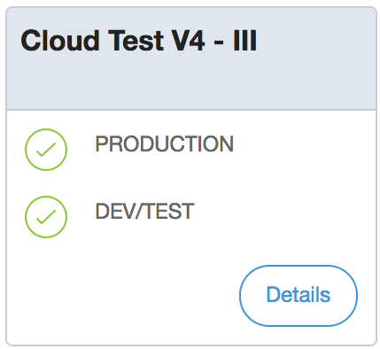

## 2018

### November 1st, 2018

#### Fixes

* We fixed an issue that caused an error while creating a backup in Mendix Cloud v4. (Tickets 70086, 70090, 75936, 75996)

#### Improvements

* We made improvements in the communication between the Web Modeler and the Cloud Portal.

### October 29th, 2018

#### Improvements

* Deploying to IBM Cloud is available from within Mendix. If you start with an IBM starter app, you will be taken through the process of creating a deployment environment on IBM Cloud. You can then deploy your app to IBM Cloud from within the Desktop Modeler or Mendix Developer Portal. More information is available in [IBM Cloud](/developerportal/deploy/ibm-cloud). You can also find Mendix Starter Kits on IBM Cloud and start the process from there.

### October 22nd, 2018

#### Improvements

* Apps deployed to SAP Cloud Platform can be edited in the Web Modeler or Desktop Modeler by choosing the appropriate option on the **Edit App** button in the Developer Portal. Older apps can have this functionality enabled using the **Enable Web Modeler** button on the **General** settings page.
* Logs for apps deployed to SAP Cloud Platform can be viewed with Kibana from the **Logs** page of the Developer Portal. See [Logs](/developerportal/operate/logs) for more information.

### October 17th, 2018

#### Improvements

* We have overhauled the scaling user interface to make it more intuitive. (Ticket 67557)
* It is now possible to pause and resume downloading backups for Mendix Cloud V4 applications.

#### Fixes

* We fixed a memory leak problem that caused Cloud Portal to have longer response times.
* We addressed and fixed an issue that caused some Cloud Portal users to see empty dialog boxes instead of error message content. (Tickets 67626, 69363)
* We addressed an issue that caused live logging to freeze from time to time. The fix has been confirmed on all mainstream browsers except for Internet Explorer, which we still are investigating. (Ticket 66418)
* We fixed an issue which caused subdomain validation errors for sandbox environments. (Ticket 56574)

### October 16th, 2018

#### Fixes

* It is now possible to go to a Mendix community member's new [Mendix Profile](/developerportal/mendix-profile/index) directly from the [Buzz](/developerportal/collaborate/appbuzz) and [People](https://sprintr.home.mendix.com/link/people) pages. (Ticket 69702)

### October 11th, 2018

#### Improvements

* The Mendix Profile in the Developer Portal has been merged with the Community Profile. For more information, see [Mendix Profile](/developerportal/mendix-profile/index).
* Several UX updates were made to Developer Portal pages:
  * The [My Apps](https://sprintr.home.mendix.com/link/myapps) page has been redesigned, and you can now toggle your app list views.
  * The **App** > **General** page has been redesigned.
  * The [People](https://developer.mendixcloud.com/link/people) overview has been redesigned. The same view on Mendix community members is available in the [Connections tab](/developerportal/mendix-profile/index#connections) of your Mendix Profile.

### October 1st, 2018

#### Web Modeler Improvements

The Web Modeler can now be enabled for all types of apps. You can do this on the **Settings** > **General** page of your app. If you have a licensed app, you will also need to choose your deployment environment.

#### SAP OData Connector Version 4.0.0

This version of the SAP OData Connector allows you to use the destination services of SAP Cloud Platform. This simplifies configuration, authentication and endpoint management when integrating your application, running in SAP Cloud Platform, with SAP backend services. See [SAP Destination Service](/refguide/sap/sap-destination-service).

The following authentication types are currently supported in SAP Destination Services:

* PrincipalPropagation authentication and ProxyType on-premise (Connectivity Service/Cloud Connector/On premise backend)
* Oauth2SALMAssertion authentication (For Neo Platform apps)
* Basic and None authentication for public backends

The SAP OData Connector is included in the SAP starter apps and is also available in the App Store here: https://appstore.home.mendix.com/link/app/74525/.

#### SAP Leonardo Machine Learning Foundation Connector Version 1.0.0

This new connector allows you to consume Leonardo Machine learning services from both API Business Hub and SAP Cloud Platform by adding activities to your Mendix model.

The SAP Leonardo Machine Learning Foundation Connector is available in the App Store here: https://appstore.home.mendix.com/link/app/107221/.

#### SAP Fiori Styling

The existing SAP Blank starter app has been replaced by a new Fiori Blank starter app. This new Fiori Blank starter app has a new Fiori UI Package included. This is based on Atlas UI, which means that you can use either the Web Modeler or Desktop Modeler to build applications which give the Fiori UI experience.

#### SAP Cloud Deployment Version 3.5.2

We now configure Destination Service in the scope of XSUAA. This means that we add the uaa.user default scope to the destination instances in each new environment. This is needed to fetch the destination configuration.

#### Breaking Changes

* The new **SAP OData Connector** will break existing projects which are using the SAP Cloud Connector. The SAP OData Connector no longer supports the “Use Cloud Connector” attribute. This is now embedded in the destination service configuration. See [SAP Destination Service](/refguide/sap/sap-destination-service) for more details.

#### Fixes

* For a while, the **Show activity for** filter buttons on the company **Buzz** page were broken and displayed nothing. They now work again.

### September 10th, 2018

#### Improvements

* An application created through our APIs now has the Web Modeler enabled if the template on which the app is based is suitable for use in the Web Modeler.

#### Fixes

* We have loosened an unnecessarily strict constraint on email domains during signup. You can now sign up with email domains with single-character sub-domains. (Tickets 68210 , 68386)

### August 21st, 2018

#### Fixes

* We have fixed a bug that was causing some Mendix Cloud v4 users to unsubscribe from alerting lists after changing environment privilege settings.
* We have addressed an issue that caused some Mendix Cloud v4 users to not to be able to see their archived logs from previous day.

### August 13th, 2018

#### Improvements

* A new API call for accessing the logs of Mendix Cloud V4 applications is now available. Detailed information can be found in the [Deploy API](/apidocs-mxsdk/apidocs/deploy-api).
* It is now possible to add custom environment variables via the Cloud Portal to set up application metrics with Datadog and Telegraph.
* All the log levels in the Cloud Portal (as in, INFO, ERROR, TRACE, DEBUG, WARNING, CRITICAL) are now also available in Datadog.
* The Postgres database size can also be observed in Datadog after enabling it in the Cloud Portal.

#### Fixes

* We improved the feedback messages in the case of a startup failure.
* The status page link in alert emails now redirects you to the corresponding alerts page in the Cloud Portal.
* We solved an issue that caused blank error messages during backup creation.
* The **Environments** breadcrumb in **Deploy** > **Environments** > environment is now a link that redirects you back to the **Environments** page.

### August 9th, 2018

#### Improvements

* Alerts are now sent when a Mendix Cloud v3 app or database runs out of system memory.

### August 8th, 2018

#### Improvements

Over the last few months, we have made several improvements to our alerting stack of Mendix Cloud v4 applications to improve the timeliness of alerts. As a consequence, we are reducing the runtime heartbeat timeout from 15 minutes to 3 minutes. We are doing this to ensure that you do not accidentally miss any alerts. We will be monitoring your applications for false positives.

In some cases, you may still experience false positives for the runtime heartbeat alert. If that happens, you can resolve the problem by doing a transport and then a restart of the app.

### August 7th, 2018

#### Improvements

* We introduced a new environments lifecycle for our SAP apps and migrated all of the old environments.
* We improved our UX, especially on the **Environments** screens of SAP apps.
* We fixed a few minor UX bugs.

### July 23rd, 2018

#### Improvements

* We fixed problems with the uploading, downloading, and restoring of backups with very large databases in Cloud V4.
* We added alerts on database connections and on internal alerting problems.
* We fixed the problem wherein 404, 403, and 503 responses to a REST call translated to an HTML error page.
* We added Telegraf as a sidecar for monitoring.

### July 17th, 2018

#### Improvements

* We improved the deployment speed for the Asia region. The feature is not enabled by default, so you need to request it if necessary.
* We implemented tags on environments for metrics in Datadog. It is now possible to add custom tags to metrics that will serve as selection criteria for grouping environments. Environment tags can be created, retrieved, and deleted using APIs. Detailed information can be found in the [Deploy API](/apidocs-mxsdk/apidocs/deploy-api).
* We changed the yearly overview of trends to quarterly in the Cloud Portal for v4 applications.
* It is now possible for an Operations Manager to reorder environments.
* Custom offline pages are now immediately active after the transport of a new deployment package.

#### Fixes

* You now get a warning if you try to restore a backup into a small environment. (Ticket 63367)
* Creating a backup via REST API no longer returns error message 500 when it succeeds. (Ticket 65762)

### July 3rd, 2018

#### Improvements

* To improve integration and security between Mendix and SAP we now redirect you to SAP to provide your SAP credentials. This means that you need to use the same username (email address) for Mendix and SAP the next time you need to provide your credentials. This is currently implemented only for SAP regions **eu10 (Europe - Frankfurt)** and **us10 (US East - VA)**.

### July 2nd, 2018

#### Improvements

* We improved the stability of the alerting stack.

### June 26th, 2018

#### Improvements

* We implemented the new Mendix header.
* We fixed the bug that allowed users to start an application during a restore.

### June 15th, 2018

#### Improvements

* We added support for client certificate validation in the **Access Restriction Profile** for Mendix Cloud V4 deployments.

#### Fixes

* We fixed the incorrect message that was shown during the scaling of a non-deployed environment. (Ticket 64799)
* We reintroduced copy privileges for operations.
* Retrieving an environment package via REST API is no longer broken. (Tickets 65348, 65370)

### June 11th, 2018

#### Improvements

* We added alerts for when an application runs out of memory or otherwise unexpectedly crashes. This is only applicable to Mendix Cloud V4 deployments.

### June 8th, 2018

#### Improvements

* We have introduced scaling via API for Mendix Cloud V4. It is now possible to scale Mendix Cloud V4 applications via the Deploy API. For instructions, see the [Deploy API](../../apidocs-mxsdk/apidocs/deploy-api).
* We have aggregated the health icons for the acceptance and test environments in the **Nodes** dashboard and **Company Admin** screen.

  

  * The health icon will display the health status of the environment that is in the worst condition. This is to prepare for an upcoming release that will support more than three environments per application.

#### Fixes

* We fixed an issue in our alerting infrastructure that prevented some Mendix Cloud V4 users from receiving alerts when their apps ran out of memory.
* We fixed the problem that caused the Mendix Cloud V4 **Metrics** legend to remain on the screen even if the user navigated to a different page.
* We fixed the health icon statuses of the environments so that they reflect the environment health with minimum delay.

### May 23rd, 2018

#### Improvements

* Company Admins can now export three reports to Excel: active users, app permissions of active users, and apps. This enables managing users and their permissions at scale.

#### Fixes

* The **Revisions** tab on the **Story Details** page now shows the avatar of the committer instead of the app's avatar.

### May 22nd, 2018

#### Fixes

* We fixed the bug in Mendix Cloud v4 that prevented users from using nested custom domains. Now you can have one domain (for example, `app.example.com`) and one on `microservice.app.example.com`.

### May 8th, 2018

#### Improvements

* You can now assign colors to your labels on the **Stories** page: Mendix Blue, Firetruck Red, Goldfish Orange, and Tulip Green.
* The **Story Details** page now has a new tab that shows the revisions related to the story.

#### Fixes

* On the **Feedback Details** page, the **Move to app** drop-down menu is visible again.
* Special characters like `&` are now displayed correctly in the subject of **Buzz** notification emails.
* The green call-to-action button in Buzz notification emails will now also work in Outlook for Windows. (Ticket 63452)
* If there is a lot of activity in a Buzz thread, each notification email now displays the correct thread history, instead of each email containing the same comments.
* We fixed two documentation links.

### May 5th, 2018

#### Improvements

* It is now possible to add a comment as an optional parameter to the backup while generating one via REST API.
* It is now possible to see the Mendix Runtime version in response to a "Retrieve Environment Package" API call.

#### Fixes

* We fixed an issue that prevented our Mendix Cloud v4 users from uploading and restoring big backups (larger than ~30GB) to their environments. It has been tested with the archives (~90GBs) on Mendix Cloud v4.
* We addressed and fixed an issue that caused Mendix Cloud v4 users in the Asia Pacific time zone to receive the wrong timestamps when they downloaded daily logs.

### April 9th, 2018

#### Improvements

* As of today, Mendix Cloud v4 users will be able to create and restore backups of their environments via REST API. Detailed information can be found in the [Deploy API](/apidocs-mxsdk/apidocs/deploy-api) documentation.
* The results of **Retrieve Environments** and **Retrieve Environment** REST API calls will now also include the model version and Mendix version information of the applications for which the call is being made.

#### Fixes

* It is now possible to assign an empty value for application constants that have string as the data type.
* The loading pop-up window text shown while retrieving branches is now fixed.
* The bug that prevented some users from viewing the list of running requests of their applications is now fixed.
* The bug that prevented users from deactivating their projects is now fixed.

### March 21st, 2018

#### Improvements

* Applications in Mendix Cloud v3 that were running for more than 248 days started to use 100% CPU due to an unknown bug in either the Mendix Runtime, the JVM, or a combination thereof. A very small number of applications have been impacted by this, as most applications are updated much more often, and every deployment restarts an application. However, this problem has been causing performance issues for both the affected applications and our infrastructure. As a workaround, we will now automatically restart apps that have been running non-stop for 247 days between 01:00 and 07:00 local time of the cloud region. If this happens to an application, you will see a message in the application log.

### March 20th, 2018

#### Improvements

* We enabled ICMP (ping) packets for our Mendix Cloud v4 load balancers. Now you can use tools like ping, traceroute, and mtr to debug connectivity issues from your location to Mendix Cloud v4 applications. Note that packets will not reach the actual application but only the load balancers. You can expect latency in the low single-digit milliseconds between the load balancers and applications.

### March 16th, 2018

#### Improvements

* We changed the browser title from "Mendix App Platform" to **Mendix Platform** to be consistent with our messaging and documentation.
* We have improved database storage alerts for Mendix Cloud v4 applications. If you subscribed to your applications' alerts, you will receive a warning alert when you have less than 25% disk space on your applications' databases and a critical alert when disk space is below 10%. You need to re-deploy your application to activate this alert.
* Live logging for Mendix Cloud v4 applications is here! You can now view logs neatly and in real-time.
* Hybrid mobile improvements: you can now generate icons and splash screens, add custom loader and error images, and add custom HTML and CSS. We also added a new theming section for minor color tweaks.

#### Fixes

* Users of Mendix Cloud V4 applications will now see a notification if their environment fails to clean properly.
* The health status of newly-created Mendix Cloud v4 applications used to be reflected with a red cross. This has been fixed.
* The **Deploy** and **Operate** deep links were not available in the **Security** menu for user groups without monitoring access. This has been fixed.

### March 13th, 2018

#### Improvements

* In the Mendix Cloud, we have renewed the SSL/TLS certificates for *.mendixcloud.com*, *.mxapps.io*, and *.mendix.com*.

### March 1st, 2018

#### Fixes

* Switching between environments in the **Metrics** menu of Mendix Cloud v3 apps is now fixed.
* We fixed the synchronization problem that prevented Mendix Cloud v3 users from seeing their latest nightly backups.

### February 27th, 2018

#### Fixes

* We fixed an issue that prevented SAP Cloud users from viewing the **Mobile App** section properly.
* When uploading a backup in Mendix Cloud v3, double-clicking the **Restore** button was causing the UI to break. This is now fixed.

### February 23rd, 2018

#### Improvements

* In Mendix Cloud v4, the native memory usage of applications was very high. This led to crashes and automatic restarts, especially on containers with 1GB of memory. We activated an advanced memory limiting setting for glibc (`MALLOC_ARENA_MAX`), which will prevent this behavior. The fix will automatically be applied to all apps that are transported and restarted as of today.

### February 22nd, 2018

#### Improvements

* We implemented a popular feedback item – the platform will now remember your selected environment while switching between screens.
* It is now possible to see the database details such as **DB Plan Space**, **Plan Cores**, and **Plan Memory** of a Mendix Cloud V4 application.
* Scaling Mendix 7 apps is now simplified and faster.

#### Fixes

* Backup creation was reported as a backup restore action in the activity feed, which is now fixed.
* We addressed and fixed an issue where a backup activity item was added each time the backups page was viewed.
* The environment details list was loading slowly for some of our users, which is now fixed.

### February 19th, 2018

#### Improvements

* In Mendix Cloud v4, we have enabled logging slow database queries. This is the custom runtime setting `LogMinDurationQuery`, and it is useful for finding performance bottlenecks in your application. The value is set to a default of 10,000 ms, which was also the value on Mendix Cloud v3. You can customize this setting by using the **Runtime** tab on your environment details screen under **Environments**. To start using this feature on a Mendix Cloud environment, transport your deployment package and restart your app.

### February 15th, 2018

#### Improvements

* We introduced a beautiful new design for the notification emails you receive when someone replies to your **Buzz** posts.

#### Fixes

* We addressed an issue that prevented the **Daily Digest** email from being sent.

### January 25th, 2018

#### Fixes

* Happy new year! We addressed an issue where backup downloads were logged as restored backups in the activity log.
* If you had a **Backups** section of your apps open in multiple tabs, you saw multiple activity log entries for each action taken. That's fixed now.
* The restart and stop/start activities are now distinctly defined in the **Activity** section.
* Branches of an application are sorted alphabetically, but **Main Line** is now always on top.
* The target cloud of a Free App is now shown correctly in the **Environments** section.
* The broken styling of the **View Current Log** button for a Free App has been fixed.

#### Improvements

* The **Alerts** section in Mendix Cloud V4 apps will now include health check details, just like for Mendix Cloud V3 apps.
* It is now possible for you to change the technical contact of your applications by yourself.

## 2017

### December 29th, 2017

#### Fixes

* In Mendix Cloud v4, the **archived log** function returned logs from a broader time range than what the user had selected (for example, the logs for one day returned log data from two days). This was fixed.

### December 22nd, 2017

#### Improvements

* We are introducing a **Restart** button for Mendix Cloud environments. This is useful for preparing configuration changes and activating them with only one click.

#### Fixes

* It's now possible to scale Mendix 6 applications on Cloud V4. Previously, this was only possible with environments that run Mendix 7 apps. With Mendix 6 apps, you can only scale the allocated memory, but not the amount of instances.
* Big backups are now welcomed on V4 environments, as we fixed an issue that prevented users from uploading backup packages larger than 5 GBs.
* We fixed an issue where some Mendix Cloud V3 users were not able to set a specified Java version for environments.
* Hovering over a Mendix Cloud environment status icon will now give more information about the environment's health.

### December 13th, 2017

#### Fixes

* The JVM Process Memory graph in Cloud v4 now also show the native memory of the application.
* The Application Node Operating System Memory graph for Cloud v4 now shows as two lines: total and used. The previous version displayed the total added to the used in a stacked area graph, which was very confusing.

### December 6th, 2017

#### Fixes

* We addressed an issue that prevents Free Apps from being embedded in an iframe.

### November 27th, 2017

#### Improvements

* Free App users now have the option to select between Web Modeler and Desktop Modeler for editing their application models.

### November 15th, 2017

#### Improvements

* Mendix Cloud v4 backups can now be restored to other environments in the same Mendix Cloud node. This is useful when preparing production migrations or for reproducing errors.
* When creating a deployment package from Team Server, the dialog box now shows branches in case-insensitive order, which makes more sense for users.
* Mendix Cloud v4 alert status showed `UNKNOWN` sometimes due to an error. This was fixed and the correct status is now shown.
* In the **Deploy**, **Operate**, and **Backups** pages, you can *finally* use the <kbd>Enter</kbd> key to submit your two-factor authentication code. Happy typing!

### October 20th, 2017

#### Improvements

* Deploying a different version without stopping a running application is also now available on Mendix Cloud v3. Once the deployment is done, you can restart the application with a single click.
* We improved the error handling. Much more user-friendly feedback messages are provided in case of an error.
* The user experience of backup uploads has been improved for Mendix Cloud v4. It is also possible to manually delete the old backups on Mendix Cloud v4.
* We made a series of minor user experience improvements for metrics on Mendix Cloud v4.

#### Fixes

* When creating a deployment package from Team Server, users will now be able to see the revisions that were committed without the Mendix Modeler.

### October 10th, 2017

#### Improvements

* We removed the backup expiry entries from the activity logs for all applications in the Mendix Cloud, as we found they cluttered the overview and did not provide any useful information to users.

### September 29th, 2017

#### Fixes

* We fixed an issue where a user who signed up to Mendix would get an error page in Internet Explorer and Microsoft Edge.

### September 28th, 2017

#### Improvements

* Deployments with almost no downtime: It is now possible to deploy a different version without stopping a running application. Once the deployment is done, you can restart the application with a single click. This is now available for Mendix Cloud v4. For Mendix Cloud v3, this will be available soon.
* Improved the robustness of the Deploy API: Occasional failures that occurred while starting/stopping an environment via the Deploy API no longer occur.
* Improved the stability for transporting deployment packages for Asia-Pacific users for Mendix Cloud v4.
* Environment health indicators for your environments are now much more accurate.

#### Fixes

* We fixed a problem where Team Server branches that were committed without the Mendix Modeler were hidden in the Cloud Portal.
* We fixed a problem where changing an access restriction profile could display a wrong error about having more than 1 certificate in use.

### September 25th, 2017

#### Improvements

* We changed the link at the bottom of our notification mails to point to a page where you can unsubscribe from these emails.

#### Fixes

* We fixed the link to the *Deploy on-premises* docs in the Cloud Settings page.

### September 20th, 2017

#### Improvements

* It is now possible to accept invitations and confirm signups on mobile devices.
* The Security page for an application (Settings > Security) will now also show the company of an app team member, making it easier to identify external user accounts. (Ticket 51296)

#### Fixes

* Deleting a document will no longer delete the corresponding discussion thread. Instead, a note that the previously uploaded document was deleted will be added to the discussion thread. Conversely, it is no longer possible to delete a discussion thread that has comments with uploaded documents. (Ticket 46480)
* Updated the Excel import functionality with various fixes and security improvements.

### August 30th, 2017

#### Improvements

* The user interface of the instance/memory slider for Cloud v4 has been improved considerably. Scaling will also appear in the activity log of the application.
* For Mendix Cloud v4, we do no longer show the size of the archived log. The size we displayed previously was wrong.
* The expiry date for Mendix Cloud backups is now visible in the backup list.

### August 22nd, 2017

#### Improvements

* Due to various optimizations, the deployment speed for apps in Mendix Cloud v4 EU is now about twice as fast. The latency for FileDocument read/write actions has also improved for all Mendix Cloud v4 regions.

### August 15th, 2017

#### Improvements

* We enabled path-based access restrictions for all Mendix Cloud v3 apps. This allows users to more easily configure access restrictions on their environments. For more information, see [Access Restrictions](/deployment/mendixcloud/access-restrictions). Mendix Cloud v4 already has this functionality enabled.

### August 14th, 2017

#### Fixes

* We fixed an issue where users with Microsoft browsers would get an error page after signup instead of automatically continuing to the Developer Portal.

### August 11th, 2017

#### Fixes

* We fixed an issue where Desktop Modeler users couldn't submit feedback items.
* We fixed an issue where team member names in the **Node Security** screen were empty and only visible after a refresh.

### August 2nd, 2017

* Company Admins can invite users to all the apps within their company. (Ticket 51296)
* Company Admins can export a list of all company members from the **Members** page. (Ticket 52683)
* Technical Contacts can access the **Node Permissions** page, even when they don't have app admin rights. (Tickets 51315, 53088, 54081)
* The Stories API and Feedback API return sprints, stories, and feedback items in the same order as shown in the Platform Portal.

### August 1st, 2017

#### Improvements

* For Mendix Cloud v3, Java will be upgraded, including the most recent security updates. The Java KeyStore has also been updated. It contains trusted root certificates for secure outgoing connections from your Mendix app. For example, with the updated Java KeyStore, you are now able to connect to endpoints that use a certificate signed by [Let's Encrypt](https://letsencrypt.org/). Root certificates that are considered unsecure by Oracle and Mozilla have been removed. Your app will automatically start using a newer Java version and KeyStore when you restart the app. For Mendix Cloud v4, we are still planning the rollout of this fix.

### July 31st, 2017

#### Fixes

* The [Deploy API](/apidocs-mxsdk/apidocs/deploy-api) for apps in Mendix Cloud v4 contained multiple bugs in the start, stop and transport calls. These are now fixed.

### July 18th, 2017

#### Improvements

* For all apps running on the Mendix Cloud, the following HTTP request headers are now available: `SSL-Protocol` (possible values: `TLSv1`, `TLSv1.1`, `TLSv1.2`) and `SSL-Cipher` (for example, `ECDHE-RSA-AES256-GCM-SHA384`). These can be used to block login attempts (for example, `TLSv1` connections). *(Please note that these release notes previously stated the header name was `SSL-Version`, but it should have been `SSL-Protocol`.)*
* Modern browsers are aggressively caching static HTML resources, which can lead to user problems after deploying new versions of applications. Clearing the cache can solve this, but that is a bad user experience. So, for all apps running on Mendix Cloud v3, we have added an explicit `no-cache` header to the resources `/` and `/index.html`, `/login.html`, and `/index[0-9].html`. For Mendix Cloud v4, an `expires` with a negative value was already used, so no changes are required there. We believe this change eliminates most of the browser caching issues we have seen so far.
* You can now restrict access to your Mendix Cloud v4 applications based on IP ranges. This is available for all Mendix Cloud v4 regions and can be configured from the **Network** tab of your cloud environment.

#### Fixes

* When updating the admin user password in the Mendix Cloud, the password policy description was wrong, which led to confusing situations. We updated the text.
* When navigating to **Node Security**, the **App Team** tab no longer disappears.
* Due to a ZIP file encoding change in Mendix 7.5.0, AppServices could not be parsed when deploying to the Mendix Cloud. We fixed this.
* The **View Current Log** button is no longer hidden for Free Apps.

### July 12th, 2017

#### Improvements

* Every platform user is now enabled to create Web Modeler apps!

#### Fixes

* A story in a completed sprint no longer disappears when you open the details view.
* The Mendix Feedback Widget now supports reporting feedback from pages with very long URLs.

### June 21st, 2017

* Private company App Store content is now indicated in the **Template** browser with a lock icon.

### June 7th, 2017

#### Fixes

* We fixed an issue with the input of Japanese characters in the feedback widget.

### May 19th, 2017

#### Fixes

* We corrected the backup retention scheme for paid applications on Mendix Cloud v4, and it is now the same as on Mendix Cloud v3.
* The "view current log" functionality for Mendix Cloud v4 applications was empty by default and the **Show all** button needed to be used. It now shows the content right away.

### May 17th, 2017

#### Improvements

* We upgraded the SSL/TLS ciphers for connections to apps in Mendix Cloud v4. These included dropping block-based ciphers (3DES), moving to 2048 bit DH params. Mendix Cloud v4 now has an [A+ rating at SSL Labs](https://www.ssllabs.com/ssltest/index.html).
* We added HTTP/2 support for connections to all apps in Mendix Cloud v3 and Mendix Cloud v4. HTTP/2 is supported by all major browsers and results in more efficient network connections. [Read more about HTTP/2 here](https://http2.github.io/faq/).

### May 4th, 2017

#### Improvements

* Transporting a new deployment package dead-ended in a "Deploy successful" screen. Users are redirected to the environment details screen, which is much more useful.

#### Fixes

* We fixed the failing of large backups in Mendix Cloud v4. Backups will now only fail when the disk of the database is filled up.
* Alert Details now highlights the right menu item.
* Fixed a race condition where two apps created at the same time could get the same domain name.
* Added a warning message before restore backup, to prevent users clearing their environment. Clearing the environment before restoring resulted in a much slower non-incremental restore operation.
* Disabled automatic copying of "Data Snapshots" to empty environments in Mendix Cloud v4 Pro/Enterprise environments. This features is only used in Free Apps. Weak admin passwords in the database snapshot would prevent the app from starting.

### April 5th, 2017

#### Improvements

* Posting comments to a discussion on the Buzz sometimes took a long time to complete. We made a change so that comments now appear almost instantly after hitting the **Post Comment** button. This change will also speed up completing sprints with stories which have associated feedback items.

#### Fixes

* We fixed an issue where invitation dialogs would be shown twice in some situations. They are now shown just once.

### April 1st, 2017

* We added list backups/download backup operations to the [Deploy API](/apidocs-mxsdk/apidocs/deploy-api#3-15-list-environment-backups).
* We fixed the status page link in alert emails.
* We updated the **Security** link from the Deploy/Operate tabs. It now goes to the same page on all pages in the platform.
* We fixed an issue where the Free Apps backups page was very slow or resulted in an error in some cases.
* We fixed an issue where the log viewer for Free Apps did not escape HTML, so if the application logged plain HTML, it was interpreted in the browser.
* We fixed an issue where simultaneous snapshot restore jobs from the same environment to two others could lock one of the environments.
* We updated links from *world.mendix.com* to *docs.mendix.com*.

### March 20th, 2017

* The Deploy / Operate sections in the Platform Portal were broken on Internet Explorer 11 due to widget incompatibility, introduced in the previous release. This was already hot-patched in production on March 16th.

### March 13th, 2017

* The highlighted menu state was fixed, the wrong items were highlighted in some instances
* AppStore links clicked from within the Deploy/Operate sections now open in the same tab
* The **Show Profile** link was broken in some parts of the platform
* Clicking **Operate -> Backups** resulted in errors for a Free App
* Various fixes for internal beta program

### March 10th, 2017

* We introduced a new setting in **Node Security**, you can now configure **Monitoring Permissions** separately from **Transport Permissions**. Immediately after this change, we granted all users that had **Transport Permissions** on an environment the **Monitoring Permissions** there as well. From now on, a **Technical Contact** can configure these settings for everyone in the team separately. While we introduced this setting, we revisited the layout of the **Node Security** screen, you now have a simpler interface to change the permissions en each environment.

### March 9th, 2017

#### Improvements
* We improved the performance of sprint completion. This should now take significantly less time.
* The App Store now shares the same navigation top bar, and it will therefore now be opened in the same tab.
* We made various small styling improvements.

#### Fixes
* We fixed an issue in which completing a sprint from the **Stories** page wouldn't properly update the UI.
* The **getAccounts** call in the **UserManagementAPI** will now sort results consistently on **EmailAddress** when using limit/offset.

### February 21st, 2017

#### New Features
* We added the **View App** and **Edit App** buttons. The **View App** button brings you to the deployment URL of your Free App, or, if you have test, acceptance, and production environments, it lets you choose between these environments using a drop-down menu. The **Edit App** button will launch the Desktop Modeler if you have it installed; if you are part of the partner group testing the Web Modeler, then you'll have the choice to directly open your app in the WM.
* We redesigned the interface. The new look sports light colors and a responsive layout. Menu items pertaining to your apps have been moved from the top to the left-hand side. Users with permissions to access restricted parts of the Mendix App Platform can navigate there using the **Profile** menu, which opens when you click your avatar in the top-right corner of the screen.
* We improved the breadcrumbs. A header on top of the Mendix App Platform will show you where you are in the navigation structure.
* The **Feedback** widget can now be used when opened on small screen sizes (for example, on a  smartphone).
* The **Guidance** sidebar has been replaced by the **Intercom** widget.

#### Bug fixes
* We fixed the password reset form giving an error if you tried to submit it using the **Enter** key (even though you would receive a link).
* We fixed the **Team** overview flickering every few seconds that occurred after you create a new app.
* We fixed the screen jumping at every key-press that occurred while you were writing a large post on the Buzz.

### February 20th, 2017

* We removed static information from the log lines in Mendix Cloud v3. Every line before contained `tr10000` and `127.0.0.1`. We removed these fields as they were useless.

## 2016

### October 5th, 2016

* On Webkit-based browsers such as Safari a "connection error" dialog would sometimes pop up while loading the Dev Portal, after which the page would continue to load normally. We now prevent this dialog from appearing so that people can open the Dev Portal uninterrupted.

### May 12th, 2016

* The colors and styling of the Development Portal have been brought in line with the rest of the platform.

### March 4th, 2016

* Fixed the Invite API - it is again possible to invite other users to your app using a custom invitation flow.

### February 8th, 2016

* Advanced Runtime Settings can now be configured for the paid tiers in Mendix Cloud applications. You can find a list of all custom settings here: [Custom Settings](/refguide6/custom-settings)
* The advanced settings LogMinDurationQuery and ClientQueryTimeout have been enabled by default. LogMinDurationQuery will print all database queries that take longer than 10 seconds to the application log and ClientQueryTimeout will cancel database select queries triggered from the Client that take longer than 15 minutes, which is when the http timeout has kicked in so the results can not be delivered and the query can safely be killed. A restart of the application is required for these changes to take effect.

### January 13th, 2016

* The Technical Contact of an application can now assign other people as the Technical Contact using the Node Security tab in the Project Settings on [https://home.mendix.com/](https://home.mendix.com/).

## 2015

### December 1st, 2015

* The Mendix Cloud switched from the Jetty blocking I/O connector to a selector based non-blocking I/O connector for all applications. Due to a bug in the blocking I/O connector HTTP requests could be fired multiple times for long-running (> 2 minutes) requests, which would result in strange results in the Mendix Debugger (ticket 462699). If you want to apply this fix you can simply restart your application.
* Fixed bug that occurs when a which contains a large SVN directory is exposed into an Online Working Copy using Mendix Platform SDK.

### November 30th, 2015

* The story details page now provides more context, by showing comments, tasks and feedback when applicable.
* It is now easier to swap the priority of stories, using the arrow buttons at the left of each story and task.

### October 16th, 2015

#### Improvements
* Document links in comments will now open in a new tab, preventing loss of context. 

#### Bug fixes
* Fixed issue which prevented downloading of feedback item attachments.
* Fixed issue which hid the tooltip explaining password requirements in the password reset screen.
* Fixed issue causing some messages on the Buzz to be rendered twice when clicking 'Show more'.

### September 17th, 2015

* Fixed issue which caused collapsed/expanded state of sprints and stories to be forgotten when switching between the stories overview of a project and a story's details page.

### September 3rd, 2015

#### New features
* All expanded items in the backlog can be collapsed at once, by using either the new 'Collapse All' button in the toolbar or the keyboard shortcut <ctrl+space>.
* New stories can be pre-filled with a default set of tasks, which can be defined as a Story Template on the Capture page (click More>Manage story templates).

#### Improvements
* The signup process takes less time to complete
* The 'details' link of each story in the backlog is now always visible, making it easier to access to the story details page.

#### Bug fix
* Removed the unnecessary confirmation popup at the end of the sign up process.

### August 6th, 2015

* We have rolled out our new project creation flow to all users. When creating a new project from the Portal, you are presented with a set of themes and sample apps that you can use as a basis for your new application.

### July 31st, 2015

#### Improvement
* Improved project creation performance. Users will now quickly navigate to the project homepage, with the project's Team Server repository being set up in the background.

#### Bug fix
* Added limits to search input fields in a number of pages.

### July 24th, 2015

#### New functionality
* The status of stories and tasks can now be changed from the story details page

#### Bug fix
* Clicking on feedback items on your profile brings you to the proper details page

### July 16th, 2015

* Various small fixes

### July 3rd, 2015

* Improved project creation performance. Creating a new project will now take several seconds less than before.

### June 16th, 2015

* Fixed an issue where in certain cases the input element was not focusable in Internet Explorer, after submitting feedback with the feedback widget  (Ticket #278349)

### June 2nd, 2015

* Various small improvements

### May 29th, 2015

* Some users experienced stability issues when filtering projects on the Buzz. These issues has now been resolved.
* Several small fixes related to the UI and stability of Sprintr

### April 21st, 2015

* Fixed [home.mendix.com](https://home.mendix.com/) stability issue.

### April 16th, 2015

#### Improvement
* Added guidance to the Develop page

#### Fixes
* Images on the wall can also be opened on Mobile interfaces
* MyProjects overview is once again sorted based on a logic (Tickets #212931, #140834)
* Various performance fixes
* Various styling fixes

### March 31st, 2015

#### New features
* The blue toolbar now contains a button for quickly creating new apps, and a shortcut that leads to the Mendix Developer Portal ([https://developers.mendix.com/](https://developers.mendix.com/)).
* Guidance balloons guide new users through a few main features of the Mendix Platform.
* The project dashboard has been extended with Team and Development information.
    * The Team Box shows all team members within a project, and allows you to easily invite new team members.
    * The Development Box shows information about the latest main line commit, and provides a shortcut to quickly open the app in the Mendix Modeler.

#### Improvements
* Several UI improvements, including a new navigation sidebar and a revised Projects page.
* Story / task detail pages contain buttons to quickly navigate back and forth between all stories / tasks within the same context.

### February 26th, 2015

* Searching for a term on the Capture page no longer causes spaces to be added within the results list.
* Various small UX fixes.

### February 19th, 2015

* Various small improvements

### February 5th, 2015

* Various small user interface improvements

### January 22nd, 2015

#### Improvement
* Numerous small user interface improvements

#### New feature
* For deployment, a new graph was introduced: JVM Process memory usage (read more about this here: [https://tech.mendix.com/linux/2015/01/14/whats-in-my-jvm-memory/](https://tech.mendix.com/linux/2015/01/14/whats-in-my-jvm-memory/))

## 2014

### December 30th, 2014

* The loading time of the Deploy tab of a project has been decreased dramatically.
* The "Create package from teamserver" button is now always visible. Previously it was only visible for projects that are on Mendix 5, but as most users are on Mendix 5 we dropped this restriction. Users that are not on Mendix 5 or do not have data in their Teamserver repository will be shown a pop up message stating that the feature is only available after an upgrade.

### December 23rd, 2014

#### New features
* It's now possible to move a user story to a different project from the Story details page. 
* Trends now include system graphs like disk usage and memory usage; It also includes a new graph with the number of connections to the database.
* Sandbox users may use publish to mobile

#### Improvements

##### Capture
* A progress bar will now be shown while a comment is being posted on the Buzz.
* It's now possible to search for a document based on its labels.

##### Develop
* Restructured the Develop tab. Each commit now offers an App Store link to the Modeler version with which it was committed. Added a button to open the latest Main line revision in the modeler.
* The Mendix version used is now tracked for each revision individually, rather than per branch. (Feedback 120751)
* App Store links to the Modeler from the Develop tab now open in a new browser tab.
* The details screen of a revision in the Develop tab will now show the exact time of the commit to the Team Server. (Feedback 120300)

##### Feedback
* Responding to a feedback item as its submitter will no longer mark the item as 'Handled' (Feedback 108318)
* Added button to manually mark a feedback item as 'Handled', or to mark it as 'Open' again in the feedback details screen. (Feedback 77164)
* Setting a feedback item to 'Under review' will no longer mark it as 'Handled'

##### Invitations
* App and Project invites will now expire after 14 days. (Feedback 90894)
* App and Project invites can now be retracted by the inviter. You can find this functionality in the Pending Invites tab of your Profile. (Feedback 90894)
* You will now see a progress bar while your App and project invites are being sent. (Feedback 79146)
* It is now possible to initiate an invite to the Mendix Platform using the Share button on the blue Mendix toolbar.

#### Fixes

##### General
* Significantly improved robustness of navigating through the Platform Portal. (Feedback 68886, 78020, 78479, 78550, 78638, 94395)
* Populated lists will no longer erroneously show a message at the bottom stating that they are empty. (Feedback 89679, 89380, 90217, 90532)

##### Profile
* The tabs in the Profile page will now render correctly irrespective of your browser's width. (Feedback  117232)

##### Capture
* If you cancel uploading a file, the Platform will no longer attempt to upload the file anyways. (Feedback 112661)
* Fixed an issue where the first item in the Documents list could not be deselected. (Feedback 115653)

##### Develop
* The 'Open in modeler' functionality in the Develop tab now works correctly again. (Feedback 106471, 122538)

##### Feedback
* Fixed issue which prevented users from viewing images in comments posted by other users to a feedback item. (Feedback 117855, 106590, 82013)
* When opening the details section containing an item's metadata in the Feedback details screen, this will no longer erase a partially typed comment. (Feedback 62772, 107863)
* Fixed issue which caused the page from which feedback was submitted to not be properly registered for Mendix 5.10 and newer. (Ticket 204384)
* Removed erroneously displayed resizing tooltip in the feedback widget's Description field. (Feedback 110995)
* Fixed issue where paging to the last page in the Feedback overview would result in an empty page. (Feedback 69332)

##### Invitations
* Fixed issue which would sometimes make it impossible to select a role for the invitee during the project or App invitation wizard. (Feedback 113294, 114629)
* Email addresses will no longer erroneously be considered invalid if they contain an apostrophe. (Feedback 89526)

##### Company Management
* Fixed issue where creating a security group right after deleting another security group occasionally resulted in an error (Feedback 105421)
* Clicking on a line in the Company Admins overview of the Company Admin will now only open this user's profile if you click directly on his or her name. (Feedback 57009)

##### APIs
* The WebService version of the Stories API now supports empty values for the Points attribute of Story. You can download the new WSDL from the [API Documentation](/apidocs-mxsdk/apidocs/index). (Ticket 102035, 204529, Feedback 88517, 94287)

#### Known issues
* Due to changes in AppService definitions in recent Mendix versions, developers using Mendix 5.10 or newer are recommended to use the WebService versions of the Stories and Feedback APIs. These can be found in the [API Documentation](/apidocs-mxsdk/apidocs/index).

#### Removed features
* The timeline in the Planning section has been removed.
* Chat functionality has been discontinued in the Platform Portal. As we have to prioritize features carefully in order to deliver the best software we can, we've come to realize that Mendix users don't use the chat functionality very often. In order to focus our time on more heavily used existing or exciting new features, we've decided to discontinue this functionality.
