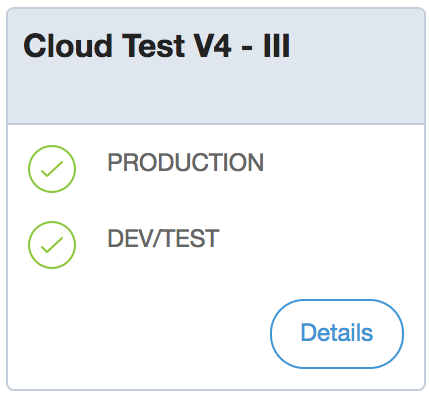

These release notes cover changes to deployment to [Mendix Cloud](/developerportal/deploy/mendix-cloud-deploy). There are separate release notes for other deployment targets, see [Deployment](deployment) release notes page for further information.

For information on the current status of deployment to Mendix Cloud and any planned releases see [Mendix Status](https://status.mendix.com/).

## 2020

### November 5th, 2020

#### Improvements

* We added support to generate 1024x1024 App Store icons for iOS.

#### Fixes

* We resolved an issue where an incorrect debugger password was sometimes shown for Mendix Cloud v4 apps in the Developer Portal. This meant that customers were not able to connect to the debugger. (Ticket 105317)

### October 26th, 2020

#### Fixes

* We resolved an issue where [HTTP headers](https://docs.mendix.com/developerportal/deploy/environments-details#http-headers) were only returned for a successful request. You will have to redeploy your app to apply this fix. (Tickets 94915 and 107140)

    See [Mendix Buildpack Releases](https://github.com/mendix/cf-mendix-buildpack/releases) on *GitHub* for more information.

### October 22nd, 2020

#### Improvements

* We are in the process of migrating the alerting service to our internal infrastructure to improve maintainability. Your alerts will continue to operate in the same way after the migration.
* As part of the migration the existing alert history will be deleted. The alerts history tab will only contain those alerts which have been triggered since the migration.

* We added the ability for the technical contact to download a list of [node permissions](/developerportal/deploy/node-permissions) as a CSV to assist with audits
* We added information about the size of backup files.

### October 5th, 2020

#### Improvements

* In response to user feedback, we changed the way that you can control the target environment when deploying apps from Studio Pro
    * You can now choose only to build the MDA without deploying to an environment
    * The setting of the target environment (for Technical Contacts only) has been moved from the individual Environment Details pages to the Environments page of the app

### September 22nd, 2020

#### Improvements

* We have added the ability for Technical Contacts to download the activity log from an environment.
* On some of the Developer Portal pages (*Environments*, *Mobile App*, *App Services*, *Metrics*, *Alerts*, *Logs*, *Backups*, and the *Node Permissions* tab of *Security*) we have split the **Edit App** button into two separate buttons: **Edit in Studio** and **Edit in Studio Pro**.
* We removed the ability to build PhoneGap hybrid applications through the Developer Portal. The PhoneGap Build service is removed by Adobe on 1 October, so this action would have failed after this date. You can still build your hybrid app locally.

#### Fixes

* We resolved an issue where transports which failed were not reported correctly to the customer. (Ticket 106033)
* We resolved an issue where memory could not be scaled above 16GiB even though 32GiB was available. (Ticket 101035)
* We resolved an issue where the documentation field was empty when editing a constant in the Developer Portal, even though there was documentation in the model. To see the documentation, you will need to redeploy your app. (Tickets 78758, 78958, 79212, 79359, 92954, 93107, and 100756)

### September 17th, 2020

#### Improvements

* We improved the way that the SSL/TLS connection is established to the database instance in Mendix Cloud **v4**. Now the application will verify that the Subject Alternative Name attribute(s) or the Common Name attribute of the database server certificate is matched against the database host name.

{}This change will take effect the next time you deploy your application.{}

### September 15th, 2020

#### Fixes

* We fixed an issue where some customers were getting JVM heap size out of memory errors for applications with a Studio target set. (Tickets 106848, 106966)

    {}You must restart the affected environment to apply this fix.{} 

### September 14th, 2020

#### Announcement - Deprecation of HTTPS SSL/TLS weak ciphers from **December 1st, 2020**

To improve the security of the HTTPS connections made to apps in Mendix Cloud v4 we [enabled TLSv1.3 in February this year](#tls-v1_3). Since then more than 50% of the requests to Cloud v4 apps have been served over TLSv1.3.

To further improve the security of the HTTPS connections to apps in Mendix Cloud v4 we are deprecating and stopping support for block ciphers. Block ciphers are considered weak.

**On December 1st, 2020**, we will stop technical support for **TLSv1.2 Block ciphers (CBC)** for HTTPS connections to apps in **Mendix Cloud v4**.

**What this means for your Mendix apps**

Stopping support for TLSv1.2 Block ciphers (CBC) means that old clients will not be able to connect to your Mendix app any more.

Some examples of clients which will no longer be supported are:

* Java 7 (Mendix 5)
* Internet Explorer version 11 on Windows 7
* Internet Explorer version 11 on Windows 8.1
* Safari before version 9 on OS X 10.11
* Safari before version 9 on iOS 9

**Test your clients**

You can test whether your client (browser or integrating client) will be able to connect to your app after December 1st, 2020, by going to [tls-check.mendix.com](https://tls-check.mendix.com/).

**What we continue to support (expert details)**

SSL/TLS ciphers that are still supported for HTTPS connections after December 1st, 2020:

**TLSv1.3**

* `TLS_AES_128_GCM_SHA256`
* `TLS_AES_256_GCM_SHA384`
* `TLS_CHACHA20_POLY1305_SHA256`

**TLSv1.2**

* `TLS_ECDHE_RSA_WITH_AES_256_GCM_SHA384`
* `TLS_ECDHE_RSA_WITH_AES_128_GCM_SHA256`
* `TLS_ECDHE_RSA_WITH_CHACHA20_POLY1305_SHA256`
* `TLS_DHE_RSA_WITH_AES_256_GCM_SHA384`
* `TLS_DHE_RSA_WITH_AES_128_GCM_SHA256`

### September 4th, 2020

#### Improvements

* We have added *used storage space* to the Database Node Disk Usage graph in Mendix Cloud v4. See [Trends in Mendix Cloud v4](/developerportal/operate/trends-v4#Trends-dbdfabs) for more information.

### August 28th, 2020

#### Fixes

* We fixed issues related to the [Deploy to Licensed Cloud Node](/refguide/project-menu#deploy) flow in Mendix Studio Pro:
	* We rolled back the restriction for Mendix Cloud v3 apps in the [Deploy to Licensed Cloud Node](/refguide/project-menu#deploy) flow in Mendix Studio Pro.
	* We improved the error messages for Mendix Cloud v4 apps that appear when you deploy from Studio Pro with no [Mendix Studios Target](/developerportal/deploy/studio-deployment-settings#target) set or you do not have sufficient privileges to deploy to the Studios target.
	* We fixed an issue where you were able to log in as a **Demo User** to the Studios target. Please note that in this scenario, you have to clear the Studios target and redeploy to the affected environment. The target can then be set after redeploying. (Ticket 106312)

### August 26th, 2020

#### Improvements

* We improved the error handling and feedback of the scale app functionality for Mendix Cloud v4. (Ticket 103304) 
* We fixed an issue where some customers were not able to access the [Deploy APIs](/apidocs-mxsdk/apidocs/deploy-api). (Ticket 103241)
* We have modified the [Deploy to Licensed Cloud Node](/refguide/project-menu#deploy) flow in Mendix Studio Pro. When **Deploy to Licensed Cloud Node** is selected in Mendix Studio Pro, your application will automatically be deployed to the *Mendix Studios Target* environment of your licensed node. This deployment will include a restart of that environment. It is now only possible to deploy Mendix Cloud v4 applications which have a [Mendix Studios Target](/developerportal/deploy/studio-deployment-settings#target) set. Please note that you will get an error message if you deploy from Studio Pro when no **Mendix Studios Target** is set.

#### Fixes

* We fixed an issue where some customers were unable to manually add certificates to [access restriction profiles](/developerportal/deploy/environments#asp). (Ticket 102615)

### August 7th, 2020

#### Fixes

* We fixed an issue where some customers did not receive an SMS for two-factor authentication. (Ticket 104252) 

### July 30th, 2020

#### Fixes

* We fixed an issue where users did not see changes they made to node permissions. (Tickets 104154 and 104642)

### July 22nd, 2020

#### Fixes

* We fixed an issue where trends graphs were not being updated with the latest data. (Ticket 102400)

### July 16th, 2020

#### Improvements

* We added the ability to set the `SameSite` value on cookies to `None` for existing apps. This enables apps to run in iframes in browsers where the default SameSite setting for cookies is `Lax` or `Strict`. (Tickets 97187, 97190, 97699, 97701, 97900, and 98507)
    *  This is implemented through the `SAMESITE_COOKIE_PRE_MX812` custom environment variable. For more information see [Running Your App in an Iframe](/developerportal/deploy/environments-details#iframe) in the *Environment Details* documentation.

### July 8th, 2020

#### Fixes

* We resolved an issue where deactivated users were still shown in the [Node Permissions](/developerportal/deploy/node-permissions) tab of the Security page for an app. (Tickets 90744 95319, 97722, 98474, 99978, 100493, 101595, 103007, and 103549)
* We resolved an issue where you could not change the role of the inbuilt administrator account for apps deployed to the cloud. (Tickets 87013 and 87605)
    {}You will still need to change the password of the administrator account for the new role to be assigned to the administrator. See the [User Role](/refguide/administrator#user-role) section of *Administrator* for more information{}
* We resolved an issue where an incorrect debugger password could be displayed for Mendix Cloud **v4** when the **Show Debugger Information** button was clicked on the Environment Details page. (Ticket 99469)

### July 2nd, 2020

#### Improvements & Fixes

* We have changed the way that the *unused java heap* metric is calculated to make the data more accurate.
	* This also fixes the issue where this metric could have a negative value (tickets: 92998, 93241, 93725, 94560, 99308, 99979, 100086, 101004, 101429, 102260, & 103225).

This value is displayed in the following graphs in Metrics for Mendix Cloud v4:

* as **unused** in [JVM Object Heap](/developerportal/operate/trends-v4#a-name-trends-appmxruntimejvmheap-a-4-4-jvm-object-heap)
* as **unused java heap** in [JVM Process Memory Usage](/developerportal/operate/trends-v4#a-name-trends-appmxruntimejvmprocessmemory-a-4-5-jvm-process-memory-usage)

{}This change will take effect the next time you deploy your application.{}

{}You may see a large increase in the size of the unused java heap metric when this change is applied. This is a consequence of the new calculation and not a change in the memory usage of your app.{}

### June 17th, 2020

#### Fixes

* We fixed an issue where manual backups on Mendix Cloud v3 did not correctly update the status in the Developer Portal when they completed. (Tickets 97485, 97573, 97577, 97748, 97819, & 98313)
* We fixed an issue where some valid certificate authorities could not be uploaded. (Tickets 98150 & 100271)
* We made some changes to the Mendix Cloud v3 [Trends](/developerportal/operate/trends) graphs.

### June 16th, 2020

#### Improvements

* We introduced new alerts for Mendix Cloud v4.
    * Database IOPS Burst Balance, based on the graph [Database IOPS Burst Balance](/developerportal/operate/trends-v4#Trends-dbmxdatabaseburstbalance)
    * Database Freeable Memory, based on the graph [Database Node Operating System Memory](/developerportal/operate/trends-v4#a-name-trends-dbmemory-a-5-5-database-node-operating-system-memory)

### June 4th, 2020

#### Improvements

* We introduced a new graph in the **Trends** metrics for Mendix Cloud v4. This shows the **database burst balance**. See [Database Burst Balance](/developerportal/operate/trends-v4#Trends-dbmxdatabaseburstbalance) in the *Trends in Mendix Cloud v4* document for more information.
* In Mendix Cloud v4 we introduced changes to the Access Restriction Profile (ARP) Certificate Authorities (CAs). These changes allow you to:
    * Have stricter access restrictions by allowing the selection of intermediate certificates instead of the root
    * Use different root certificates for each path
        {}Existing configurations will not be changed and environments can be restarted safely.  To migrate to the new ARPs, you must remove **all** existing ARPs and replace them with *clones* that you have edited using the latest Developer Portal. In other words **Clone** the existing ARPs, **Edit** the CAs, and **Apply** the new ARPs to all paths.{}
        For more information see [How To Restrict Access for Incoming Requests](/developerportal/deploy/access-restrictions).

    You will need to redeploy your app in order to apply the new ARP(s).

### May 1st, 2020

#### Improvements

* For [Mendix Cloud Dedicated](https://www.mendix.com/evaluation-guide/app-capabilities/mendix-cloud-overview#mendix-cloud-vpc), we have added the ability to whitelist outgoing IP addresses.

### March 17th, 2020

#### Improvements

* We have updated the environment details and backups screens for Mendix Clouds to show a more precise region, and the location of the secondary backup.

### March 2nd, 2020

#### Improvements

* Restoring data on the Mendix Cloud now takes place asynchronously. This means the following:
    * You can continue working in the Developer Portal while your backup is restored
    * You will be unable to stop or start your app while the backup is being restored
    * Your environment details page will display a message while the backup is being restored
    * The environment activity log will indicate when the restore has completed
* New Deploy API calls have been added. These will be added to the [Deploy API](/apidocs-mxsdk/apidocs/deploy-api) documentation shortly.
* You will now be warned that you cannot restore a file-only backup to Mendix Cloud. You can only restore backups which include the database.

### February 27th, 2020{#tls-v1_3}

#### TLSv1.3 Support for Mendix Cloud (All Regions)

* Mendix Cloud v4 and Mendix Cloud v3 now support TLSv1.3. TLSv1.3 improves the speed and security of HTTPS connections.

### February 17th, 2020

#### TLSv1.3 Support for Mendix Cloud v4 Free Tier EU

* We enabled TLSv1.3 support in Mendix Cloud v4 Free Tier EU. TLSv1.3 improves the speed and security of HTTPS connections.

### January 21st, 2020

#### Fixes

* We fixed an issue where, if the data type of a constant was changed in the app model, it was not changed in the Developer Portal. This meant that validation sometimes failed and the app could not be started. (Ticket 88425)
* We fixed an issue on the page where you select a node to deploy your app, where the app name and the link to the Environments page disappeared.
* We corrected the text of the welcome email for new cloud environments which gave incorrect instructions for deploying your app. (Ticket 93145)

### January 7th, 2020

#### Improvements

**3DES Ciphers Disabled for Mendix Cloud v3**

* We have implemented a change to our Mendix Cloud v3 infrastructure so that incoming SSL connections no longer support 3DES ciphers. 3DES ciphers are considered insecure.

## 2019

### December 23rd, 2019

#### Improvements

* We improved the stability and performance of Mendix Cloud deployment. (Tickets 86800, 92241, 92426)

### November 21st, 2019

#### Improvements

* We implemented a number of improvements to enable Mendix Support to provide better support if there are deployment issues

### November 7th, 2019{#20201107}

#### Improvements & Fixes

* We have improved the stability and performance of Mendix Cloud Deployment and Operations.

    * This also resolved the [known issues noted on October 30th](#ki20201030)

### October 30th, 2019

#### Improvements

* We have upgraded Mendix Cloud Deployment and Operation. It is now a Mendix 7 app.
* You can now mask app constant values so that they cannot be seen in the **Model Options** tab of the **Environment Details**.
* We now warn you on all **OPERATE** and **DEPLOY** pages if a maintenance window has been created to allow updating of the Mendix Developer Portal.

**Known Issue**

* In the **Environments** page, when you click the **Details** button for a **Production** environment and successfully complete two-factor authentication you are redirected to the **first** environment listed for your app, *not the Production environment*. (Ticket 90999)

    * Workaround – Choose the **Details** for the **Production** environment again and you will be taken to the correct environment.
    * Resolved by release on [November 7th](#20201107).

* When you attempt to open an **OPERATE** or **DEPLOY** page in the Developer Portal, you may see a login page. You will need to force a refresh of your page, or clear your browser cache, in order to access the page.

    * Resolved by release on [November 7th](#20201107).

### October 1st, 2019

#### Improvements

* The `X-Client-Certificate` request header has been removed. You can use the `SSL-Client-S-DN` header instead. See [Mendix Cloud HTTP Request Headers](/developerportal/deploy/mendix-cloud-request-headers) for more information.

### September 27th, 2019

#### Improvements

**Update of `*.mendixcloud.com` SSL/TLS certificate**

We have renewed the SSL/TLS certificate for `*.mendixcloud.com`. Browsers like Mozilla Firefox, Microsoft Edge, Google Chrome, and Internet Explorer automatically trust the new certificate. In those cases, there is nothing you have to do.

{}
If you run services that connect to a `*.mendixcloud.com` endpoint AND use a static or outdated trust store, we advise you to update them. The new SSL/TLS certificate can be downloaded [here](attachments/mendixcloud.com-2019-09-12.crt.txt).
{}

**Current Certificate Details**

* Subject: `*.mendixcloud.com`
* Issuer: C = US, O = DigiCert Inc, OU = www.digicert.com, CN = RapidSSL RSA CA 2018
* Validity: Jan 3 00:00:00 2018 GMT - Oct 2 12:00:00 2019 GMT
* SHA-256 Fingerprint: F8:FD:79:7A:73:48:E5:B0:9E:70:42:2B:15:D0:8C:D4:5E:F3:66:74:F8:B7:CF:5A:36:16:07:0D:E8:73:BE:8A
* SHA-1 Fingerprint: 78:0D:25:B2:86:12:64:BA:A0:F0:0C:C3:DD:88:C8:32:55:BD:C0:F8

**New Certificate Details**

* Subject: `*.mendixcloud.com`
* Issuer: C = US, O = DigiCert Inc, OU = www.digicert.com, CN = RapidSSL TLS RSA CA G1
* Validity: Sep 12 00:00:00 2019 GMT - Nov 10 12:00:00 2021 GMT
* SHA-256 Fingerprint: AE:55:1D:88:32:E1:7E:BF:AB:0D:F3:2F:57:57:C8:98:8D:87:3F:E8:F6:5F:A6:09:82:EA:37:F7:12:25:A5:D3
* SHA-1 Fingerprint: 5E:4D:05:9B:FE:54:3F:B6:D8:A4:D7:86:7F:3B:50:9A:EE:09:35:8F

### September 5th, 2019

#### Fixes

* We fixed an issue that caused the wrong Technical Contact information to be shown on the app's *General* page in the Developer Portal. (Ticket 84852)
* We added a feedback message when you try to restore a backup while the backup is still being created. (Ticket 85786)

### August 23rd, 2019

#### Improvements

* We improved the performance of the Environments page by reducing the number of remote requests needed.

### July 25th, 2019

#### Improvements

* We reordered and improved the Trends pages of operating metrics to improve the user experience.
* We improved the performance of calculating the environment health status.
* We improved the ability to recover from a failed deployment in the Free App cluster.

### June 27th, 2019

#### Improvements

* We added a confirmation dialogue when you delete Custom Headers.
* We made general performance improvements.

#### Fixes

* We fixed an issue which prevented the adding of comments to a backup. (Ticket 81993)
* We updated the **Read documentation** link in the Mendix Cloud v4 metrics page to point to the right document. (Ticket 82130)
* We added appropriate feedback if you try to upload a client certificate which is unsupported because it is not encoded in PEM. (Ticket 82299)
* We fixed an issue which prevented the offboarding of a single environment if you wanted to retain other environments in the Mendix Cloud node. (Ticket 83189)

### June 15th, 2019

#### Improvements

* All **HTTP Request Headers** set by the Mendix Cloud which available to app developers are documented in [Mendix Cloud HTTP Request Headers](/developerportal/deploy/mendix-cloud-request-headers).
* The `X-Client-Certificate` request header that is currently present is deprecated and will be removed in a later stage. Any application relying on this header must switch to the new `SSL-Client-S-DN` header. See the previously mentioned documentation for more information.

### May 17th, 2019

#### Fixes

* We made several changes to our maintenance window management to ensure that environments are completely locked during maintenance.

### May 16th, 2019

#### Improvements

* We redesigned the App User management page of the Developer Portal for Mendix Cloud environments which are enabled for single sign-on (SSO).

### May 9th, 2019

#### Fixes

* We fixed an issue where the Mendix feedback widget stopped working for apps deployed to Mendix Cloud because of a change to HTTP Headers. (Ticket 83001)

### May 7th, 2019

#### Improvements

* For Mendix Cloud v4, we have extended the range of HTTP Headers which are supported in the Developer Portal. Previously, only *X-Frame-Options* was supported. For more information, see [Environment Details](/developerportal/deploy/environments-details#http-headers).
	* If you add or change these settings, you will need to redeploy your app before the changes take effect.
* For Mendix Cloud v4 deployments of Mendix apps version 7.23.1 and above, we now support AdoptOpenJDK, and the relevant Java version is displayed on the Environment Details page.
* We clarified which logs can be downloaded from the Developer Portal by changing the button text from *Download Today's Log* to *Download Current Log*

#### Fixes

* We resolved an issue where some team members were not visible in Node Permissions after an app was relinked (Tickets 70285, 79708, 79824, 80557, 81713, 82591).

### May 3rd, 2019

#### Improvements

* We released **Free Edition** of Mendix. This removes the limit of 10 named users on Free Apps which are deployed to the Mendix Cloud. To take advantage of the *Free Edition* for an existing app, you need to redeploy your app.

### April 4th, 2019

#### Fixes

* We have fixed an issue with changing [Node Permissions](/developerportal/deploy/node-permissions).

### March 29th, 2019

#### Improvements

* We have introduced *Flexible Environments* for Mendix Cloud v4. This means that you can have more than three environments for your licensed node. More information is available [here](/developerportal/deploy/mendix-cloud-deploy#flexible-environments). If you need more than three environments, contact [Mendix Support](/developerportal/support/). Features of Flexible Environments include the following:
    * You can search for the environment for which you want to see details
    * The Technical Contact can rename the environments
    * The Technical Contact can re-order the environments
* As part of support for Flexible Environments we have made the following changes:
    * When deploying your application via the Developer Portal you can choose the destination environment
    * When viewing metrics, logs, backups, etc. you will have to choose the environment using a drop-down rather than clicking directly on the environment you want

#### Other Improvements

* We have added the ability to manage tags through the Developer Portal, in addition to the current method which involved using the API

### March 7th, 2019

#### Fixes

* We have fixed the issue where custom domains were not getting bound to environments if they were added before the environment was initialized. (Tickets 78324, 76159, 76439, 77366, 77504, 78324, 78484)
* We have fixed the issue which caused the "Running Since" value in the Environment Details to be updated after transporting an MDA to an environment but where the process was canceled without restarting the environment. (Ticket 76893)
* We have fixed the issue regarding unclear application version numbering when building an MDA packages. The "App latest tag" and "Branch latest tag" have been replaced with "App highest tag" and "Branch highest tag" respectively to represent the values more precisely. (Ticket 78699)
* We have fixed the issue which meant that license information was displayed incorrectly in the Developer Portal for some Mendix Cloud v3 production environments. (Ticket 78229, 80336)

### February 6th, 2019

#### Fixes

* We addressed and fixed an issue which caused some Mendix Cloud v4 backups to be duplicated.
* We fixed a problem on Mendix Cloud v3 which prevented Path-based Access Restrictions from working with multiple TLS certificate authorities. (Ticket 77282)
* We fixed the problem which prevented users in the Pacific Time Zone from being able to download the current day's logs. (Tickets 78325, 78586, 79119, 79162, 79427)
* We addressed and solved a problem which meant that some sandboxes could not be resumed after getting stopped.
* We have fixed the issue that prevented apps with ACS (AppCloudServices) from being deployed using the Web Modeler. (Ticket 76888)

### January 28th, 2019

#### Improvements{#tls}

**TLS v1.0 & v1.1 Disabled for Mendix Cloud v4**

* We have implemented a change on our Mendix Cloud v4 infrastructure so that incoming connections that do not support TLS v1.2 or higher will stop working. This effectively means that TLS v1.0 and v1.1 are disabled, and Mendix Cloud v4 now has an [A+ rating at SSL Labs](https://www.ssllabs.com/ssltest/index.html) again.

### January 3rd, 2019

#### Fixes

* We fixed issues regarding incorrect values for some application constants for some Mendix Cloud v4 and v3 applications. (Tickets 77302, 77390, 77505, 77797)
* We addressed and fixed an issue that prevented some Mendix Cloud v3 users from being able to change Java version of their applications. (Tickets 77251, 77652)

## 2018

### December 1st, 2018

#### Fixes

* We fixed an issue that caused deployments for some users to hang. (Tickets, 76691,76700)
* We fixed a security issue that allowed app team members without deploy access to see the debugger password. (Ticket 76172)
* We fixed a security issue that allowed app team members without deploy access to see application constants. (Ticket 76171)
* We addressed and fixed an issue that prevented some users from being able to deploy to their environments. (Tickets 77060, 77122)

### November 14th, 2018

#### Fixes

* We fixed an issue in which [custom error pages](/howto/front-end/custom-error-page) did not work for online applications in Mendix Cloud v4.

### November 1st, 2018

#### Fixes

* We fixed an issue that caused an error while creating a backup in Mendix Cloud v4. (Tickets 70086, 70090, 75936, 75996)

### October 30th, 2018

#### Improvements

* Cloud v3 PostgreSQL backups are now created with `pg_dump` version 1.13. This version has been shipped with PostgreSQL since March 2018 (PostgreSQL 10.3, 9.6.8, 9.5.12, 9.4.17, and 9.3.22). The side-effect is that it is not possible to restore these PostgreSQL backups using a `pg_restore` version below 1.13. The error that you will receive is `pg_restore: [archiver] unsupported version (1.13) in file header`. To fix this issue, upgrade your PostgreSQL client software to one that includes newer versions of `pg_dump` and `pg_restore`.

### October 17th, 2018

#### Improvements

* It is now possible to pause and resume downloading backups for Mendix Cloud v4 applications.
* We have overhauled the scaling user interface to make it more intuitive. (Ticket 67557)
* We addressed an issue that caused live logging to freeze from time to time. The fix has been confirmed on all mainstream browsers except for Internet Explorer, which we still are investigating. (Ticket 66418)

#### Fixes

* We fixed an issue which caused subdomain validation errors for sandbox environments. (Ticket 56574)

### August 21st, 2018

#### Fixes

* We have fixed a bug that was causing some Mendix Cloud v4 users to unsubscribe from alerting lists after changing environment privilege settings.
* We have addressed an issue that caused some Mendix Cloud v4 users to not to be able to see their archived logs from previous day.

### August 13th, 2018

#### Fixes

* We improved the feedback messages in the case of a startup failure.
* The status page link in alert emails now redirects you to the corresponding alerts page in the Developer Portal.
* We solved an issue that caused blank error messages during backup creation.

#### Improvements

* A new API call for accessing the logs of Mendix Cloud v4 applications is now available. Detailed information can be found in the [Deploy API](/apidocs-mxsdk/apidocs/deploy-api).
* It is now possible to add custom environment variables via the Developer Portal to set up application metrics with Datadog and Telegraph.
* All the log levels in the Developer Portal (as in, INFO, ERROR, TRACE, DEBUG, WARNING, CRITICAL) are now also available in Datadog.
* The Postgres database size can also be observed in Datadog after enabling it in the Developer Portal.
* The **Environments** breadcrumb in **Deploy** > **Environments** > environment is now a link that redirects you back to the **Environments** page.

### August 9th, 2018

#### Improvements

* Alerts are now sent when a Mendix Cloud v3 app or database runs out of system memory.

### August 8th, 2018

#### Improvements

Over the last few months, we have made several improvements to our alerting stack of Mendix Cloud v4 applications to improve the timeliness of alerts. As a consequence, we are reducing the runtime heartbeat timeout from 15 minutes to 3 minutes. We are doing this to ensure that you do not accidentally miss any alerts. We will be monitoring your applications for false positives.

In some cases, you may still experience false positives for the runtime heartbeat alert. If that happens, you can resolve the problem by doing a transport and then a restart of the app.

### July 23rd, 2018

#### Improvements

* We added alerts on database connections and on internal alerting problems.
* We added Telegraf as a sidecar for monitoring.

#### Fixes

* We fixed problems with the uploading, downloading, and restoring of backups with very large databases in Cloud v4.
* We fixed the problem wherein 404, 403, and 503 responses to a REST call translated to an HTML error page.

### July 17th, 2018

#### Improvements

* We improved the deployment speed for the Asia region. The feature is not enabled by default, so you need to request it if necessary.
* We implemented tags on environments for metrics in Datadog. It is now possible to add custom tags to metrics that will serve as selection criteria for grouping environments. Environment tags can be created, retrieved, and deleted using APIs. Detailed information can be found in the [Deploy API](/apidocs-mxsdk/apidocs/deploy-api).
* We changed the yearly overview of trends to quarterly in the Developer Portal for v4 applications.
* It is now possible for an Operations Manager to reorder environments.
* Custom offline pages are now immediately active after the transport of a new deployment package.

#### Fixes

* You now get a warning if you try to restore a backup into a small environment. (Ticket 63367)
* Creating a backup via REST API no longer returns error message 500 when it succeeds. (Ticket 65762)

### July 2nd, 2018

#### Improvements

* We improved the stability of the alerting stack.

### June 26th, 2018

#### Fixes

* We fixed the bug that allowed users to start an application during a restore.

### June 15th, 2018

#### Improvements

* We added support for client certificate validation in the **Access Restriction Profile** for Mendix Cloud v4 deployments.

#### Fixes

* We fixed the incorrect message that was shown during the scaling of a non-deployed environment. (Ticket 64799)
* Retrieving an environment package via REST API is no longer broken. (Tickets 65348, 65370)
* We reintroduced copy privileges for operations.

### June 11th, 2018

#### Improvements

* We added alerts for when an application runs out of memory or otherwise unexpectedly crashes. This is only applicable to Mendix Cloud v4 deployments.

### June 8th, 2018

#### Improvements

* We have introduced scaling via API for Mendix Cloud v4. It is now possible to scale Mendix Cloud v4 applications via the Deploy API. For instructions, see the [Deploy API](../../apidocs-mxsdk/apidocs/deploy-api).
*  We have aggregated the health icons for the acceptance and test environments in the **Nodes** dashboard and **Company Admin** screen.

	{}
	{}

* The health icon will display the health status of the environment that is in the worst condition. This is to prepare for an upcoming release that will support more than three environments per application.

#### Fixes

* We fixed an issue in our alerting infrastructure that prevented some Mendix Cloud v4 users from receiving alerts when their apps ran out of memory.
* We fixed the problem that caused the Mendix Cloud v4 **Metrics** legend to remain on the screen even if the user navigated to a different page.
* We fixed the health icon statuses of the environments so that they reflect the environment health with minimum delay.

### May 22nd, 2018

#### Fixes

* We fixed the bug in Mendix Cloud v4 that prevented users from using nested custom domains. Now you can have one domain (for example, `app.example.com`) and one on `microservice.app.example.com`.

### May 5th, 2018

#### Improvements

* It is now possible to add a comment as an optional parameter to the backup while generating one via REST API.
* It is now possible to see the Mendix Runtime version in response to a "Retrieve Environment Package" API call.

#### Fixes

* We fixed an issue that prevented our Mendix Cloud v4 users from uploading and restoring big backups (larger than ~30GB) to their environments. It has been tested with the archives (~90GBs) on Mendix Cloud v4.
* We addressed and fixed an issue that caused Mendix Cloud v4 users in the Asia Pacific time zone to receive the wrong timestamps when they downloaded daily logs.

### April 9th, 2018

#### Improvements

* As of today, Mendix Cloud v4 users will be able to create and restore backups of their environments via REST API. Detailed information can be found in the [Deploy API](/apidocs-mxsdk/apidocs/deploy-api) documentation.
* The results of **Retrieve Environments** and **Retrieve Environment** REST API calls will now also include the model version and Mendix version information of the applications for which the call is being made.

### March 21st, 2018

#### Improvements

* Applications in Mendix Cloud v3 that were running for more than 248 days started to use 100% CPU due to an unknown bug in either the Mendix Runtime, the JVM, or a combination thereof. A very small number of applications have been impacted by this, as most applications are updated much more often, and every deployment restarts an application. However, this problem has been causing performance issues for both the affected applications and our infrastructure. As a workaround, we will now automatically restart apps that have been running non-stop for 247 days between 01:00 and 07:00 local time of the cloud region. If this happens to an application, you will see a message in the application log.

### March 20th, 2018

#### Improvements

* We enabled ICMP (ping) packets for our Mendix Cloud v4 load balancers. Now you can use tools like ping, traceroute, and mtr to debug connectivity issues from your location to Mendix Cloud v4 applications. Note that packets will not reach the actual application but only the load balancers. You can expect latency in the low single-digit milliseconds between the load balancers and applications.

### March 16th, 2018

#### Fixes

* Users of Mendix Cloud v4 applications will now see a notification if their environment fails to clean properly.
* The health status of newly-created Mendix Cloud v4 applications used to be reflected with a red cross. This has been fixed.

#### Improvements

* We have improved database storage alerts for Mendix Cloud v4 applications. If you subscribed to your applications' alerts, you will receive a warning alert when you have less than 25% disk space on your applications' databases and a critical alert when disk space is below 10%. You need to re-deploy your application to activate this alert.
* Live logging for Mendix Cloud v4 applications is here! You can now view logs neatly and in real-time.

### March 13th, 2018

#### Improvements

* In the Mendix Cloud, we have renewed the SSL/TLS certificates for *.mendixcloud.com*, *.mxapps.io*, and *.mendix.com*.

### March 1st, 2018

#### Fixes

* Switching between environments in the **Metrics** menu of Mendix Cloud v3 apps is now fixed.
* We fixed the synchronization problem that prevented Mendix Cloud v3 users from seeing their latest nightly backups.

### February 27th, 2018

#### Fixes

* When uploading a backup in Mendix Cloud v3, double-clicking the **Restore** button was causing the UI to break. This is now fixed.

### February 23rd, 2018

#### Improvements

* In Mendix Cloud v4, the native memory usage of applications was very high. This led to crashes and automatic restarts, especially on containers with 1GB of memory. We activated an advanced memory limiting setting for glibc (`MALLOC_ARENA_MAX`), which will prevent this behavior. The fix will automatically be applied to all apps that are transported and restarted as of today.

### February 22nd, 2018

#### Improvements

* We implemented a popular feedback item – the platform will now remember your selected environment while switching between screens.
* It is now possible to see the database details such as **DB Plan Space**, **Plan Cores**, and **Plan Memory** of a Mendix Cloud v4 application.
* Scaling Mendix 7 apps is now simplified and faster.

#### Fixes

* Backup creation was reported as a backup restore action in the activity feed, which is now fixed.
* We addressed and fixed an issue where a backup activity item was added each time the backups page was viewed.
* The environment details list was loading slowly for some of our users, which is now fixed.

### February 19th, 2018

#### Improvements

* In Mendix Cloud v4, we have enabled logging slow database queries. This is the custom runtime setting `LogMinDurationQuery`, and it is useful for finding performance bottlenecks in your application. The value is set to a default of 10,000 ms, which was also the value on Mendix Cloud v3. You can customize this setting by using the **Runtime** tab on your environment details screen under **Environments**. To start using this feature on a Mendix Cloud environment, transport your deployment package and restart your app.

### January 25th, 2018

#### Fixes

* The target cloud of a Free App is now shown correctly in the **Environments** section.
* Happy new year! We addressed an issue where backup downloads were logged as restored backups in the activity log.
* If you had a **Backups** section of your apps open in multiple tabs, you saw multiple activity log entries for each action taken. That's fixed now.
* The restart and stop/start activities are now distinctly defined in the **Activity** section.
* Branches of an application are sorted alphabetically, but **Main Line** is now always on top.
* The broken styling of the **View Current Log** button for a Free App has been fixed.

#### Improvements

* The **Alerts** section in Mendix Cloud v4 apps will now include health check details, just like for Mendix Cloud v3 apps.

## 2017

### December 29th, 2017

#### Fixes

* In Mendix Cloud v4, the **archived log** function returned logs from a broader time range than what the user had selected (for example, the logs for one day returned log data from two days). This was fixed.

### December 22nd, 2017

#### Improvements

* We are introducing a **Restart** button for Mendix Cloud environments. This is useful for preparing configuration changes and activating them with only one click.

#### Fixes

* It's now possible to scale Mendix 6 applications on Cloud v4. Previously, this was only possible with environments that run Mendix 7 apps. With Mendix 6 apps, you can only scale the allocated memory, but not the amount of instances.
* Big backups are now welcomed on v4 environments, as we fixed an issue that prevented users from uploading backup packages larger than 5 GBs.
* We fixed an issue where some Mendix Cloud v3 users were not able to set a specified Java version for environments.
* Hovering over a Mendix Cloud environment status icon will now give more information about the environment's health.

### December 13th, 2017

#### Fixes

* The JVM Process Memory graph in Cloud v4 now also show the native memory of the application.
* The Application Node Operating System Memory graph for Cloud v4 now shows as two lines: total and used. The previous version displayed the total added to the used in a stacked area graph, which was very confusing.

### December 6th, 2017

#### Fixes

* We addressed an issue that prevents Free Apps from being embedded in an iframe.

### November 27th, 2017

#### Improvements

* Free App users now have the option to select between Web Modeler and Desktop Modeler for editing their application models.

### November 15th, 2017

#### Improvements

* Mendix Cloud v4 backups can now be restored to other environments in the same Mendix Cloud node. This is useful when preparing production migrations or for reproducing errors.
* When creating a deployment package from Team Server, the dialog box now shows branches in case-insensitive order, which makes more sense for users.
* Mendix Cloud v4 alert status showed `UNKNOWN` sometimes due to an error. This was fixed and the correct status is now shown.
* In the **Deploy**, **Operate**, and **Backups** pages, you can *finally* use the <kbd>Enter</kbd> key to submit your two-factor authentication code. Happy typing!

### October 20th, 2017

#### Improvements

* Deploying a different version without stopping a running application is also now available on Mendix Cloud v3. Once the deployment is done, you can restart the application with a single click.
* The user experience of backup uploads has been improved for Mendix Cloud v4. It is also possible to manually delete the old backups on Mendix Cloud v4.
* We made a series of minor user experience improvements for metrics on Mendix Cloud v4.

#### Fixes

* When creating a deployment package from Team Server, users will now be able to see the revisions that were committed without the Mendix Modeler.

### October 10th, 2017

#### Improvements

* We removed the backup expiry entries from the activity logs for all applications in the Mendix Cloud, as we found they cluttered the overview and did not provide any useful information to users.

### September 28th, 2017

#### Improvements

* Deployments with almost no downtime: It is now possible to deploy a different version without stopping a running application. Once the deployment is done, you can restart the application with a single click. This is now available for Mendix Cloud v4. For Mendix Cloud v3, this will be available soon.
* Improved the robustness of the Deploy API: Occasional failures that occurred while starting/stopping an environment via the Deploy API no longer occur.
* Improved the stability for transporting deployment packages for Asia-Pacific users for Mendix Cloud v4.
* Environment health indicators for your environments are now much more accurate.

### August 30th, 2017

#### Improvements

* The user interface of the instance/memory slider for Cloud v4 has been improved considerably. Scaling will also appear in the activity log of the application.
* For Mendix Cloud v4, we do no longer show the size of the archived log. The size we displayed previously was wrong.
* The expiry date for Mendix Cloud backups is now visible in the backup list.

### August 22nd, 2017

#### Improvements

* Due to various optimizations, the deployment speed for apps in Mendix Cloud v4 EU is now about twice as fast. The latency for FileDocument read/write actions has also improved for all Mendix Cloud v4 regions.

### August 15th, 2017

#### Improvements

* We enabled path-based access restrictions for all Mendix Cloud v3 apps. This allows users to more easily configure access restrictions on their environments. For more information, see [Access Restrictions](/developerportal/deploy/access-restrictions). Mendix Cloud v4 already has this functionality enabled.

### August 1st, 2017

#### Improvements

* For Mendix Cloud v3, Java will be upgraded, including the most recent security updates. The Java KeyStore has also been updated. It contains trusted root certificates for secure outgoing connections from your Mendix app. For example, with the updated Java KeyStore, you are now able to connect to endpoints that use a certificate signed by [Let's Encrypt](https://letsencrypt.org/). Root certificates that are considered unsecure by Oracle and Mozilla have been removed. Your app will automatically start using a newer Java version and KeyStore when you restart the app. For Mendix Cloud v4, we are still planning the rollout of this fix.

### July 31st, 2017

#### Fixes

* The [Deploy API](/apidocs-mxsdk/apidocs/deploy-api) for apps in Mendix Cloud v4 contained multiple bugs in the start, stop and transport calls. These are now fixed.

### July 18th, 2017

#### Improvements

* For all apps running on the Mendix Cloud, the following HTTP request headers are now available: `SSL-Protocol` (possible values: `TLSv1`, `TLSv1.1`, `TLSv1.2`) and `SSL-Cipher` (for example, `ECDHE-RSA-AES256-GCM-SHA384`). These can be used to block login attempts (for example, `TLSv1` connections). *(Please note that these release notes previously stated the header name was `SSL-Version`, but it should have been `SSL-Protocol`.)*
* Modern browsers are aggressively caching static HTML resources, which can lead to user problems after deploying new versions of applications. Clearing the cache can solve this, but that is a bad user experience. So, for all apps running on Mendix Cloud v3, we have added an explicit `no-cache` header to the resources `/` and `/index.html`, `/login.html`, and `/index[0-9].html`. For Mendix Cloud v4, an `expires` with a negative value was already used, so no changes are required there. We believe this change eliminates most of the browser caching issues we have seen so far.
* You can now restrict access to your Mendix Cloud v4 applications based on IP ranges. This is available for all Mendix Cloud v4 regions and can be configured from the **Network** tab of your cloud environment.

#### Fixes

* When updating the admin user password in the Mendix Cloud, the password policy description was wrong, which led to confusing situations. We updated the text.
* When navigating to **Node Security**, the **App Team** tab no longer disappears.
* Due to a ZIP file encoding change in Mendix 7.5.0, AppServices could not be parsed when deploying to the Mendix Cloud. We fixed this.
* The **View Current Log** button is no longer hidden for Free Apps.

### May 19th, 2017

#### Fixes

* We corrected the backup retention scheme for paid applications on Mendix Cloud v4, and it is now the same as on Mendix Cloud v3.
* The "view current log" functionality for Mendix Cloud v4 applications was empty by default and the **Show all** button needed to be used. It now shows the content right away.

### May 17th, 2017

#### Improvements

* We upgraded the SSL/TLS ciphers for connections to apps in Mendix Cloud v4. These included dropping block-based ciphers (3DES), moving to 2048 bit DH params. Mendix Cloud v4 now has an [A+ rating at SSL Labs](https://www.ssllabs.com/ssltest/index.html).
* We added HTTP/2 support for connections to all apps in Mendix Cloud v3 and Mendix Cloud v4. HTTP/2 is supported by all major browsers and results in more efficient network connections. [Read more about HTTP/2 here](https://http2.github.io/faq/).

### May 4th, 2017

#### Improvements

* Transporting a new deployment package dead-ended in a "Deploy successful" screen. Users are redirected to the environment details screen, which is much more useful.

#### Fixes

* We fixed the failing of large backups in Mendix Cloud v4. Backups will now only fail when the disk of the database is filled up.
* Alert Details now highlights the right menu item.
* Fixed a race condition where two apps created at the same time could get the same domain name.
* Added a warning message before restore backup, to prevent users clearing their environment. Clearing the environment before restoring resulted in a much slower non-incremental restore operation.
* Disabled automatic copying of "Data Snapshots" to empty environments in Mendix Cloud v4 Pro/Enterprise environments. This features is only used in Free Apps. Weak admin passwords in the database snapshot would prevent the app from starting.

### April 1st, 2017

#### Improvements

* We added list backups/download backup operations to the [Deploy API](/apidocs-mxsdk/apidocs/deploy-api).
* We updated the **Security** link from the Deploy/Operate tabs. It now goes to the same page on all pages in the platform.

#### Fixes

* We fixed the status page link in alert emails.
* We fixed an issue where the Free Apps backups page was very slow or resulted in an error in some cases.
* We fixed an issue where the log viewer for Free Apps did not escape HTML, so if the application logged plain HTML, it was interpreted in the browser.
* We fixed an issue where simultaneous snapshot restore jobs from the same environment to two others could lock one of the environments.

### March 20th, 2017

#### Fixes

* The Deploy / Operate sections in the Platform Portal were broken on Internet Explorer 11 due to widget incompatibility, introduced in the previous release. This was already hot-patched in production on March 16th.

### March 13th, 2017

#### Fixes

* Clicking **Operate -> Backups** resulted in errors for a Free App. This has been fixed.

### March 10th, 2017

#### Improvements

* We introduced a new setting in **Node Security**, you can now configure **Monitoring Permissions** separately from **Transport Permissions**. Immediately after this change, we granted all users that had **Transport Permissions** on an environment the **Monitoring Permissions** there as well. From now on, a **Technical Contact** can configure these settings for everyone in the team separately. While we introduced this setting, we revisited the layout of the **Node Security** screen, you now have a simpler interface to change the permissions for each environment.

### February 20th, 2017

#### Improvements

* We removed static information from the log lines in Mendix Cloud v3. Every line before contained `tr10000` and `127.0.0.1`. We removed these fields as they were useless.
