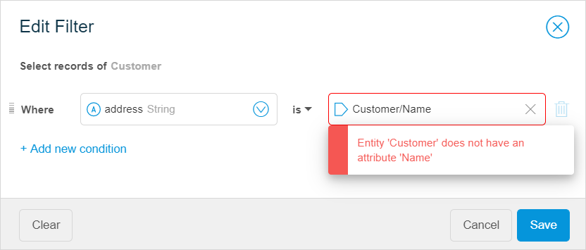
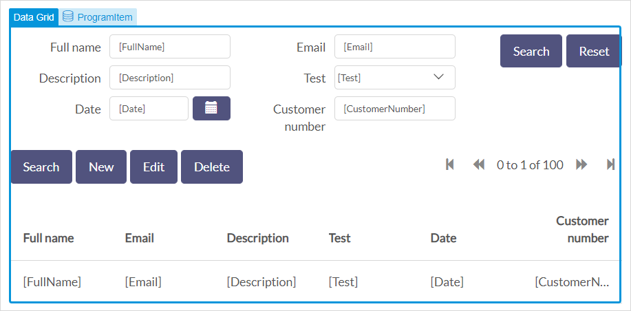

These are the Mendix Studio release notes for apps built with Desktop Modeler/Studio Pro version 7.23. The release notes include all minor versions, patches, and known issues.

For more information on the correlation between Mendix Studio and Desktop Modeler/Studio Pro versions, see [Studio Ranges & Mendix Versions](/studio7/general-versions).

{}
Previously, **Mendix Studio** was called the **Mendix Web Modeler**. With Mendix 8, the **Mendix Desktop Modeler** was renamed to **Mendix Studio Pro**.
{}

For Studio release notes correlated with Studio Pro versions 8.0–8.6, see [8.0–8.6](8.0-8.6). 

For updates on the operational status of Studio as well as deployment features and other Mendix services, see [Mendix Status](https://status.mendix.com/).

## 2021

### February 5th, 2021

#### Deprecations

* Publishing is no longer available in Studio for apps with Mendix version 7. You can either publish your app in Studio Pro or upgrade your app to Mendix version 8 or above. For more information, see [Moving from Desktop Modeler Version 7 to Studio Pro 8](/refguide8/moving-from-7-to-8).

## 2019

### September 6th, 2019

#### Improvements 

* To point you to the correct documentation version, the links from 7.23 version range of Studio now lead to [Mendix 7 Studio Guide](/studio7/). 

### July 29th, 2019

#### New Features

*  In the page editor, it is now possible to add **Input Validation** for input widgets. This means that you can make a certain field mandatory to fill in and specify an message for end-users if validation fails. For example, you can mark the **Full name** field as required for new customers and you can add a message  “Please specify your name to proceed” that will be displayed if they skip the required field.

    

*  To enhance the number of use-cases you can configure in the page editor, we added opportunity to sort items in list views and data grids. You can set a **Sort Order** by adding a sorting rule for a list view or a data grid if their data source is set to **Database**. You can add multiple sorting rules.

    

#### Improvements

* For **App from a spreadsheet**, we no longer discover associations for columns with *Number* format (converted to integer and long types of attributes). If you want associations to be created, you need to save numbers as text in your spreadsheet before uploading it. 
* Adding an attribute value to a **Text** widget right after creating it, now replaces the default value (*Text*) rather than appending it. 

#### Fixes

* For **App from a spreadsheet**, we fixed an issue where an entity and an enumeration had the same name and it resulted into consistency errors. Now when an entity and one or more enumerations share the same name, after the import an underscore and a numeric postfix is added to the name of the enumeration. For example, if both the entity and enumeration are named *Customer,* the enumeration name will be *Customer_1*. If there is an additional enumeration named *Customer*, it will be named *Customer_2*. 

* We fixed an issue where you could still open a Studio disabled app by opening the app URL. 

### July 19th, 2019 ###

#### Improvements

* In the page editor, the **Layout Grid** widget has now been replaced by multiple widgets each representing a layout grid configured with a specific number of columns. This improvement is based on user feedback and makes building (responsive) pages a lot easier. Find the new pre-configured widgets in the **Columns** category of the widgets toolbox in the page editor.

*   You can now add six columns to your page by simply dragging and dropping the **6 Columns** widget from the **Toolbox**, or by adding any column widget to your page and then changing its properties:

    

* For **App from a spreadsheet**, you can now import spreadsheets up to 1 MB.

*  In the domain model editor, you can now specify the text for the user-facing error message when configuring delete behavior for associated entities.
	{}
	{}

#### Fixes
* We fixed an error that occurred when double-clicking a microflow activity that has a consistency error. 
* We fixed an issue where content of input fields was lost when clicking another object in the microflow editor.
* We fixed the issue where, after turning on security for the first time, the login.html file of your app could end up in a broken state.

### July 12th, 2019 ###

#### New Features

* We added support for [Studio Pro 8.0.0 Beta 3](/releasenotes/studio-pro/8.0).

#### Improvements

* In the page editor, you can now use the **Drop Down** widget as an input widget for selecting both enumerations and associations. For the associations, the Reference Selector widget was required before. Now, the Drop Down widget can be used in all cases. This improvement was based on user feedback and makes building data input pages easier and faster.
* We made the following improvements for **App from a spreadsheet**:
  * You can now horizontally scroll tab pages in the **Data Import Preview** screen (useful when a spreadsheet with many sheets is selected as a starting point).
  * We increased the maximum size of spreadsheets that can be imported in Studio to 500 KB.

#### Fixes

* For apps started from a spreadsheet, we fixed the issue where importing data was failing when header names in the spreadsheet were very long.
* For the **Checks** panel, we fixed the following issues:
  * Selecting an error did not scroll the page editor or microflow editor to the related widget or activity, but resulted in an error pop-up window.
  * When previewing or publishing the app, the Checks panel did not display anything the first time consistency errors were reported.

### June 28th, 2019

#### Improvements

* To speed up the process of consistency error solving and to make it easier for you, the page editor will now scroll to the selected widget if it is not visible when you select a consistency error in the **Checks** panel.
* Custom widgets will now have a more relevant name instead of the generic "customWidget1". This is particularly helpful when you fix consistency errors: you can now quickly understand what custom widget an error refers to. 

#### Fixes

* We fixed an issue where a container widget could no longer be selected after removing its contents.
* We fixed an issue where special characters in a spreadsheet preview were displayed as question marks. 

### June 24th, 2019

#### New Features

* On pages, you can now quickly configure the most important properties of many widgets. Simply drag and drop a widget on a page and configure properties in a pop-up window. This feature not only saves your time but also helps you avoid consistency errors.  For more information, the [Quick Configuration of Widget Properties](/studio7/page-editor-widgets#quick-config) section in Widgets. 

		

#### Improvements

* We made the following improvement for **App from a spreadsheet** (for more information on how to create an app with your own data, see  [Starting With Your Own Data](/studio7/start-with-data)):
  * We improved generating entities from your spreadsheet. Now if a worksheet has only one column, Studio will not create associations with it to avoid creating entities without any attributes.
  * When you import an empty spreadsheet, you can now try again and import another spreadsheet. 

  For more information on how to create an app with your own data, see  [Starting With Your Own Data](/studio7/start-with-data).

#### Fixes

* We fixed an issue where the **Preview** button resulted in an error message in case consistency errors were detected.
* We fixed an issue where deleting an association used for filtering data on pages or in microflows showed no error message in filters.
* We fixed an issue where Studio created custom widgets with a wrong configuration, causing the "please update your custom widget" consistency error.
* We fixed an issue where the Edge browser was not be able to load the page editor.

### June 14th, 2019

#### New Features

* We added support for [Studio Pro 8.0.0 Beta 2](/releasenotes/studio-pro/8.0). 

### June 6th, 2019

#### New Features

* You can now start an app based on a spreadsheet. Mendix Studio will generate a fully functional app based on your data!  The data of the spreadsheet will be analyzed and converted into entities, attributes, and associations. Also, pages and navigation items based on your data can be created. Click **Create App** and select **App from a spreadsheet** in the Developer Portal to get started. This is a great way to jump-start your app. It saves you time so that you can focus immediately on extending and tailoring the app to best fit your needs. For more information, see [Starting With Your Own Data](/studio7/start-with-data) in the *Studio 7 Guide*.

#### Fixes

* We fixed an issue where first time users were not able to continue the guided introduction tour after the first step.
* We fixed an issue where the **Properties** tab of a list view with filters resulted in an error if the entity used as the list view’s data source was deleted.
* We fixed an issue where updating a custom widget package did not correctly update all the widgets in it. 

### May 24th, 2019

#### Improvements

*  To assist you in fixing consistency error, the link to [documentation](/studio7/consistency-errors) was added to the **Checks** panel. For more information on the **Checks** panel, see [Checks](/studio7/checks) in the *Studio 7 Guide*. 
*   To prevent you from creating data filters with consistency errors, we added validation in filters. That means that a filter with errors cannot be saved and you will immediately see what the error is. For more information, see [Data Filters](/studio7/filters) in the *Studio 7 Guide*. 
	
	

#### Fixes

* We fixed an issue where Studio could not load custom widgets for apps with model versions 7.23.4 and below. 

### May 17th, 2019

#### New Features

* Mendix Studio now configures the security of any app that you create. That means your data is protected from public access and visible only for users whom you grant access. Moreover, you can configure different roles for different users so that you can optimize the user experience, making sure each user sees exactly what you want them to see.
  How does this work? When you publish your app to the Mendix cloud for the first time, Mendix Studio will auto-configure security so that your data stays secure right from the start. The result is that any user that wants to access your app must use login credentials or will be logged in automatically in case your platform administrator has configured a single sign-on experience for Mendix apps.   
  Auto-configuring security will be done for all apps with Mendix version 7.23.3 and higher that are accessed in Mendix Studio. For more information, see the following documents:
  
  * For citizen developers: read how to use security and app roles in [Security, Roles & Permissions](/studio7/settings-security) in the *Studio 7 Guide*
  * For professional developers: read the details of model changes that are applied when Mendix Studio auto-configures security settings in [Model Changes When Security Is Enabled in Studio](/refguide8/studio-security-enabled) in the *Studio Pro Guide*

### May 10th, 2019

#### New Features

* You are now able to preview your app without publishing it. The **Preview** feature allows you to to verify your own changes and to see how your app will look like for different end-users, without changing the published app in the cloud. As it has a different environment from the published app, you can use the **Preview** to experiment with changes and test them. While building your app, simply click **Preview** to see the effects of your changes. Studio will show you the working app instantly, so that you can see your changes straight away. Studio will also assist you in checking for any consistency errors. Then, when you are ready to share your changes with users of your app, click **Publish** to push the latest version of your app to the cloud. For more information, see [Previewing & Publishing Your App](/studio7/publishing-app) in the *Studio 7 Guide*.

    

*  We have made it very easy to configure filters when showing and retrieving data in your app. In microflows, you can add a filter to the **Retrieve** activity, and in the page editor, it is possible to filter data in a list view and in a data grid.  For more information, see [Data Filters](/studio7/filters) in the *Studio 7 Guide*.

    

#### Improvements

* To avoid confusion, we changed naming of variables and objects in the microflow editor. Previously, the term "variable" could be used in different ways: as a name for a list of objects or as an object itself. This has now been cleared. 
* To improve the user experience of the microflow editor, we added more tooltips for activity properties, so that users are better informed on the available options and related behavior. 

#### Fixes

* We fixed an issue where app publishing was not working in Studio for newly created apps.

### May 2nd, 2019

#### New Features

* We added support for [Studio Pro 8.0.0 Beta 1](/releasenotes/studio-pro/8.0). 

### April 12th, 2019

#### Improvements

* To improve collaboration between Studio users, users that are in the read-only mode can see the changes made by the other Studio user in real-time without the need to refresh the browser page.

### March 29th, 2019

#### New Features

*  We replaced the sync process between Studio and Studio Pro with a new, simplified, process of sharing model changes. It is enabled for apps with Mendix version 7.23.3 and above to experience true  collaborative development within your team. All changes made in Studio are auto-saved, and Studio Pro users get these changes when they click **Update** or **Commit**. For more information, see [Collaborative Development](/refguide7/collaborative-development) in *Version Control* and [Collaborative Development in Studio](/studio7/general-collaborative-development) in the *Studio 7 Guide*. 

    {}Existing apps with Mendix version 7.23.2 or below can continue using **Sync with Studio** until September 2019.
    {}

*  You can now use a [data grid](/studio7/page-editor-data-grid) on your pages. A data grid is a data container that shows a list of objects in a table. For example, a data grid can show all the program items for an event, users can search, add, delete items and perform other functions depending on the settings. For more information, see [Data Grid](/studio7/page-editor-data-grid). 

      

* In the page editor, you can now use the **Association** data source for a list view and a data grid. The list view or data grid is filled with the objects linked to the data view object by an association. For example, you can show all orderlines for a customer. This data source is available when the list view/data grid is placed inside another data container, for example, a data view.  

* We added support for [Desktop Modeler/Studio Pro 7.23.3](/releasenotes/studio-pro/7.23). 

#### Fixes

* We fixed an issue where a custom widget was not correctly shown in the **Toolbox** of the page editor, if this widget no longer existed in a newer package on the Marketplace.

### March 15th, 2019

#### Improvements

* To speed up the process of creating pages, **Pre-fill page contents based on the `<name>` entity** is now checked by default when creating a new page with an entity.

    {}
    {}

### March 8th, 2019

#### New Features

* We added support for [Desktop Modeler/Studio Pro 7.23.2](/releasenotes/studio-pro/7.23).

### February 22nd, 2019

#### New Features

* We added support for [Desktop Modeler/Studio Pro 7.23.0](/releasenotes/studio-pro/7.23) and [Desktop Modeler/Studio Pro 7.23.1](/releasenotes/studio-pro/7.23).

## 2019

### February 1st, 2019

#### Improvements

* You can now resize annotations in the microflow editor, this will improve the user experience. 

### January 25th, 2019

#### Improvements

* To avoid confusion and to make your work in the page editor and the navigation document easier, we have added **Create Object** as an option for the **Open page** on click-action in properties. 

  {}
  {}

  For example, you want a button to open a page with the details of a new location. Your users will fill in the details, save them, and create a new location. To do so, the page needs to be populated with a new data object. If you enable **Create Object** and select an entity, the object of the selected entity will be created and passed to the page. Previously, if you realized that a new object needed to be passed to the page, you had to change the on-click action to **Create Object**. Now you can just enable/disable the switch-button. For more information, see section [2.1 Create Object Option](/studio7/page-editor-widgets-events-section#create-object-option) in *Events Section* in the *Studio 7 Guide*.. 

* To improve user experience we updated the page editor behavior when deleting widgets. Previously, if you deleted a widget, the page would be selected. Now a widget close to the one you have just deleted will be selected. 

* To speed up your work in the page editor, we improved widget copy-pasting in the following ways: 

  * If you copy-paste a widget that is in a container, the pasted widget will be inserted into the container 
  * A newly pasted item is no longer automatically selected

#### Fixes

* We fixed an issue in the microflow editor where the range selection for the **Retrieve** action was updated only if you reloaded the page. 
* We fixed an issue in the microflow editor, when error messages were not shown if your expression contained errors. Now if some elements in your expression are underlined red, you see an error message when hovering over these elements. 

### January 14th, 2019

#### Improvements

* To make your work in the [page editor](/studio7/page-editor) easier, we improved data container highlights in the following ways:

  * If the widget is inside a data container (a data view or a list view), it will be indicated with a data container icon

    {}
    {}

  * We now also highlight a list view you are about to choose when configuring a data view to have the list view as the data source (when the data view listens to the list view)

#### Fixes

* We fixed an issue where text widgets could no longer be dragged after double-clicking them and changing the caption directly on the page.

### January 4th, 2019

#### New Features

* We added support for [Desktop Modeler/Studio Pro 7.22.1](/releasenotes/studio-pro/7.22).

#### Improvements

* For better user experience we improved the drag and drop function: dragging a data container (a data view or a list view) will now also highlight other data containers as possible targets.

#### Fixes

* We fixed an issue where updating custom widgets was not functioning for several widgets (for example, a progress bar). The old version of the widget was still shown in the widgets overview in App Settings.  

### December 21st, 2018

#### New Features

* Upon popular demand, it is now possible to upload images in the SVG format in image widgets in the page editor and in the Theme Customizer.

* In the page editor, we added new settings to the **Design** section of widgets: **Hide On
  Phone/Tablet/Desktop**. When you enable this setting, the selected widget will be hidden from the page in the corresponding view. This can be useful, for example, if you want to show more information or images in the desktop view than in the phone view of the same page.

  {}
  {}

* We added support for [Desktop Modeler/Studio Pro 7.22](/releasenotes/studio-pro/7.22).

#### Improvements

* In the page editor , we renamed the **Typography** category to **Text**. This improvement, based on user feedback, helps you find the right widget much faster. The new category now contains all possible text variants: text, paragraph, page title, and headings.

  {}
  {}

#### Fixes

* We fixed an issue in the domain model where after copy-pasting an entity and trying to publish a consistency error was shown.  

### December 14th, 2018

#### Fixes

* We fixed an issue in the microflow editor where Studio could crash when someone else was taking over your app.

### December 7th, 2018

#### New Features

* We added support for [Desktop Modeler/Studio Pro 7.21](/releasenotes/studio-pro/7.21).

#### Improvements

* To speed up your work in the page editor, selecting a sub-widget  now shows a breadcrumb to navigate to the main widget in **Properties**. Sub-widgets are widgets that are part of other widget's properties: **Tab** in **Tab Container**, **Column** in **Layout Grid**, and **Row** in **Layout Grid**. For example, you can go back to the tab container from tab properties. 

  {}
  {}

### December 3rd, 2018

#### New Features

* We added a tab container widget to the page editor > **Toolbox** > **Widgets** > **Layouts**. A tab container is a container that is used to show information categorized into tabs. This can be useful if the amount of information that you would like to display is larger than the amount of space on the screen. For example, you can show a list of customers on one tab, and orders on the other one. 

#### Improvements

* To improve the user experience in the page editor, we now highlight data containers when you drag a custom widget (that needs to be wrapped with a data container) from the **Toolbox** onto your page.

#### Fixes

* We fixed an issue where after you exited read-only mode by taking over and made changes without refreshing the screen or opening another document, these changes were not saved. 

### November 28th, 2018

#### New Features

* We added support for [Desktop Modeler/Studio Pro 7.20.1](/releasenotes/studio-pro/7.20).

#### Improvements

* To make the process of creating loops in microflows easier, we now automatically add a continue event instead of an end event when you create a case for an exclusive split inside a loop.
* To prevent you from getting consistency errors that cannot be fixed in Studio, you now cannot delete a page in Studio if it is used in one of navigation profiles in Desktop Modeler/Studio Pro. For more information on navigation profiles, see [Navigation Profiles](/refguide7/navigation-profile).

#### Fixes

*  We fixed an issue where deprecated types of attributes were mentioned in a hint of the **Select Attribute** dialog box.

*  We fixed an issue in the page editor where the selected border of some custom widgets was much larger than it should have been. 

### November 16th, 2018

#### Improvements

* We improved drag and drop experience in the page editor.

#### Fixes

* We fixed an issue where a text widget could no longer be dragged after changing the **Render Mode** property. 

### November 9th, 2018

#### New Features

* Cut/Copy/Paste is now available in all editors of Studio: pages, microflows, domain models, and navigation. This functionality will speed up your work immensely. To cut/copy/paste you can use <kbd>Ctrl</kbd> + <kbd>Z</kbd> /  <kbd>Ctrl</kbd> + <kbd>C</kbd> / <kbd>Ctrl</kbd> + <kbd>V</kbd> or  <kbd>Cmn</kbd> + <kbd>Z</kbd> /  <kbd>Cmd</kbd> + <kbd>C</kbd> / <kbd>Cmd</kbd> + <kbd>V</kbd>. Mind the following issues when using cut/copy/paste:
  * You can cut/copy/paste elements within one editor. That means that you can cut/copy/paste elements within one page or to other pages in Studio, and copy microflow activities within one microflow or to other microflows, etcetera.  
  * You can cut/copy/paste elements even to different apps in Studio if they have the same Mendix version.  
* To help you fix consistency errors in microflows quickly and efficiently, we added documentation on [consistency errors in the microflow editor](/studio7/consistency-errors-microflows). For more information on consistency errors in microflows and ways to fix them, see [Microflow Editor Consistency Errors](/studio7/consistency-errors-microflows).
* We added support for [Desktop Modeler/Studio Pro 7.20](/releasenotes/studio-pro/7.20).

#### Improvements

* The **Auto-Arrange** function in the domain model editor now groups and aligns entities by associations. Entities with no associations will be vertically aligned. This improves user-experience. 
* Default access rules are now assigned for newly created entities. This improves collaboration between Desktop Modeler/Studio Pro and Studio and has impact on apps for which app security is enabled in Desktop Modeler/Studio Pro. For more information on security, see [Security](/refguide7/security).

#### Fixes

* We fixed an issue where links to documentation were not working.

### November 2nd, 2018

#### New Features

* To help you fix consistency errors quickly and efficiently, we added documentation on the most common [consistency errors in the page editor](/studio7/consistency-errors-pages) and [navigation](/studio7/consistency-errors-navigation), and described the ways to fix them. For more information on consistency errors and ways to fix them, see [Consistency Errors](/studio7/consistency-errors), [Page Editor Consistency Errors](/studio7/consistency-errors-pages), and [Navigation Consistency Errors](/studio7/consistency-errors-navigation).

#### Improvements

* We updated the styling and colors of the highlights used in the page editor to improve the user experience. For example, now you can see what element is used on the page by simply hovering over it without selecting it.

  {}
  {}

### October 19th, 2018

#### New Features

* We added support for [Desktop Modeler/Studio Pro 7.19](/releasenotes/studio-pro/7.19).

#### Improvements

* To aid you in finding a useful spot to drop a widget, we now show you all your data containers when
  dragging a widget that depends on it to the page editor canvas. For example, a **Date Picker** can only properly function in a data container. Now, when you drag this widget on the canvas, we highlight data
  views and list views (if any) on the page as the best option to drop this input widget to. This helps you to avoid consistency errors, when publishing your app and hence speeds up your work considerably.

* To improve performance, we now show only five list view items as a preview in Studio. However, when you publish your app, you will see the amount of items that you have indicated in **Properties** > the **Genera**l section > **Page Size**. 

  {} 
  {}

* We now automatically close the **Publish** dialog box after you click **View app**, so that you can get straight to work when you return to Studio.

  {}
  {}

### October 12th, 2018

#### Improvements

* To enhance the number of use-cases you can configure with Studio, we added a read-only setting for a data view and a list view in the page editor. If the setting is enabled, all input widgets (such as, a text box, a drop-down, a check box, etcetera) in the data view are in read-only mode. For example, you can disable editabilily for a data view that shows a completed order and its reference number that end-users cannot change. 
* We now allow you to configure the **Editability** of your input widgets (such as, a text box, a drop-down,  etcetera). It indicates whether the end-user will be able to change the value displayed by the widget. Open **Properties** of an input widget > the **General** section to change the setting. Note that if an attribute set for the widget's data source is of the AutoNumber type, the widget is set into read-only mode by default and the **Editability** setting itself is disabled, because attributes of this type are generated automatically.
* We improved the way you can see where new widgets and building blocks are being dropped on your page.

### October 5th, 2018

#### Improvements

* You can now easily rearrange attributes inside an entity by simply dragging them, that is you can change the order of attributes inside the entity. This speeds up the process of changing your domain model.

  {}
  {}

* To improve the user experience when building pages, from now on we only show the dark layer over the layout when you hover over the layout or drag and drop an element on a page.

* To make the **Expression** tab in the microflow editor more user-friendly and to avoid confusion,  we now disable the expression editor area until you select an attribute or association. 

#### Fixes

* We fixed an issue where the shortcuts were not working in the navigation editor.

### October 1st, 2018

#### New Features

* Studio is now generally available. This means that the [Beta version limitations](/releasenotes/beta-features/) are no longer applicable and you can use Studio at its full. 
* You can now add constraints to list views in the page editor. Constraints are used to limit (filter) data in a list view. For example, Description contains *Mendix*, ShippingStatus equals *Shipped*. This allows you to strip away unnecessary data from the app and hence provide the best possible user experience to your end-users. Note that constraints are available for the **Database** data source and you can choose only the following types of attributes for constraints: AutoNumber, Boolean, Decimal, Enumeration, Integer, Long, and String. 

#### Improvements

* To improve your experience with the **Expression** tab in the microflow editor, we improved suggestion texts and created new icons in the suggestions menu.

  {} 
    {}

#### Fixes

* We fixed an issue where an error was thrown when consistency errors were connected with an element that had been deleted (a page, a widget, etcetera). Previously when you clicked on such consistency error, the system tried to navigate you to this non-existing element. Now only a message is shown that the element no longer exists.  
* We fixed an issue where the page editor showed nothing in the data source for **List View** widgets with a **Nanoflow** source. Note that nanoflows can be configured in Desktop Modeler/Studio Pro only.

### September 21st, 2018 {#21st}

#### New Features

 * In the microflow editor, you can now use **Loop** activities. This is a powerful feature that allows you to add all sorts of logic, like logic based on items in a list. For example, you can retrieve a list of orders from your database, then loop over this list and mark orders as processed.

#### Improvements

 * We improved the expression editor that is part of the microflow editor. When writing expressions (for example, conditions for an **Exclusive split** activity or attribute values for a **Change object** activity), the suggestions you see in the expression editor are now categorized. This improves readability and helps you write the right expression more easily.

#### Fixes

 * We re-added support for [Desktop Modeler/Studio Pro 7.18](/releasenotes/studio-pro/7.18). The known issue with consistency error checking in Mendix version 7.18.0 has been resolved in version [7.18.1](/releasenotes/studio-pro/7.18#68234). Studio users with apps in Mendix version 7.18.0 can now upgrade their apps when opening Studio in order to continue building and publishing.

### September 14th, 2018

#### Improvements

* We removed the **Feedback** option from the sidebar in the user interface, because users got confused with the [Mendix Feedback](/appstore/widgets/mendix-feedback) widget that is part of an app. Of course, you are still welcome to provide feedback about your experience while using Studio. You can do so in three ways:
  * Click the chat icon at the lower-right side of your screen
  * Contact [Mendix Support](https://support.mendix.com/hc/en-us) for specific issues or questions
  * Raise your questions and make comments on the [Mendix Forum](https://forum.mendixcloud.com/index4.html)
* We added links to Mendix Support (**Contact Mendix Support**) and Mendix community (**Ask the Community**) in the information menu at the upper right of Studio.

#### Fixes

* We fixed a broken URL for the how-to that describes syncing Studio with Desktop Modeler/Studio Pro. This link is located in the pop-up window that appears after selecting **Edit in Studio Pro** via the information menu on the upper-right side of the screen.
* We fixed an issue in the microflow editor where Studio crashed while opening the **Condition** dialog box for an exclusive split activity based on an enumeration.

### September 7th, 2018

#### Improvements

* You can switch between list view templates in Studio, if you have configured them in Desktop Modeler/Studio Pro and then synchronized your app with Studio. This will improve collaboration between Studio and Desktop Modeler/Studio Pro. 

#### Fixes

* We fixed an issue where if you had an app built with Desktop Modeler/Studio Pro versions 7.11-7.14 and you tried to upgrade the project in Studio, the upgrade would fail. Now if you click the **Upgrade** button in Studio, your project will be updated to the latest current version. 
* We fixed an issue in the microflow editor where the Mendix Assist information dialog box was open and you hit <kbd>Delete</kbd> on your keyboard, the **Delete microflow** confirmation pop-up window was not visible. 

### September 4th, 2018

#### Known Issues

* We temporarily removed support for the [Desktop Modeler/ 7.18](/releasenotes/studio-pro/7.18) because of a known issue with consistency error checking. In some cases, consistency errors remain shown in the **Checks** panel, even though they have been fixed (Ticket 68234). Because of this, users are not able to publish apps in Mendix version 7.18 from Studio. As a temporary solution we have made sure all apps on the **Create New App** page are of Mendix version 7.17.2. Studio users with apps of Mendix version 7.18 are advised either to create a new app template, or to wait for the 7.18.1 patch release and upgrade your app to continue building and publishing the app.
  * Fixed on [September 21st, 2018](#21st).

### August 31st, 2018

#### New Features

* We added support for [Desktop Modeler/Studio Pro 7.18](/releasenotes/studio-pro/7.18).

#### Improvements

* In the page editor, it is now possible to add attributes in the **Label** text in properties of input widgets. Labels change dynamically depending on a value of an attribute. This will improve user experience.

  {} 
  {}

#### Fixes

* We fixed an issue where you deleted a layout in Desktop Modeler/Studio Pro, synced the app with Studio, and Studio crashed because of the missing layout. You will see an informative error message now. 
* We fixed an issue in the microflow editor where the **Change variable** activity suggested you changing a parameter, which should not be possible. 

### August 24th, 2018

#### Improvements

* In microflows, you can now edit captions of activities inline, while previously they could be changed only in properties of an activity. Simply double-click the caption of the activity and change it. This improvement will make the process of creating microflows easier and faster.

* To avoid confusion between **Select** (for example, a page or a microflow) dialog boxes and **Create**  dialog boxes in the page editor, we added a link to create a new page in the placeholder that is displayed when there are no search results.  Additionally, the text from the search bar is used to pre-fill the **Name** field if the **Create new** link is clicked.

  {}
  {}

#### Fixes

* We fixed an issue where the page editor in Studio did not take the alignment property of scroll container widgets (configured in Desktop Modeler/Studio Pro) into account, and the scroll container was always aligned to the right.

### August 17th, 2018

#### New Features

* We added support for [Desktop Modeler/Studio Pro 7.17.2](/releasenotes/studio-pro/7.17).
* To improve your experience and make the process of creating pages faster and easier, we added the **Delete Object** button to **Widgets** in the page editor **Toolbox**. Previously, users needed to configure a microflow first and then use that microflow for buttons to delete objects from a page. Now you can simply drag and drop the **Delete Object** button to your page. When placed on a data view, the **Delete Object** button will delete the connected object. When placed in a list view, the object of the containing list view item will be deleted. 

#### Improvements

* To improve usability of the page editor, we added ability to switch between **Static Image** and **Dynamic Image** widgets in the **Properties**. Simply add an image widget to your page, open its properties and change the **Image Source** (**Static Image** or **Dynamic Image**) when needed. 
* You can now switch the **Create Object** button in the page editor to become a different button or set it do nothing. Previously when you placed the button on the page and wanted to configure it later, the system would return consistency errors. Now you can set it do nothing like any other button. This improvement makes the process of creating pages faster and easier.

### August 2nd, 2018

#### New Features

* We added support for [Desktop Modeler/Studio Pro 7.17](/releasenotes/studio-pro/7.17).

#### Improvements

* To make the process of adding new attributes to your domain model easier, we added a hint showing the list of attribute types and their description when you create a new attribute. Now you can quickly choose what type of attribute you need to create: hover over the eye icon in the **Create New Attribute** dialog box to view the hint. 
* To make the microflow editor more user-friendly, we added a hint on what type of attributes you can use when you add an **Aggregate list** activity to your microflow. Click the information icon in **Properties** to view the hint. 

#### Fixes

* We fixed an issue where in some cases an **Annotation** element was sticking to the mouse pointer in the microflow editor.

### July 20th, 2018

#### New Features

* Documentation for the [Studio](/studio7) is now available. We added the *Studio 7 Guide* to improve your understanding of Studio. You can now read about the main features, concepts, and definitions, as well as learn how to perform different actions.

#### Fixes

* We fixed an issue where the **Carousel** custom widget crashed Studio when you configured the **Static Images** property. 

### July 16th, 2018

#### Improvements

* To give you a better preview of the pages, we now display pages with a pop-up window that renders when you use the pop-up layout.
* To improve user experience, we now display the real rendering of drop-down buttons in the page editor.
* When you add several tabs on a page in Desktop Modeler/Studio Pro, you can now switch between them in Desktop Modeler/Studio and view their contents. This improves collaboration between developers in Studio and Desktop Modeler/Studio Pro. 

#### Fixes

* We fixed an issue where Studio crashed when your app had list view templates. 
* We fixed an issue where you could not select inherited attributes when initializing or setting values for microflow activities.

### July 5th, 2018

#### New Features

* We added support for [Desktop Modeler/Studio Pro 7.16](/releasenotes/studio-pro/7.16). Studio supports ranges for Desktop Modeler/Studio Pro. This gives you choice in whether to update Studio right away, or postpone the update. For more information on the topic, see [Studio Ranges & Mendix Versions](/studio7/general-versions).
* We introduced a brand new expressions functionality in the microflow editor. You can now write a custom expression when configuring microflow activities. This enhances the cases that you can configure in the microflows and makes microflows far more powerful and flexible. Configure a condition in an **Exclusive split** activity, initialize values for **Create object** and **Create variable** activities, set values for **Change object** and **Change variable** activities, set a return value for the **End Event**.
* We added the **Aggregate list** activity to the microflow editor. You can use this activity to calculate aggregated values such as the maximum, minimum, sum, average and total amount of values in a list of objects.         

#### Fixes

*  We fixed an issue where it was impossible to deploy or open an app in Desktop Modeler/Studio Pro after **Auto Arrange** in the domain model editor was used. 

### June 29th, 2018

#### New Features

* We added **Create variable** and **Change variable** activities to the microflow editor, so as to enhance the number of cases you can configure in Mendix Studio. Use **Create variable** to create a variable that can store, change, and reuse a specified value. Use **Change variable** to change the value of an existing variable in the current microflow. 

#### Fixes

* We fixed an issue where an entity in the domain model editor jumped to the right if you dragged it outside your current viewport. 

### June 22nd, 2018

#### Improvements

* In the page editor, we improved the process of adding attributes in text widgets so that you can build applications even faster. Now, when selecting an attribute to use in the text, you can use <kbd>Ctrl</kbd> + <kbd>Space</kbd> as a keyboard shortcut.

#### Fixes

* In the page editor, we fixed the bug where PNG images could not be uploaded in Safari.

### June 15th, 2018

#### Fixes

* We fixed an issue where the user got stuck on the loading spinner if the connection to Mendix Studio failed. Now, when the connection is restored, the page will reload.
* We fixed an issue where the error pop-up window was not always on top of other pop-up windows.
* We fixed an issue where custom widgets on the page could not be dragged once placed.
* We fixed an issue where the user could drag items to the **Navigation Document** while in read-only mode.

### June 11th, 2018

#### New Features

* Elective application upgrade: with the latest release of Studio, applications created with version 7.11 and above will not auto-upgrade when they are opened in Studio. Instead, users will receive a prompt to upgrade if it is available, but they do not have to select it. This is great for users on the business side and in IT who want to leverage both Studio and Desktop Modeler/Studio Pro to collaborate on the same application.

#### Improvements

* To improve the user experience, we added a pop-up window when the user goes offline with information that the internet connection has been lost. Once the connection is restored, the pop-up window will disappear automatically.
* The selection of items in the lists opened from the left sidebar menu (for example, pages, domain models, microflows) has been improved, including use of the up arrow and down arrow keys.

#### Fixes

* We fixed an issue where the user ended up in read-only mode after refreshing.
* We fixed an issue where single-key shortcuts were triggered by pressing <kbd>Ctrl</kbd> + {shortcut} or <kbd>Cmd</kbd> + {shortcut} (for example, the **Checks** panel was opened when pressing <kbd>Ctrl</kbd>+<kbd>C</kbd> instead of pressing <kbd>C</kbd>).

### June 4th, 2018

#### New Features

* We added keyboard shortcuts to make the process of building applications even faster. The new hotkeys are for opening editors (such as the page editor, microflow editor, and domain model editor) as well as for publishing and viewing the app. To learn which hotkeys are available, click the information icon in the upper-right corner of Studio, then select the **Keyboard Shortcuts** option.

#### Fixes

* We fixed an issue that occurred when the user clicked **Yes** and wanted to skip the guided product introduction tour, but the tour could only be skipped by clicking **Cancel**. To skip the guided product tour, you now need to click **Yes**.
* We fixed an issue where you could not use an attribute as a source for an **Open Link** action in a list view.
* We fixed an issue where Adobe PhoneGap Build service custom widgets were always considered out of date when the widgets were present in pages.

### May 25th, 2018

#### Improvements

* We improved the process of creating and editing attributes of the enumeration type in domain models. To make the process faster and more user-friendly, we redesigned the **Create new enumeration** wizard in the domain model editor.
* When you are editing a microflow and rearranging the existing activities in it, a preview of an activity now shows you where you can place that activity. This hint makes the process of editing microflows easier.

#### Fixes

* We fixed an issue where a pop-up window did not appear in the **Buzz** tab when typing an `@` symbol to mention team members. 

### May 18th, 2018

#### Fixes

* We fixed an issue where the the guided product introduction tour sometimes crashed when opening the **Create new page** wizard on slow connections.

### May 11th, 2018

#### New Features

* We added a quick search to make the process of searching different elements in your application faster. Click the magnifying glass icon in the left menu bar to search through microflows, entities, and pages. Simply start typing the name of the item you are looking for and the search feature will return any matches it finds, using exact matches as well as fuzzy matches based on the characters entered.

#### Improvements

* When dragging new elements to a microflow, a preview of the element shows you where you can place this element. This hint makes the process of creating microflows easier.
* We improved the **Pages** icon and color in the left menu bar for a better modeling experience.

#### Fixes

* We fixed an issue that caused Studio to crash when a custom widget contained a nanoflow property.

### May 1st, 2018

#### New Features

This release contains collaborative modeling features that will benefit collaboration within extended development teams. Such teams consist of, for example, business developers, professional developers, product owners, key users, UX designers, and other stakeholders.

* Using the new **Buzz** tab, you can now leave comments on pages, domain models, microflows, and navigation layouts. You can also respond to comments made by other team members.
* Mentioning a team member at any point in time will trigger an email notification to that user containing your comment and a link to the document you commented on in Studio.
* All conversations are visible on the **Buzz** section of the Developer Portal. The conversation will contain a link to access the page, domain model, microflow, or navigation layout directly in Studio.
* You can now create feedback items directly from your app's **Buzz** for any topics that should be part of the next Sprint’s grooming by selecting **Create Feedback Item** from the top menu inside a Buzz conversation. This generates a feedback item in the Developer Portal tied directly to the app component in question, which product owners can then follow up on.
* When multiple users open the app in Studio, one user is in control while others can still view the entire app model and contribute to any running Buzz conversations. This means they are fully part of the development process.
* As a view-only user, you can see the latest changes performed by others by clicking **Refresh**, or you take control yourself with one click by selecting **Take Over**.

In summary, by connecting communication directly to the application model, Mendix Studio paves the way for development teams to remain engaged and in the loop throughout the development lifecycle. This allows each team member to contribute to a successful result.
For more information about these features, please see the [Mendix 7.14 release blog post](https://www.mendix.com/blog/mendix-7-14-the-power-of-teamwork/).

#### Improvements

* We added support for [Desktop Modeler/Studio Pro 7.14.1](/releasenotes/studio-pro/7.14). The minimum supported version remains Desktop Modeler/Studio Pro 7.11.0.

### April 25th, 2018

#### Improvements

* You can now move activities within a microflow, whereas previously an activity was unmovable once positioned. This makes it easier and faster to manage microflows. The improvement includes all microflow activities, exclusive and inheritance splits, and merges and loops if they have only one incoming or one outgoing connection. 

#### Fixes

* We fixed an issue where a step was skipped during the guided product introduction tour.

### April 18th, 2018

#### Improvements

* We added inline editing functionality to the domain model editor and the navigation editor. This makes it very easy and intuitive to change the captions of entities, attributes, and navigation menu items. Simply double-click the caption and start typing straight away.
* Any user can now start a short guided product introduction tour at any moment, in any app. This helps you find your way easily. To start the tour, select the **Take a Product Tour** option from the information menu at the upper right of Studio.
* You can now change the caption of microflow activities in the microflow editor. This allows you to build a microflow just the way you want it to be, with captions you recognize easily.
* The **Checks** panel can now be resized by dragging it. This is the panel in which consistency errors are shown. The resizable panel helps you to keep an overview when solving consistency errors.
* In the microflow editor, the element that causes a consistency error is now highlighted when you click the consistency error record. This helps you to solve consistency errors fast.

#### Fixes

* The page editor no longer crashes when encountering a list view with a nanoflow data source (for example, if this was incorporated using Desktop Modeler/Studio Pro).
* We fixed an issue where the custom widget **Text Box Search** made Studio crash if no entity was provided.

### March 27th, 2018 

#### Improvements

* In the page editor, the following widgets are now rendered in their full glory (meaning, when you add them to your model using Desktop Modeler/Studio Pro):
  * Data grids
  * Template grids
  * Reference set selectors
  * Input reference set selectors
  * Table widgets
  * Header widgets from your layouts
  * Report widgets
  * Snippets
  * Widgets specific to the login page
* At this stage *all* the Mendix widgets supported by Desktop Modeler/Studio Pro are now rendered in Studio. This will further streamline collaboration between users of Mendix Studio and Desktop Modeler/Studio Pro. It also enables you to use Studio live in meetings (for example, in frequent iterations during the app development cycle).
* Input widgets set to read-only will now render as such in Studio's page editor. For example, if you configure a text box widget to be rendered as a control or as a text widget, it will now render the same way in Studio as for an end-user, regardless of editability.
* In the microflow editor, you are now able to connect annotations with microflow activities. In this way, the valuable information often contained in annotations will always be in context, even when the activity is moved during the construction of the microflow. This will benefit users in understanding and maintaining microflows.
* We added support for the release of Desktop Modeler/Studio Pro version 7.13.1. The minimum supported version remains Desktop Modeler/Studio Pro 7.11.0.

#### Fixes

* We fixed the "Something went wrong" messages that appeared when creating new enumeration items and new microflows.
* Studio will now start even if the Marketplace cannot be reached.

### March 5th, 2018 

#### Improvements

* We've added tooltips to various controls to make things easier for new users to comprehend.
* The header of the page editor toolbox is "sticky" now, so it does not scroll along with the **Toolbox** contents. This makes it easier for users to browse widgets and/or building blocks. 
* The order of the editors in the left sidebar menu has been improved to better match user expectations and improve overall modeling experience.
* In both the domain model editor and microflow editor, after dragging an item from the toolbox, the side panel will not toggle to the **Properties** pane. Instead it will keep displaying the **Toolbox**. This improves modeling speed, as we have witnessed in various user tests.
* An animation is now shown as custom widgets are updated on the **App Settings** page to inform the user that the widget is being updated in the background.
* Based on user feedback, we improved the guided product introduction tour, available when you select **Start Your First App** from the **Introduction Tour** category in the [Mendix Developer Portal](https://sprintr.home.mendix.com/) when you create a new app.
* We improved the drawing and auto-resizing of microflows when a user removes one or more activities from a microflow.
* In the microflow editor, the **Refresh In Client** property for **Create object** and **Change object** activities now has the default value **True**. This prevents the consequences of users accidentally not setting this property, as witnessed in many user tests.
* Java actions and connectors may be part of your microflows (for example, when added to your model using Desktop Modeler/Studio Pro). If so, they are now fully rendered in Studio's microflow editor. Also, the return type of a Java action is now available for use in microflows.
* We added support for [Desktop Modeler/Studio Pro 7.12.0](/releasenotes/studio-pro/7.12). The minimum supported version remains Desktop Modeler/Studio Pro 7.11.0.
* A maintenance page is now shown when Studio is unavailable due to maintenance activities by Mendix. 

#### Fixes

* Only the filtering of non-form page templates is now allowed while creating edit pages.
* Studio now handles conversion and custom widget requests better. 

### February 7th, 2018 

#### Improvements

* In all dialog boxes, you can now use the <kbd>Ctrl</kbd> + <kbd>Enter</kbd> shortcut to confirm your choices and close the dialog box. For simple dialog boxes containing only one field, pressing only <kbd>Enter</kbd> works to confirm and close the dialog box.
* In the domain model editor, it is now possible to swap the direction of an association by using the **Swap Direction** button or icon. If you are unsure which direction an association between two entities should have, you can now create it either way. Then, if the **Multiplicity** property does not contain the option you need, you can switch the association direction to configure it correctly. This will save you time when setting up your domain model.
* We introduced a feature to the domain model editor that arranges the position of entities automatically. When your view is becoming cluttered with entity objects and association lines, click the **Auto arrange entities** icon in the upper-left corner of the editor. We’ll then use an algorithm to determine the best possible placement of items on your screen. Still not happy with the result? Click the icon again to see if we can come up with something better.
* In both the microflow editor and domain model editor, the canvas will now follow the cursor if it is moved outside the visible area. This makes it easy to work with more extensive microflows and domain models.

#### Fixes

* In the page editor, the **Create** button on the **Create New Attribute** dialog box now functions properly, even when used after clicking **Add parameter** (which is used, for example, for the **Caption** property of a widget).

### January 29th, 2018 

#### Improvements

* In the page editor, you can now configure the page size of list views by changing the value of the **Page Size** property. The WYSIWYG editor will instantly render the number of rows you entered.
* When you create a page from an entity context that contains an Atlas UI data view, you will now see a new check box in the **Create new page** wizard: **Pre-fill page contents based on the `<name>` entity**. When you check this box, page content will pre-fill automatically. This speeds up initial app development by automagically adding and wiring the appropriate widgets for the entity specified.
* When using exclusive splits in the microflow editor, we now auto-configure the last split condition of an exclusive split. This will save you time and keep you from unintentionally omitting that condition.
* You can now easily jump to the microflow that serves as the data source for your data widget by clicking the arrow icon that is located right next to the **Data Source** property.
* We added support for [Desktop Modeler/Studio Pro 7.11.0](/releasenotes/studio-pro/7.11). The minimum (and only) supported version is now Desktop Modeler/Studio Pro 7.11.0.

## 2017

### December 18th, 2017 

#### Improvements

* You can now use the radio buttons widget in the page editor.
* For an **Exclusive Split**, you can now configure split cases using the **Add case** button in the **Properties** pane of the microflow editor.
* We added a progress bar to the steps in the guided product introduction tour that is available when you select **Start Your First App** when creating an app in the [Mendix Developer Portal](https://sprintr.home.mendix.com/).
* We added support for the forthcoming release of Mendix 7.10.

#### Fixes

* Studio failed to load on Safari 10. We fixed several minor runtime issues for this.
* We made a general security fix.

### December 1st, 2017 

#### Improvements

* We introduced a help menu and improved the dialog box for syncing with Desktop Modeler/Studio Pro.
* We added support for [Desktop Modeler/Studio Pro 7.9.0](/releasenotes/studio-pro/7.9). The minimum (and only) supported version is now [Desktop Modeler/Studio Pro 7.9.0](/releasenotes/studio-pro/7.9).
* You are now able to configure **Close page** and **Show home page** activities in the microflow editor.
* Your SCSS is no longer compiled to CSS when opening Studio, so you won't have styling changes when you sync with Desktop Modeler/Studio Pro without having changed any styling in Studio.

### November 20th, 2017

#### Improvements

* You are now able to configure splits with enumerations in the microflow editor. This adds a host of opportunities for adding logic to your app!

#### Fixes

* We fixed an issue where following the user guidance could lead to a consistency error when deploying.

### November 14th, 2017

#### Improvements

* We dropped support for [Desktop Modeler/Studio Pro 7.7.1](/releasenotes/studio-pro/7.7). The minimum (and only) supported version is now [Desktop Modeler/Studio Pro 7.8.0](/releasenotes/studio-pro/7.8).
* You are now able to combine multiple flows using a **Merge** in the microflow editor
* You are now able to delete sequence flows and annotation flows in the microflow editor.
* We improved texts of the **Publish** dialog box for initial deployments.
* You can now configure an **Exclusive Split** activity and drag in a new **End Event** from the **Toolbox** in the microflow editor to create additional split cases.

### November 8th, 2017

#### Improvements

* You can now configure a **Show Message** activity in the microflow editor.
* Studio now shows the default user avatar in the main menu bar if the profile service is down and the actual user profile cannot be retrieved.

#### Fixes

* We fixed an issue that redirected the user to the `project/null` URL while syncing with Desktop Modeler/Studio Pro or during model conversion.

### November 2nd, 2017

#### Improvements

* We improved the text of the guided product introduction tour.

#### Fixes

* We fixed the **Locked by** pop-up window so that the username of the person who locked the app is shown.

### October 26th, 2017

#### Improvements

* We added support for [Desktop Modeler/Studio Pro 7.8.0](/releasenotes/studio-pro/7.8).

#### Fixes

* We fixed an issue where apps could not be opened in Studio if they weren't created from an Atlas UI template through the Developer Portal app creation flow.
* We fixed the browser detection for browsers that do not support ES2015 syntax or that do not provide certain ES5 APIs.

### October 19th, 2017

#### Improvements

* We introduced guidance for first-time users. A guided product introduction tour is now shown when you select **Start Your First App** from the **Introduction Tour** category when creating an app in the [Mendix Developer Portal](https://sprintr.home.mendix.com/).
* You can now clear the selected icon for buttons and dynamic image widgets in the page editor.
* You can now configure the data source of the **Dynamic Image** viewer. Also, the **On Click Action** of both the **Dynamic image** and static **Image** viewers can be configured in the page editor.
* You can now upload new images for image widgets in the page editor.
* False positive changes in *entry-prefix.css* no longer occur when syncing with Desktop Modeler/Studio Pro.

#### Fixes

* We fixed clearing the error in **End Event** properties after selecting **Undo** in the microflow editor.
* We fixed an issue where the model conversion wouldn't finish.

### October 3rd, 2017

#### Improvements

* You are now able to reconnect microflow objects in the microflow editor.
* You are now able to delete all microflow objects (along with deleting them using the keyboard) in the microflow editor.
* Along with all of its button cousins, we now support the creation and configuration of link buttons. You can find the new **Open Link** button in your **Toolbox**. An old favorite from Desktop Modeler/Studio Pro, link buttons allow you to, for example, redirect the browser to a new page, an email form, or the call/messaging apps on your phone.
* We added support for [Desktop Modeler/Studio Pro 7.7.1](/releasenotes/studio-pro/7.7)

#### Fixes

* We fixed the problem that prevented configuring an add-on widget when one of its properties used a relative path in its `entityProperty` configuration.

### September 5th, 2017

#### Improvements

* Entity access will no longer be out of date when adding or removing attributes, associations, and entities, so you won't need to go to Desktop Modeler/Studio Pro anymore to fix this problem. Deployment in Studio will succeed after the aforementioned actions.
* We improved the publish-application flow by updating some messages in the **Publish** dialog box.
* Menu bars and navigation trees configured with a custom menu document are now displayed.
* We implemented a page where you can upgrade the model to the newest version. You will see this page every time the minimum supported version for Studio is updated so that you can keep using Studio.
* You can now add and configure an **Exclusive Split** for Boolean conditions (based on variable or attribute values) in the microflow editor.

#### Fixes

* We fixed an issue in the microflow editor elements that was causing synchronization with Desktop Modeler/Studio Pro to fail.

### August 28th, 2017

#### Improvements

* You can now edit text widgets inline in the page editor. Double-click a text to start editing it, and then press <kbd>Enter</kbd> to confirm. Use <kbd>Shift</kbd> + <kbd>Enter</kbd> to add another line.
* We added support for [Desktop Modeler/Studio Pro 7.6.0](/releasenotes/studio-pro/7.6).

#### Fixes

* Pressing <kbd>Delete</kbd> no longer tries to remove the currently selected element when the focus is on an input box or search field.

### August 15th, 2017

#### Improvements

* You can now change the (default) image for an image widget as well as configure the width and height of image widgets in the page editor.
* We implemented basic keyboard support for the modal dialog boxes. You can use <kbd>Tab</kbd> and <kbd>Shift</kbd> + <kbd>Tab</kbd> to jump to the next input field or button inside a modal dialog box. You can also use <kbd>Esc</kbd> to close the dialog box.

#### Fixes

* We added keyboard support for undo, redo, and delete operations.
* You can now add annotations to your microflows in the microflow editor.
* We fixed the initial layout selection in the **Create new page** wizard.
* We added an information message to the **Checks** panel to clarify for the user that the list with consistency errors will be refreshed only after the next publishing of the app.
* We fixed an issue that caused an image to be accidentally copied to your project multiple times when using a page template or building block. This caused a consistency error that could not be solved in Studio.

### July 25th, 2017

#### Improvements

* You can now use enumerations to set the initial values of members in the microflow editor.
* When an input widget is not yet wrapped in a data view or list view, you can now easily wrap it with a new data view in the page editor.
* We now also load styling for new custom widgets when inserting a building block that contains them in the page editor.
* It is now possible to remove custom widget packages from an app. All existing widget instances will be removed from all the pages automatically (where applicable).

#### Fixes

* We fixed Desktop Modeler/Studio Pro links not opening the correct projects.

### July 13th, 2017

#### Fixes

* The initial deployment of an app is no longer represented as if the user started it in the deploy pop-up window.
* We fixed the bug that removed the current value of the text widget after adding a parameter in the page editor **Toolbox**.

### July 12th, 2017

* Hello world! Mendix Studio is now available in public Beta. Start building beautiful apps at speed and collaborate with non-technical domain experts using the Desktop Modeler/Studio Pro's WYS/WYG page editor and visual modeling capabilities.
* We welcome users to provide feedback on issues or share suggestions for improvements.