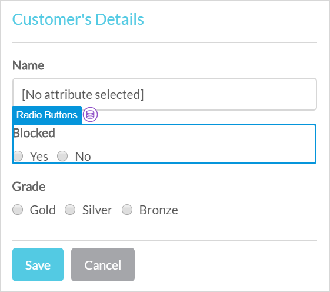
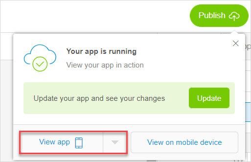

These are the Mendix Studio release notes for app projects built with Desktop Modeler/Studio Pro versions 7.15–7.22. The release notes include all minor versions, patches, and known issues.

For more information on the correlation between Mendix Studio and Desktop Modeler/Studio Pro versions, see [Studio Ranges & Mendix Versions](/studio7/general-versions).

{}
Previously, **Mendix Studio** was called the **Mendix Web Modeler**. With Mendix 8, the **Mendix Desktop Modeler** was renamed to **Mendix Studio Pro**.
{}

For Studio release notes correlated with Desktop Modeler/Studio Pro version 7.23, see [7.23](7.23). 

For updates on the operational status of Studio as well as deployment features and other Mendix services, see [Mendix Status](https://status.mendix.com/).

## 2019

### February 1st, 2019

#### Improvements

* You can now resize annotations in the microflow editor, this will improve the user experience. 

### January 25th, 2019

#### Improvements

*  To avoid confusion and to make your work in the page editor and the navigation document easier, we have added **Create Object** as an option for the **Open page** on click-action in properties. 

	{}
	{}

  For example, you want a button to open a page with the details of a new location. Your users will fill in the details, save them, and create a new location. To do so, the page needs to be populated with a new data object. If you enable **Create Object** and select an entity, the object of the selected entity will be created and passed to the page. Previously, if you realized that a new object needed to be passed to the page, you had to change the on-click action to **Create Object**. Now you can just enable/disable the switch-button. For more information, see section [2.1 Create Object Option](/studio7/page-editor-widgets-events-section#create-object-option) in *Events Section* in the *Studio 7 Guide*.. 

* To improve user experience we updated the page editor behavior when deleting widgets. Previously, if you deleted a widget, the page would be selected. Now a widget close to the one you have just deleted will be selected. 

* To speed up your work in the page editor, we improved widget copy-pasting in the following ways: 

  * If you copy-paste a widget that is in a container, the pasted widget will be inserted into the container 
  * A newly pasted item is no longer automatically selected

#### Fixes

* We fixed an issue in the microflow editor where the range selection for the **Retrieve** action was updated only if you reloaded the page. 
* We fixed an issue in the microflow editor, when error messages were not shown if your expression contained errors. Now if some elements in your expression are underlined red, you see an error message when hovering over these elements. 

### January 14th, 2019

#### Improvements

* To make your work in the [page editor](/studio7/page-editor) easier, we improved data container highlights in the following ways:

  * If the widget is inside a data container (a data view or a list view), it will be indicated with a data container icon

    {}
    {}

  * We now also highlight a list view you are about to choose when configuring a data view to have the list view as the data source (when the data view listens to the list view)

#### Fixes

* We fixed an issue where text widgets could no longer be dragged after double-clicking them and changing the caption directly on the page.

### January 4th, 2019

#### New Features

* We added support for [Desktop Modeler/Studio Pro 7.22.1](../studio-pro/7.22).

#### Improvements

* For better user experience we improved the drag and drop function: dragging a data container (a data view or a list view) will now also highlight other data containers as possible targets.

#### Fixes

* We fixed an issue where updating custom widgets was not functioning for several widgets (for example, a progress bar). The old version of the widget was still shown in the widgets overview in App Settings.  

## 2018

### December 21st, 2018

#### New Features

* Upon popular demand, it is now possible to upload images in the SVG format in image widgets in the page editor and in the Theme Customizer.

* In the page editor, we added new settings to the **Design** section of widgets: **Hide On
  Phone/Tablet/Desktop**. When you enable this setting, the selected widget will be hidden from the page in the corresponding view. This can be useful, for example, if you want to show more information or images in the desktop view than in the phone view of the same page.

  {}
  {}

* We added support for [Desktop Modeler/Studio Pro 7.22](../studio-pro/7.22).

#### Improvements

*  In the page editor , we renamed the **Typography** category to **Text**. This improvement, based on user feedback, helps you find the right widget much faster. The new category now contains all possible text variants: text, paragraph, page title, and headings.

	{}
	{}

#### Fixes

* We fixed an issue in the domain model where after copy-pasting an entity and trying to publish a consistency error was shown.  

### December 14th, 2018

#### Fixes

* We fixed an issue in the microflow editor where Studio could crash when someone else was taking over your project.

### December 7th, 2018

#### New Features

* We added support for [Desktop Modeler/Studio Pro 7.21](../studio-pro/7.21).

#### Improvements

*  To speed up your work in the page editor, selecting a sub-widget  now shows a breadcrumb to navigate to the main widget in **Properties**. Sub-widgets are widgets that are part of other widget's properties: **Tab** in **Tab Container**, **Column** in **Layout Grid**, and **Row** in **Layout Grid**. For example, you can go back to the tab container from tab properties. 

	{}
	{}

### December 3rd, 2018

#### New Features

* We added a tab container widget to the page editor > **Toolbox** > **Widgets** > **Layouts**. A tab container is a container that is used to show information categorized into tabs. This can be useful if the amount of information that you would like to display is larger than the amount of space on the screen. For example, you can show a list of customers on one tab, and orders on the other one. 

#### Improvements

* To improve the user experience in the page editor, we now highlight data containers when you drag a custom widget (that needs to be wrapped with a data container) from the **Toolbox** onto your page.

#### Fixes

* We fixed an issue where after you exited read-only mode by taking over and made changes without refreshing the screen or opening another document, these changes were not saved. 

### November 28th, 2018

#### New Features

* We added support for [Desktop Modeler/Studio Pro 7.20.1](../studio-pro/7.20).

#### Improvements

* To make the process of creating loops in microflows easier, we now automatically add a continue event instead of an end event when you create a case for an exclusive split inside a loop.
* To prevent you from getting consistency errors that cannot be fixed in Studio, you now cannot delete a page in Studio if it is used in one of navigation profiles in Desktop Modeler/Studio Pro. For more information on navigation profiles, see [Navigation Profiles](/refguide7/navigation-profile).

#### Fixes

*  We fixed an issue where deprecated types of attributes were mentioned in a hint of the **Select Attribute** dialog box.

*  We fixed an issue in the page editor where the selected border of some custom widgets was much larger than it should have been. 

### November 16th, 2018

#### Improvements

* We improved drag and drop experience in the page editor.

#### Fixes

* We fixed an issue where a text widget could no longer be dragged after changing the **Render Mode** property. 

### November 9th, 2018

#### New Features

* Cut/Copy/Paste is now available in all editors of Studio: pages, microflows, domain models, and navigation. This functionality will speed up your work immensely. To cut/copy/paste you can use <kbd>Ctrl</kbd> + <kbd>Z</kbd> /  <kbd>Ctrl</kbd> + <kbd>C</kbd> / <kbd>Ctrl</kbd> + <kbd>V</kbd> or  <kbd>Cmn</kbd> + <kbd>Z</kbd> /  <kbd>Cmd</kbd> + <kbd>C</kbd> / <kbd>Cmd</kbd> + <kbd>V</kbd>. Mind the following issues when using cut/copy/paste:
  * You can cut/copy/paste elements within one editor. That means that you can cut/copy/paste elements within one page or to other pages in Studio, and copy microflow activities within one microflow or to other microflows, etcetera.  
  * You can cut/copy/paste elements even to different projects in Studio if they have the same Mendix version.  
* To help you fix consistency errors in microflows quickly and efficiently, we added documentation on [consistency errors in the microflow editor](/studio7/consistency-errors-microflows). For more information on consistency errors in microflows and ways to fix them, see [Microflow Editor Consistency Errors](/studio7/consistency-errors-microflows).
* We added support for [Desktop Modeler/Studio Pro 7.20](../studio-pro/7.20).

#### Improvements

* The **Auto-Arrange** function in the domain model editor now groups and aligns entities by associations. Entities with no associations will be vertically aligned. This improves user-experience. 
* Default access rules are now assigned for newly created entities. This improves collaboration between Desktop Modeler/Studio Pro and Studio and has impact on projects for which project security is enabled in Desktop Modeler/Studio Pro. For more information on security, see [Security](/refguide7/security).

#### Fixes

* We fixed an issue where links to documentation were not working.

### November 2nd, 2018

#### New Features

* To help you fix consistency errors quickly and efficiently, we added documentation on the most common [consistency errors in the page editor](/studio7/consistency-errors-pages) and [navigation](/studio7/consistency-errors-navigation), and described the ways to fix them. For more information on consistency errors and ways to fix them, see [Consistency Errors](/studio7/consistency-errors), [Page Editor Consistency Errors](/studio7/consistency-errors-pages), and [Navigation Consistency Errors](/studio7/consistency-errors-navigation).

#### Improvements

*  We updated the styling and colors of the highlights used in the page editor to improve the user experience. For example, now you can see what element is used on the page by simply hovering over it without selecting it.

	{}
	{}

### October 19th, 2018

#### New Features

* We added support for [Desktop Modeler/Studio Pro 7.19](../studio-pro/7.19).

#### Improvements

* To aid you in finding a useful spot to drop a widget, we now show you all your data containers when
  dragging a widget that depends on it to the page editor canvas. For example, a **Date Picker** can only properly function in a data container. Now, when you drag this widget on the canvas, we highlight data
  views and list views (if any) on the page as the best option to drop this input widget to. This helps you to avoid consistency errors, when publishing your app and hence speeds up your work considerably.

*  To improve performance, we now show only five list view items as a preview in Studio. However, when you publish your app, you will see the amount of items that you have indicated in **Properties** > the **Genera**l section > **Page Size**. 

	{} 
	{}

*  We now automatically close the **Publish** dialog box after you click **View app**, so that you can get straight to work when you return to Studio.

	{}
	{}

### October 12th, 2018

#### Improvements

* To enhance the number of use-cases you can configure with Studio, we added a read-only setting for a data view and a list view in the page editor. If the setting is enabled, all input widgets (such as, a text box, a drop-down, a check box, etcetera) in the data view are in read-only mode. For example, you can disable editabilily for a data view that shows a completed order and its reference number that end-users cannot change. 
* We now allow you to configure the **Editability** of your input widgets (such as, a text box, a drop-down,  etcetera). It indicates whether the end-user will be able to change the value displayed by the widget. Open **Properties** of an input widget > the **General** section to change the setting. Note that if an attribute set for the widget's data source is of the AutoNumber type, the widget is set into read-only mode by default and the **Editability** setting itself is disabled, because attributes of this type are generated automatically.
* We improved the way you can see where new widgets and building blocks are being dropped on your page.

### October 5th, 2018

#### Improvements

*  You can now easily rearrange attributes inside an entity by simply dragging them, that is you can change the order of attributes inside the entity. This speeds up the process of changing your domain model.

	{}
	{}

* To improve the user experience when building pages, from now on we only show the dark layer over the layout when you hover over the layout or drag and drop an element on a page.

* To make the **Expression** tab in the microflow editor more user-friendly and to avoid confusion,  we now disable the expression editor area until you select an attribute or association. 

#### Fixes

* We fixed an issue where the shortcuts were not working in the navigation editor.

### October 1st, 2018

#### New Features

* Studio is now generally available. This means that the [beta version limitations](../beta-features/index) are no longer applicable and you can use Studio at its full. 
* You can now add constraints to list views in the page editor. Constraints are used to limit (filter) data in a list view. For example, Description contains *Mendix*, ShippingStatus equals *Shipped*. This allows you to strip away unnecessary data from the app and hence provide the best possible user experience to your end-users. Note that constraints are available for the **Database** data source and you can choose only the following types of attributes for constraints: AutoNumber, Boolean, Decimal, Enumeration, Integer, Long, and String. 

#### Improvements

* To improve your experience with the **Expression** tab in the microflow editor, we improved suggestion texts and created new icons in the suggestions menu.

	{} 
    {}

#### Fixes

* We fixed an issue where an error was thrown when consistency errors were connected with an element that had been deleted (a page, a widget, etcetera). Previously when you clicked on such consistency error, the system tried to navigate you to this non-existing element. Now only a message is shown that the element no longer exists.  
* We fixed an issue where the page editor showed nothing in the data source for **List View** widgets with a **Nanoflow** source. Note that nanoflows can be configured in Desktop Modeler/Studio Pro only.

### September 21st, 2018 {#21st}

#### New Features

 * In the microflow editor, you can now use **Loop** activities. This is a powerful feature that allows you to add all sorts of logic, like logic based on items in a list. For example, you can retrieve a list of orders from your database, then loop over this list and mark orders as processed.

#### Improvements

 * We improved the expression editor that is part of the microflow editor. When writing expressions (for example, conditions for an **Exclusive split** activity or attribute values for a **Change object** activity), the suggestions you see in the expression editor are now categorized. This improves readability and helps you write the right expression more easily.

#### Fixes

 * We re-added support for [Desktop Modeler/Studio Pro 7.18](../studio-pro/7.18). The known issue with consistency error checking in Mendix version 7.18.0 has been resolved in version [7.18.1](../studio-pro/7.18#68234). Studio users with apps in Mendix version 7.18.0 can now upgrade their apps when opening Studio in order to continue building and publishing.

### September 14th, 2018

#### Improvements

* We removed the **Feedback** option from the sidebar in the user interface, because users got confused with the [Mendix Feedback](/appstore/widgets/mendix-feedback) widget that is part of an app. Of course, you are still welcome to provide feedback about your experience while using Studio. You can do so in three ways:
     * Click the chat icon at the bottom-right of your screen
     * Contact [Mendix Support](https://support.mendix.com/hc/en-us) for specific issues or questions
     * Raise your questions and make comments on the [Mendix Forum](https://forum.mendixcloud.com/index4.html)
* We added links to Mendix Support (**Contact Mendix Support**) and Mendix community (**Ask the Community**) in the information menu at the top-right of Studio.

#### Fixes

* We fixed a broken URL for the how-to that describes syncing Studio with Desktop Modeler/Studio Pro. This link is located in the pop-up window that appears after selecting **Edit in Studio Pro** via the information menu at the top-right of the screen.
* We fixed an issue in the microflow editor where Studio crashed while opening the **Condition** dialog box for an exclusive split activity based on an enumeration.

### September 7th, 2018

#### Improvements

* You can switch between list view templates in Studio, if you have configured them in Desktop Modeler/Studio Pro and then synchronized your project with Studio. This will improve collaboration between Studio and Desktop Modeler/Studio Pro. 

#### Fixes

* We fixed an issue where if you had a project built with Desktop Modeler/Studio Pro versions 7.11-7.14 and you tried to upgrade the project in Studio, the upgrade would fail. Now if you click the **Upgrade** button in Studio, your project will be updated to the latest current version. 
* We fixed an issue in the microflow editor where the Mendix Assist information dialog box was open and you hit <kbd>Delete</kbd> on your keyboard, the **Delete microflow** confirmation pop-up window was not visible. 

### September 4th, 2018

#### Known Issues

* We temporarily removed support for the [Desktop Modeler/ 7.18](../studio-pro/7.18) because of a known issue with consistency error checking. In some cases, consistency errors remain shown in the **Checks** panel, even though they have been fixed (Ticket 68234). Because of this, users are not able to publish apps in Mendix version 7.18 from Studio. As a temporary solution we have made sure all apps on the **Create New App** page are of Mendix version 7.17.2. Studio users with apps of Mendix version 7.18 are advised either to create a new app template, or to wait for the 7.18.1 patch release and upgrade your app to continue building and publishing the app.
    * Fixed on [September 21st, 2018](#21st).

### August 31st, 2018

#### New Features

* We added support for [Desktop Modeler/Studio Pro 7.18](../studio-pro/7.18).

#### Improvements

*  In the page editor, it is now possible to add attributes in the **Label** text in properties of input widgets. Labels change dynamically depending on a value of an attribute. This will improve user experience.

	{} 
	{}

#### Fixes

* We fixed an issue where you deleted a layout in Desktop Modeler/Studio Pro, synced a project with Studio, and Studio crashed because of the missing layout. You will see an informative error message now. 
* We fixed an issue in the microflow editor where the **Change variable** activity suggested you changing a parameter, which should not be possible. 

### August 24th, 2018

#### Improvements

* In microflows, you can now edit captions of activities inline, while previously they could be changed only in properties of an activity. Simply double-click the caption of the activity and change it. This improvement will make the process of creating microflows easier and faster.
*  To avoid confusion between **Select** (for example, a page or a microflow) dialog boxes and **Create**  dialog boxes in the page editor, we added a link to create a new page in the placeholder that is displayed when there are no search results.  Additionally, the text from the search bar is used to pre-fill the **Name** field if the **Create new** link is clicked.

	{}
	{}

#### Fixes

* We fixed an issue where the page editor in Studio did not take the alignment property of scroll container widgets (configured in Desktop Modeler/Studio Pro) into account, and the scroll container was always aligned to the right.

### August 17th, 2018

#### New Features

* We added support for [Desktop Modeler/Studio Pro 7.17.2](../studio-pro/7.17).
* To improve your experience and make the process of creating pages faster and easier, we added the **Delete Object** button to **Widgets** in the page editor **Toolbox**. Previously, users needed to configure a microflow first and then use that microflow for buttons to delete objects from a page. Now you can simply drag and drop the **Delete Object** button to your page. When placed on a data view, the **Delete Object** button will delete the connected object. When placed in a list view, the object of the containing list view item will be deleted. 

#### Improvements

* To improve usability of the page editor, we added ability to switch between **Static Image** and **Dynamic Image** widgets in the **Properties**. Simply add an image widget to your page, open its properties and change the **Image Source** (**Static Image** or **Dynamic Image**) when needed. 
* You can now switch the **Create Object** button in the page editor to become a different button or set it do nothing. Previously when you placed the button on the page and wanted to configure it later, the system would return consistency errors. Now you can set it do nothing like any other button. This improvement makes the process of creating pages faster and easier.

### August 2nd, 2018

#### New Features

* We added support for [Desktop Modeler/Studio Pro 7.17](../studio-pro/7.17).

#### Improvements

* To make the process of adding new attributes to your domain model easier, we added a hint showing the list of attribute types and their description when you create a new attribute. Now you can quickly choose what type of attribute you need to create: hover over the eye icon in the **Create New Attribute** dialog box to view the hint. 
* To make the microflow editor more user-friendly, we added a hint on what type of attributes you can use when you add an **Aggregate list** activity to your microflow. Click the information icon in **Properties** to view the hint. 

#### Fixes

* We fixed an issue where in some cases an **Annotation** element was sticking to the mouse cursor in the microflow editor.

### July 20th, 2018

#### New Features

* Documentation for the [Studio](/studio7) is now available. We added the *Studio 7 Guide* to improve your understanding of Studio. You can now read about the main features, concepts, and definitions, as well as learn how to perform different actions.

#### Fixes

* We fixed an issue where the **Carousel** custom widget crashed Studio when you configured the **Static Images** property. 

### July 16th, 2018

#### Improvements

* To give you a better preview of the pages, we now display pages with a pop-up window that renders when you use the pop-up layout.
* To improve user experience, we now display the real rendering of drop-down buttons in the page editor.
* When you add several tabs on a page in Desktop Modeler/Studio Pro, you can now switch between them in Desktop Modeler/Studio and view their contents. This improves collaboration between developers in Studio and Desktop Modeler/Studio Pro. 

#### Fixes

* We fixed an issue where Studio crashed when your app had list view templates. 
* We fixed an issue where you could not select inherited attributes when initializing or setting values for microflow activities.

### July 5th, 2018

#### New Features

* We added support for [Desktop Modeler/Studio Pro 7.16](../studio-pro/7.16). Studio supports ranges for Desktop Modeler/Studio Pro. This gives you choice in whether to update Studio right away, or postpone the update. For more information on the topic, see [Studio Ranges & Mendix Versions](/studio7/general-versions).
* We introduced a brand new expressions functionality in the microflow editor. You can now write a custom expression when configuring microflow activities. This enhances the cases that you can configure in the microflows and makes microflows far more powerful and flexible. Configure a condition in an **Exclusive split** activity, initialize values for **Create object** and **Create variable** activities, set values for **Change object** and **Change variable** activities, set a return value for the **End Event**.
* We added the **Aggregate list** activity to the microflow editor. You can use this activity to calculate aggregated values such as the maximum, minimum, sum, average and total amount of values in a list of objects.         

#### Fixes

*  We fixed an issue where it was impossible to deploy an app or open a project in Desktop Modeler/Studio Pro after **Auto Arrange** in the domain model editor was used. 
