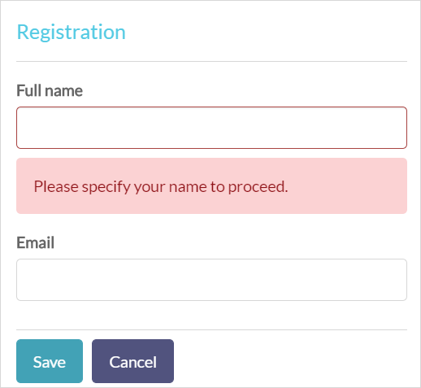
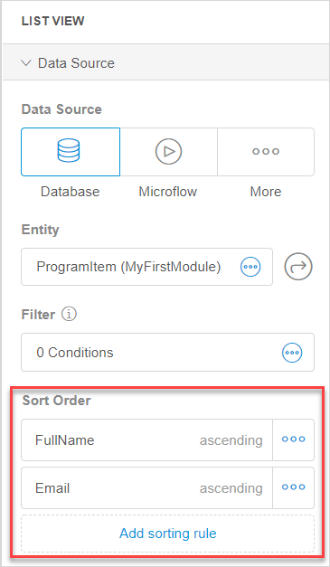
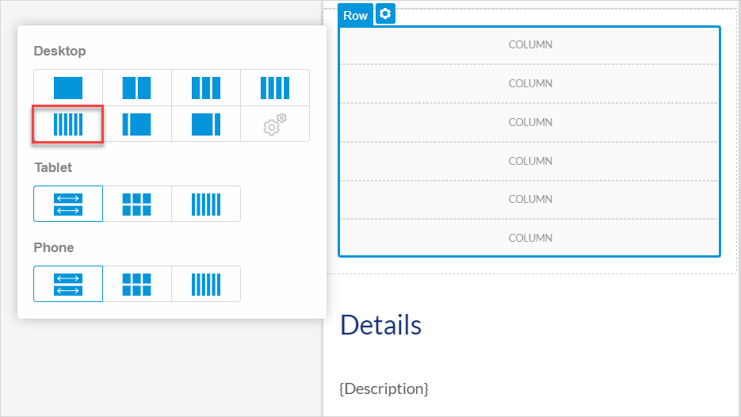
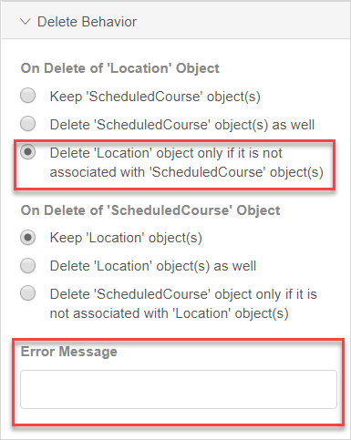
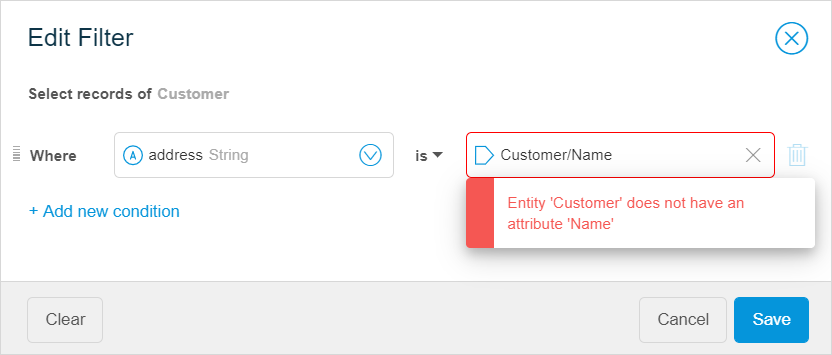
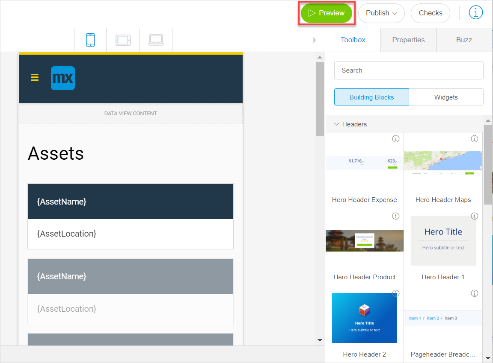
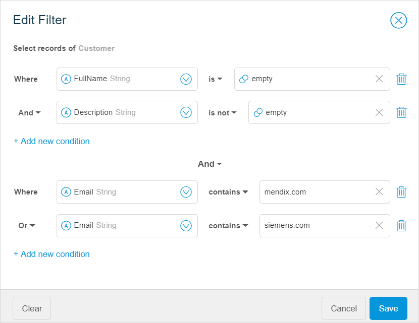
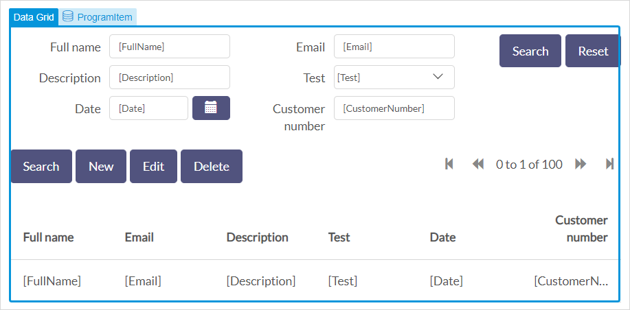
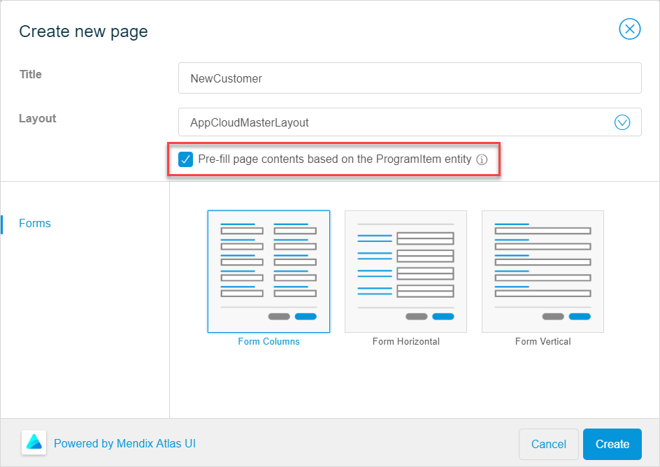

These are the Mendix Studio release notes for app projects built with Desktop Modeler/Studio Pro version 7.23. The release notes include all minor versions, patches, and known issues.

For more information on the correlation between Mendix Studio and Desktop Modeler/Studio Pro versions, see [Studio Ranges & Mendix Versions](/studio7/general-versions).

{}
Previously, **Mendix Studio** was called the **Mendix Web Modeler**. With Mendix 8, the **Mendix Desktop Modeler** was renamed to **Mendix Studio Pro**.
{}

For Studio release notes correlated with Studio Pro versions 8.0–8.6, see [8.0–8.6](8.0-8.6). 

For updates on the operational status of Studio as well as deployment features and other Mendix services, see [Mendix Status](https://status.mendix.com/).

## 2019

### September 6th, 2019

#### Improvements 

* To point you to the correct documentation version, the links from 7.23 version range of Studio now lead to [Mendix 7 Studio Guide](/studio7/). 

### July 29th, 2019

#### New Features

*  In the page editor, it is now possible to add **Input Validation** for input widgets. This means that you can make a certain field mandatory to fill in and specify an message for end-users if validation fails. For example, you can mark the **Full name** field as required for new customers and you can add a message  “Please specify your name to proceed” that will be displayed if they skip the required field.

    

*  To enhance the number of use-cases you can configure in the page editor, we added opportunity to sort items in list views and data grids. You can set a **Sort Order** by adding a sorting rule for a list view or a data grid if their data source is set to **Database**. You can add multiple sorting rules.

    

#### Improvements

* For **App from a spreadsheet**, we no longer discover associations for columns with *Number* format (converted to integer and long types of attributes). If you want associations to be created, you need to save numbers as text in your spreadsheet before uploading it. 
* Adding an attribute value to a **Text** widget right after creating it, now replaces the default value (*Text*) rather than appending it. 

#### Fixes

* For **App from a spreadsheet**, we fixed an issue where an entity and an enumeration had the same name and it resulted into consistency errors. Now when an entity and one or more enumerations share the same name, after the import an underscore and a numeric postfix is added to the name of the enumeration. For example, if both the entity and enumeration are named *Customer,* the enumeration name will be *Customer_1*. If there is an additional enumeration named *Customer*, it will be named *Customer_2*. 

* We fixed an issue where you could still open a Studio disabled project by opening the project URL. 

### July 19th, 2019 ###

#### Improvements

* In the page editor, the **Layout Grid** widget has now been replaced by multiple widgets each representing a layout grid configured with a specific number of columns. This improvement is based on user feedback and makes building (responsive) pages a lot easier. Find the new pre-configured widgets in the **Columns** category of the widgets toolbox in the page editor.

*   You can now add six columns to your page by simply dragging and dropping the **6 Columns** widget from the **Toolbox**, or by adding any column widget to your page and then changing its properties:

    

* For **App from a spreadsheet**, you can now import spreadsheets up to 1 MB.

*  In the domain model editor, you can now specify the text for the user-facing error message when configuring delete behavior for associated entities.
	{}
	{}

#### Fixes
* We fixed an error that occurred when double-clicking a microflow activity that has a consistency error. 
* We fixed an issue where content of input fields was lost when clicking another object in the microflow editor.
* We fixed the issue where, after turning on security for the first time, the login.html file of your project could end up in a broken state.

### July 12th, 2019 ###

#### New Features

* We added support for [Studio Pro 8.0.0 Beta 3](../studio-pro/8.0).

#### Improvements

* In the page editor, you can now use the **Drop Down** widget as an input widget for selecting both enumerations and associations. For the associations, the Reference Selector widget was required before. Now, the Drop Down widget can be used in all cases. This improvement was based on user feedback and makes building data input pages easier and faster.
* We made the following improvements for **App from a spreadsheet**:
  * You can now horizontally scroll tab pages in the **Data Import Preview** screen (useful when a spreadsheet with many sheets is selected as a starting point).
  * We increased the maximum size of spreadsheets that can be imported in Studio to 500 KB.

#### Fixes

* For apps started from a spreadsheet, we fixed the issue where importing data was failing when header names in the spreadsheet were very long.
* For the **Checks** panel, we fixed the following issues:
  * Selecting an error did not scroll the page editor or microflow editor to the related widget or activity, but resulted in an error pop-up window.
  * When previewing or publishing the app, the Checks panel did not display anything the first time consistency errors were reported.

### June 28th, 2019

#### Improvements

* To speed up the process of consistency error solving and to make it easier for you, the page editor will now scroll to the selected widget if it is not visible when you select a consistency error in the **Checks** panel.
* Custom widgets will now have a more relevant name instead of the generic "customWidget1". This is particularly helpful when you fix consistency errors: you can now quickly understand what custom widget an error refers to. 

#### Fixes

* We fixed an issue where a container widget could no longer be selected after removing its contents.
* We fixed an issue where special characters in a spreadsheet preview were displayed as question marks. 

### June 24th, 2019

#### New Features

* On pages, you can now quickly configure the most important properties of many widgets. Simply drag and drop a widget on a page and configure properties in a pop-up window. This feature not only saves your time but also helps you avoid consistency errors.  For more information, the [Quick Configuration of Widget Properties](/studio7/page-editor-widgets#quick-config) section in Widgets. 

		

#### Improvements

* We made the following improvement for **App from a spreadsheet** (for more information on how to create an app with your own data, see  [Starting With Your Own Data](/studio7/start-with-data)):
  * We improved generating entities from your spreadsheet. Now if a worksheet has only one column, Studio will not create associations with it to avoid creating entities without any attributes.
  * When you import an empty spreadsheet, you can now try again and import another spreadsheet. 

  For more information on how to create an app with your own data, see  [Starting With Your Own Data](/studio7/start-with-data).

#### Fixes

* We fixed an issue where the **Preview** button resulted in an error message in case consistency errors were detected.
* We fixed an issue where deleting an association used for filtering data on pages or in microflows showed no error message in filters.
* We fixed an issue where Studio created custom widgets with a wrong configuration, causing the "please update your custom widget" consistency error.
* We fixed an issue where the Edge browser was not be able to load the page editor.

### June 14th, 2019

#### New Features

* We added support for [Studio Pro 8.0.0 Beta 2](../studio-pro/8.0). 

### June 6th, 2019

#### New Features

* You can now start an app based on a spreadsheet. Mendix Studio will generate a fully functional app based on your data!  The data of the spreadsheet will be analyzed and converted into entities, attributes, and associations. Also, pages and navigation items based on your data can be created. Click **Create App** and select **App from a spreadsheet** in the Developer Portal to get started. This is a great way to jump-start your app. It saves you time so that you can focus immediately on extending and tailoring the app to best fit your needs. For more information, see [Starting With Your Own Data](/studio7/start-with-data) in the *Studio 7 Guide*.

#### Fixes

* We fixed an issue where first time users were not able to continue the guided introduction tour after the first step.
* We fixed an issue where the **Properties** tab of a list view with filters resulted in an error if the entity used as the list view’s data source was deleted.
* We fixed an issue where updating a custom widget package did not correctly update all the widgets in it. 

### May 24th, 2019

#### Improvements

*  To assist you in fixing consistency error, the link to [documentation](/studio7/consistency-errors) was added to the **Checks** panel. For more information on the **Checks** panel, see [Checks](/studio7/checks) in the *Studio 7 Guide*. 
*   To prevent you from creating data filters with consistency errors, we added validation in filters. That means that a filter with errors cannot be saved and you will immediately see what the error is. For more information, see [Data Filters](/studio7/filters) in the *Studio 7 Guide*. 
	
	

#### Fixes

* We fixed an issue where Studio could not load custom widgets for apps with model versions 7.23.4 and below. 

### May 17th, 2019

#### New Features

* Mendix Studio now configures the security of any app that you create. That means your data is protected from public access and visible only for users whom you grant access. Moreover, you can configure different roles for different users so that you can optimize the user experience, making sure each user sees exactly what you want them to see.
  How does this work? When you publish your app to the Mendix cloud for the first time, Mendix Studio will auto-configure security so that your data stays secure right from the start. The result is that any user that wants to access your app must use login credentials or will be logged in automatically in case your platform administrator has configured a single sign-on experience for Mendix apps.   
  Auto-configuring security will be done for all apps with Mendix version 7.23.3 and higher that are accessed in Mendix Studio. For more information, see the following documents:
  
  * For citizen developers: read how to use security and app roles in [Security, Roles & Permissions](/studio7/settings-security) in the *Studio 7 Guide*
  * For professional developers: read the details of model changes that are applied when Mendix Studio auto-configures security settings in [Model Changes When Security Is Enabled in Studio](/refguide/studio-security-enabled) in the *Studio Pro Guide*

### May 10th, 2019

#### New Features

* You are now able to preview your app without publishing it. The **Preview** feature allows you to to verify your own changes and to see how your app will look like for different end-users, without changing the published app in the cloud. As it has a different environment from the published app, you can use the **Preview** to experiment with changes and test them. While building your app, simply click **Preview** to see the effects of your changes. Studio will show you the working app instantly, so that you can see your changes straight away. Studio will also assist you in checking for any consistency errors. Then, when you are ready to share your changes with users of your app, click **Publish** to push the latest version of your app to the cloud. For more information, see [Previewing & Publishing Your App](/studio7/publishing-app) in the *Studio 7 Guide*.

    

*  We have made it very easy to configure filters when showing and retrieving data in your app. In microflows, you can add a filter to the **Retrieve** activity, and in the page editor, it is possible to filter data in a list view and in a data grid.  For more information, see [Data Filters](/studio7/filters) in the *Studio 7 Guide*.

    

#### Improvements

* To avoid confusion, we changed naming of variables and objects in the microflow editor. Previously, the term "variable" could be used in different ways: as a name for a list of objects or as an object itself. This has now been cleared. 
* To improve the user experience of the microflow editor, we added more tooltips for activity properties, so that users are better informed on the available options and related behavior. 

#### Fixes

* We fixed an issue where app publishing was not working in Studio for newly created apps.

### May 2nd, 2019

#### New Features

* We added support for [Studio Pro 8.0.0 Beta 1](../studio-pro/8.0). 

### April 12th, 2019

#### Improvements

* To improve collaboration between Studio users, users that are in the read-only mode can see the changes made by the other Studio user in real-time without the need to refresh the browser page.

### March 29th, 2019

#### New Features

*  We replaced the sync process between Studio and Studio Pro with a new, simplified, process of sharing model changes. It is enabled for apps with Mendix version 7.23.3 and above to experience true  collaborative development within your team. All changes made in Studio are auto-saved, and Studio Pro users get these changes when they click **Update** or **Commit**. For more information, see [Collaborative Development](/refguide7/collaborative-development) in *Version Control* and [Collaborative Development in Studio](/studio7/general-collaborative-development) in the *Studio 7 Guide*. 

    {}Existing projects with Mendix version 7.23.2 or below can continue using **Sync with Studio** until September 2019.
    {}

*  You can now use a [data grid](/studio7/page-editor-data-grid) on your pages. A data grid is a data container that shows a list of objects in a table. For example, a data grid can show all the program items for an event, users can search, add, delete items and perform other functions depending on the settings. For more information, see [Data Grid](/studio7/page-editor-data-grid). 

      

* In the page editor, you can now use the **Association** data source for a list view and a data grid. The list view or data grid is filled with the objects linked to the data view object by an association. For example, you can show all orderlines for a customer. This data source is available when the list view/data grid is placed inside another data container, for example, a data view.  

* We added support for [Desktop Modeler/Studio Pro 7.23.3](../studio-pro/7.23). 

#### Fixes

* We fixed an issue where a custom widget was not correctly shown in the **Toolbox** of the page editor, if this widget no longer existed in a newer package on the App Store.

### March 15th, 2019

#### Improvements

* To speed up the process of creating pages, **Pre-fill page contents based on the `<name>` entity** is now checked by default when creating a new page with an entity.

    {}
    {}

### March 8th, 2019

#### New Features

* We added support for [Desktop Modeler/Studio Pro 7.23.2](../studio-pro/7.23).

### February 22nd, 2019

#### New Features

* We added support for [Desktop Modeler/Studio Pro 7.23.0](../studio-pro/7.23) and [Desktop Modeler/Studio Pro 7.23.1](../studio-pro/7.23).
