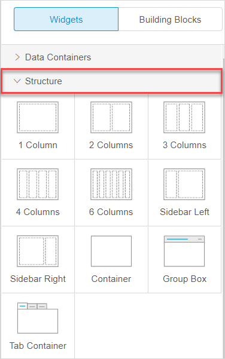

These are Mendix Studio release notes for app projects built with Desktop Modeler/Studio Pro version 7.23 and above. The release notes include all minor versions, patches, and known issues.

For more information on the correlation between Mendix Studio and Desktop Modeler/Mendix Studio Pro versions, see [Studio Version & Mendix Version Correlation](/studio/general-versions).

{}
Previously, **Mendix Studio** was called the **Mendix Web Modeler**. With Mendix 8, the **Mendix Desktop Modeler** was renamed to **Mendix Studio Pro**.
{}

{}

For Studio release notes correlated with the Studio Pro version 7.23, see [7.23](7.23).

For Studio release notes correlated with Desktop Modeler versions 7.15–7.22, see [7.15–7.22](7.15-7.22). 

For Studio release notes correlated with Desktop Modeler versions 7.11–7.14, see [7.11–7.14](7.11-7.14). 
{}

{}
For updates on the operational status of Studio as well as deployment features and other Mendix services, see [Mendix Status](https://status.mendix.com/).
{}

## 2019

### August 9th, 2019

#### Improvements

*  To make the page editor more user-friendly, we unified column and layout widgets under new **Structure** category in **Toolbox** > **Widgets**. Now all widgets that provide structure to your page are located in one category:

    

* You can open Mendix Studio in Chomebooks. 

* You no longer need to download an app for view your app on a mobile device. You can scan a QR-code with your mobile device or open a link on your mobile browser. 

### August 2nd, 2019

#### New Features

* We added support for [Studio Pro 8.0.0 General Availability](../studio-pro/8.0). Now newly created apps in Studio will have Mendix version 8. 

#### Improvements

*  To improve user experience, we added error codes to consistency errors in the **Checks** panel and improved Studio specific messages for a number of errors. You can navigate to the corresponding documentation (if available) by clicking the error code. Error codes will help you identify an error easily when asking about it in the [Mendix Forum](https://forum.mendixcloud.com/) or when turning to Mendix Support.

    

* To make the microflow editor more user-friendly, **Exclusive split** is now called **Decision**. The new name better illustrates what this element does: it makes a decision which flow a microflow should take depending on a condition. 

#### Upgrading from Mendix version 7 to 8

* Mendix version 8 brings many improvements to the platform, however, this release contains changes that cannot be upgraded automatically using the regular Studio upgrade mechanism. This means that if you want to upgrade your existing app to Mendix version 8 can only do so in Studio Pro or by involving developers familiar with Studio Pro. For more information on upgrading to Mendix version 8, see [Upgrading to Mendix version 8](/studio/general-upgrade-to-8) in the *Studio Guide* and [Moving from Desktop Modeler Version 7 to Studio Pro 8](/refguide/moving-from-7-to-8) in the *Mendix Reference Guide*.