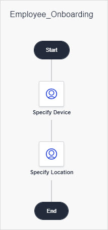

These are the Mendix Studio release notes for apps built with Studio Pro version 9.0-9.6. The release notes include all minor versions, patches, and known issues.

{}
Due to breaking changes, the minimum Studio-supported version in this bundle is 9.5.1. For more information on the correlation between Mendix Studio and Desktop Modeler/Mendix Studio Pro versions, see [Studio Ranges & Mendix Versions](/studio8/general-versions).
{}

{}
For Studio release notes correlated with the Studio Pro version 8.7–8.18, see [8.7–8.18](8.7-8.18).
{}

For updates on the operational status of Studio as well as deployment features and other Mendix services, see [Mendix Status](https://status.mendix.com/).

## 2021

### October 14th, 2021

#### Fixes

* We fixed an issue where the [Data Hub](/studio/data-hub-in-studio) tab was not accessible in Studio.
* We fixed an issue where you could not add multiple external entities from Data Hub services if the services needed [Mendix SSO](/developerportal/deploy/mendix-sso).
* We fixed an issue with jumping search results in the **Data Hub** tab.
* We fixed an issue where a wrong type of association could be selected for a data grid causing a consistency error.

### September 28th, 2021

#### New Features

* We added support for [Studio Pro 9.6.0](/releasenotes/studio-pro/9.6#960).

#### Improvements 

*  We now support Data Hub entities and associations to be used for data views and list views that are placed in another data container (nested data views and list views). 

#### Fixes 

* We fixed an issue when deleting cross-module associations where the entity the associations pointed to no longer existed caused Studio to crash. 

* We fixed an issue, which caused expression properties of some widgets to always be labeled `Expression`.

#### Breaking Changes

* Workflows in Studio are temporarily unavailable for apps with Mendix version 9.6. We introduced workflows as a Beta feature in Mendix 9 and are now incorporating feedback we received from our community to improve workflows. When an app contains workflow, Studio will not upgrade it beyond 9.5.1 to prevent the app from becoming incompatible with the changed workflow capabilities introduced in Mendix 9.6. However, you can migrate to Mendix 9.6 using Studio Pro by following the [migration path](/refguide/workflow-beta-migration).

### September 24th, 2021

#### Improvements

* We have renamed the **Images & Files** widget category in the page editor **Toolbox** to **Images, Videos & Files** because you can have video widgets that are part of this category and renaming enables you to find the widget you need quickly.
*  We now support Data Hub entities and associations to be used for data views and list views that are placed in another data container (nested data views and list views). 

#### Fixes

* We fixed an issue when deleting [cross-module associations](/studio/domain-models-association-properties#cross-module-associations) where the entity the associations pointed to no longer existed caused Studio to crash. 
* We fixed an issue, which caused expression properties of pluggable widgets to always be labeled `Expression`.

### September 10th, 2021

#### Improvements

* For your convenience, when you are switching between **In Project** and the **Data Hub** tabs in **Select** dialog boxes, the selection is automatically scrolled to the top.
* We brought back the **Go faster**/**Go slower** option when you upgrade the app to keep the fun. 

### September 2nd, 2021

#### New Features

* We added support for [Studio Pro 9.5.0](/releasenotes/studio-pro/9.5#950).

### August 26th, 2021

#### Improvements

* We renamed the **Image** widget to **Static Image** for you to easily differentiate between static and dynamic image widgets on pages.

### August 19th, 2021

#### Fixes

* We fixed an issue where an automatically created data view was not read-only when you generated a new page pre-filled with content based on an external entity. It should be read-only because you cannot change external entity attributes.

### August 13th, 2021

#### Fixes

* We fixed an issue where adding custom widgets resulted in an incorrect consistency error that the widget was not up-to-date.

### August 5th, 2021

#### Improvements

* To make configuring pages and domain model faster and easier, we added possibility to create an association from the **Select** dialog boxes when you select a context entity for widgets. This allows you to automatically create the association with the right multiplicity and navigability for your context and saves you from having consistency errors or opening the domain model to configure associations there.
* We updated the information on building blocks as it may differ depending on Atlas version used in the app. Now when clicking an information icon on a building block, a new tab opens with information corresponding to the Atlas version 2 or 3. 

### July 29th, 2021

#### New Features

* We added support for [Studio Pro 9.4.0](/releasenotes/studio-pro/9.4#940).

#### Fixes

* We fixed an issue where Studio failed to re-login when two or more tabs with the same app in Studio were open.

### July 20th, 2021

#### Improvements

* We improved messages that are displayed in the **Publish** pop-up window when the app is either being checked or has been checked and has consistency errors.

#### Fixes

* We fixed an issue where a consistency error was shown when you tried enabling workflows in apps created with Mendix version 9.3.

### July 8th, 2021

#### Improvements

* We improved the way associated entities are selected. In the **Select Entity** dialog box, we added tooltips with explanations how entities are connected. 

### June 30th, 2021

#### New Features

* We added support for [Studio Pro 9.3.0](/releasenotes/studio-pro/9.3#930).

### June 24th, 2021

#### Improvements

* It is easier to manage app users now: you can go to the [App User Management](/developerportal/collaborate/general-settings#managing-app-users) page right from the **View your app** pop-up menu. For more information on what app users are, see [Managing App Users](/studio/settings-security#managing-app-users) section in *Security, Roles & Permissions*.

#### Fixes

* We fixed an issue where horizontal and/or vertical scrollbars were not seen on pages because zoom was applied.

### June 17th, 2021

#### Improvements

* We made the new expression editor available for expression-based properties of Marketplace widgets.

#### Fixes

* We fixed an issue where running the app locally was not possible in Studio Pro after security has been enabled in Studio. 

### June 14th, 2021

#### Improvements

* We added an option to quickly go to the [App Buzz](/developerportal/collaborate/buzz#app-buzz) in the Developer Portal from Studio. Click the **More Options** (three dots) icon in the top-bar > **Open App Buzz** to access it. 
* We improved the expression editor even more: next to attribute values, you can now add expression outcomes to the content of text widgets. For more information, see the [Content](/studio/page-editor-widgets-text#content) section in *Text*. 

###  June 3rd, 2021

#### New Features

* We enhanced possibilities for configuring the navigation for your app: you can set a separate home page for a certain user role that will override the default home page. For example, an Administrator can have an Admin Dashboard as the home page, while the default home page will be displayed for all other user roles. You can set role-specific home pages in the navigation editor properties. For more information, see [Navigation Document](/studio/navigation).  

#### Improvements

* If a page, microflow, or workflow is read-only because it is part of a read-only module (such as WorkflowCommons), you can now copy it to one of your modules and make changes to it. For example, you can copy the **Task Inbox** page for workflows and adjust it the way you want.

### May 27th, 2021

#### New Features

* We added support for [Studio Pro 9.2.0](/releasenotes/studio-pro/9.2#920).
* To give you more flexibility when configuring pages, we added possibility to use expressions on pages: you can now use expressions when configuring [conditional visibility](/studio/page-editor-widgets-visibility-section) and editability for widgets that have these properties. 

#### Fixes

* We fixed an issue in Apple Safari with scrollbars not being displayed correctly in **Select** dialog boxes.

### May 19th, 2021

#### Improvements

* The microflow editor now has the same new expression editor as workflows. The new expression editor supports functions, mathematical and logical operations, which makes it expressive and easy to use. 
* In the workflow editor, we added a refresh option and a clear consistency error message if return values of the selected microflow do not match the outcomes of the **Call Microflow** activity anymore (for example, when a condition in the microflow has changed). You can quickly identify what the issue is and refresh the **Call Microflow** outcomes. 

#### Fixes

* We fixed an issue where a data container was not set to read-only automatically when the external entity was used as its data source.

### May 10th, 2021

#### Improvements

* We made sure that you have up-to-date Mendix SSO security and authentication settings in your app. When publishing your app, you will be notified if an auto-upgrade of the app's security settings is required.
* We enhanced the configuration of the home page property. You can now configure a page or a microflow as home page in the navigation editor.
* All help and learning videos are now using Mendix 9-based examples.

#### Fixes

* We fixed an issue where it was not possible to customize your theme for a Mendix [9.1.0](/releasenotes/studio-pro/9.1#910) app.
* We fixed an issue where a customized logo was not immediately visible in the page editor and theme customizer.
* We fixed an issue where access rules where incorrectly configured when copy-pasting a page, microflow, or workflow.
* We fixed an issue where adding `{` to the text area properties of widgets caused Studio to crash.
* We fixed an isssue where the **Manage Data** button was broken after creating an app based on the **App from a Spreadsheet** starting point.

### April 28th, 2021

#### New Features

* We added support for [Studio Pro 9.1.0](/releasenotes/studio-pro/9.1#910).

#### Fixes

* We fixed an issue where the publishing pop-up window blinked while your app was being prepared to be published.  
* We fixed an issue where the upgrade message in the top-bar was shown while creating the **App from a Spreadsheet** or **Approval Template** app templates.

### April 14th, 2021

#### Improvements

* To give you more information on the app publishing process, we added a pop-up menu informing you when your app is being prepared for publication. 

#### Fixes

* We fixed an issue where pages were not generated in **App from a spreadsheet** apps. 

#### Known Issues

* **Preview** and **Publish** do not work in Mendix Studio when your app contains widgets that cannot be correctly loaded. This happens, for example, when you have two widgets in your app with the same ID. The "check" spinner will never stop.
	* Fixed via [Studio Pro 9.1](/releasenotes/studio-pro/9.1#1999).

### March 31st, 2021

#### New Features 

* We introduced a new visual language – [workflows](/studio/workflows). Workflow is a visual language in Mendix Studios that allows you to build extendable processes. It is fully integrated with other visual languages, such as the microflow editor and page editor. Workflows is a visual way of expressing application logic and looks like a flow chart:

    

    * The Workflow editor comes with a brand-new expression editor for decision activities and due date conditions. The expression editor provides you the capabilities to write conditions using your app data, functions, mathematical and logical operations. It is easy to use and yet extremely expressive.

* We added support for [Studio Pro 9.0.5](/releasenotes/studio-pro/9.0) – the GA version. 

### March 11th, 2021

#### Improvements

* We replaced references to App Store with references to the new Marketplace, for example, in the page editor toolbox. You can use the integrated search to discover and download widgets from the Marketplace.

### February 25th, 2021

#### Improvements

* We overhauled Studio with a modern and clean design and fresh icons.
* To improve the user experience, we added a clear message that appears when trying to open an app with Studio disabled for it.

### February 12th,2021

#### Improvements

* If Marketplace modules are added to your app in Studio Pro, you can use the layouts of these modules. Previously this was not possible.  

### January 28th, 2021

#### Fixes

* We fixed an issue where you could open microflows from the System and Marketplace modules in Studio.

### January 21st, 2021

#### Improvements

* We improved the design of **Select** dialog boxes for better user experience:

    {}{}

* You no longer have to re-login after you were inactive for eight or more hours, Studio will keep you logged in automatically. 

#### Fixes

* We fixed an issue where list views were not filled with data from external entities when you previewed or published your app. 

### January 13th, 2021

#### Fixes

* We are now using MendixSSO 2.3.0 for model versions above 8.12.5, which fixes the publishing issue in Studio.

## 2020

### December 22nd, 2020

#### Known Issues

* Preview and Publish do not work in Studio for Mendix 9.0.2 Beta version.
  * Fixed on [January 13th, 2021](#publish).

