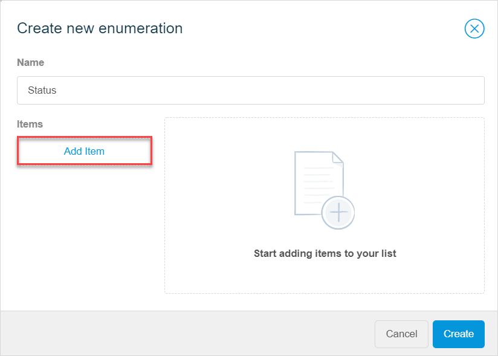
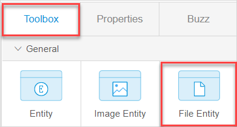

## 1 Introduction

This how-to explains how you can configure a domain model in Mendix Studio. 

**This how-to will teach you how to do the following:**

* Define what data to include to your domain model
* Create different type of entities
* Create attributes
* Create associations

This how-to describes the following use case: 

You are configuring the domain model for an online shopping app. 

## 2 Prerequisites

Before starting this how-to, make sure you have completed the following prerequisites:

* Familiarize yourself with the domain model terms and learn how to perform basic functions. For more information, see [Domain Model](/studio/domain-models).

## 3 Defining What Data to Include  

Understanding the typical process will help you define what data to include to your domain model. The workflow for new customers of the online shopping app looks the following way:

1. A customer registers in the online shopping app and enters the following details:
   1. Full name
   2. Address
   3. Email
   4. Date of birth
2. When registration is complete, a *unique ID* is assigned to the customer. 
3. The customer browses through *products* and the following product details are displayed:
   1. Product image 
   2. Name
   3. Description 
   4. Availability
   5. Price 
   6. Vendor
   7.  Unique product ID 
4. The customer adds products to a shopping cart. 
5. In the shopping cart, every item is presented as a separate line showing *quantity* and *price* per line. The customer checks the order, pays it, and gets a *confirmation* with the *order details* and the *date* the order is purchased on. 

Based on the description above, you can divide your data to the following elements: 

* [Customer](#customer) 
* [Product](#product) 
* [Order](#order) 

## 4 Defining the Product {#product}

As a product is one of the main elements of the online shopping app, an entity should be created to represent a product in your domain model. The information that defines the product, such as its name and price, should be attributes of the **Product** entity. 

To add the product to your domain model, follow the steps below:  

1. Create the **Product** entity. Do the following:

    1. Open your [domain model](/studio/domain-models).

    2. Open **Toolbox**, drag and drop **Entity** in your domain model:

       {}{}

    3. In the **Create New Entity**, dialog box, set the name to **Product** and click **Create**.

2. Create attributes for the **Product** entity. Do the following: 
    1. Select the entity and click **New attribute**:
      
		{}{}
      
    2. In the **Create New Attribute** dialog box, set the name to *Product_ID*, set the type to *Autonumber* (so that ID for a product will be assigned automatically), and click **Create**:
      
        {}{}
      
    3. Repeat step 2a to add the *Name* attribute. 
      
    4. In the **Create New Attribute** dialog box, set the name to *Name*, set the type to *String*, and click **Create**.
      
   5. Repeat step 2a to add the *Description* attribute.
   
   6. In the **Create New Attribute** dialog box, set the name to *Description*, set the type to *String*, and click **Create**. 
   
   7. Repeat step 2a to create the attribute to indicate if the product is available. 
   
   8. In the **Create New Attribute** dialog box, set the name to *Available*, set the type to *Boolean*, and click **Create**.
   
   9. Repeat step 2a to create the *Price* attribute.
   
   10. In the **Create New Attribute** dialog box, set the name to *Price*, set the type to *Decimal*, and click **Create**. 
   
   11. Repeat step 2a to create the *Vendor* attribute. 
   
   12. In the **Create New Attribute** dialog box, set the name to *Vendor*, set the type to *String*, and click **Create**. 
   
3. Each product has an *image*, but you did not create it as an attribute. You need to create a special type of entity that allows you to store images – an image entity, and set its name to *Product_Image*. Follow the steps below:

	1.  Open **Toolbox**, drag and drop the **Image Entity** in your domain model:

		{}{}

	2. In the **Create New Image Attribute** dialog box, set the name to *Product_Image* and click **Create**.
		{} *Name* and *Size* attributes are created automatically and are read-only.
		{}

Good job! You created the **Product** entity, its attributes, and the **Product_Image** image entity:

{}{}

## 5 Defining the Order {#order}

The order information can be divided into following:

* **Order** – general information about the order such as its status, order number, name of the customer and their address, etc. 
* **Order line** – items ordered, their quantity and price
* **Order confirmation** – confirmation that is sent to the customer that the order is placed

So, you need to create three entities: *Order*, *Order_Line*, and *Order_Confirmation*. 

Do the following:

1. Create the **Order** entity. Use the same method as for creating the **Product** entity. For more information, see the [Defining the Product](#product) section. 

2. Create attributes for the **Order** entity: *Order_Number* and *Status*. Do the following: 
    1. Select the entity and click **New attribute**.
      
    2. In the **Create New Attribute** dialog box, set the name to *Order_Number*, set the type to *Autonumber*, and click **Create**. 
      
    3. Repeat step 2a to create the *Status* attribute.
      
    4. Set the attribute **Name** to *Status* and **Type** to *Enumeration*. The enumeration will include different status values, for example, *Placed* or *Shipped*. 
      
    5. Click **Select enumeration** to create a new [enumeration](/studio/domain-models-enumeration). 
      
		{}{}
      
    6. In the **Select enumeration** dialog box, click the plus icon in the top right corner to add a new enumeration.
      
    7. In the **Create new enumeration** dialog box, click **Add Item** (*Status* is filled out automatically for the **Name**).
      
		{}{}
      
    8. Enter *Ordered* for the **Caption** (**Name** is filled out as *Ordered* automatically).
      
    9. Click **Add Item** and repeat the step above to create the **Paid**, **Shipped**, **Delivered**, and **Canceled** statuses.
      
		{}{}
      
    10. Click **Create** to close the dialog box and create the attribute.
   
3. Create the **Order_Line** entity to hold the order products and quantities. Use the same method as for creating the **Product** entity. For more information, see the [Defining the Product](#product) section. 

4. Create attributes for the **Order_Line** entity. Do the following: 

    1. Repeat step 2a to create the *Quantity* attribute.
    2. In the **Create New Attribute** dialog box, set **Name** to *Quantity*, set **Type** to *Integer*, and click **Create**.
    3. Repeat step 2a to create the *Order_Price* attribute. 
    4. In the **Create New Attribute** dialog box, set **Name** to *Order_Price*, set **Type** to *Decimal*, and click **Create**.

5. Create the **Order_Confirmation** entity. As an order confirmation is a file is sent to customers, you need to create a special type of entity that allows you to store files – the **File** entity. Do the following:

    1. Open **Toolbox**, drag and drop the **File Entity** in your domain model:

		{}{}

    2. In the **Create New File Attribute** dialog box, set the name to *Order_Confirmation* and click **Create**.

6. Create attributes for the the **Order_Confirmation** entity. Do the following: 

    1. Repeat step 2a to create the *Date_Sent* attribute.

    2. In the **Create New Attribute** dialog box, set **Name** to *Date_Sent*, set **Type** to *Date and Time*, and click **Create**.

		{} *Name* and *Size* attributes are created automatically and are read-only.
		{}

You configured three entities that define the order in your online shopping app.

## 6 Defining the Customer {#customer}

A customer is another crucial part of the online shopping app that needs a separate entity. The details that define customers, such as a name and address, should be attributes of this entity.

Follow the steps below:

1. Create the **Customer** entity. Use the same method as for creating the **Product** entity. For more information, see the [Defining the Product](#product) section.
2. Create attributes for the **Customer** entity (for more information on how to create an attribute, see the [Adding New Attributes](/studio/domain-models#adding-new-attributes) section in *Domain Model*). Do the following: 
1. Select the entity and click **New attribute**.
    2. In the **Create New Attribute** dialog box, set **Name** to *Customer_ID*, set **Type** to *Autonumber*, and click **Create**. 
3. Repeat step 2a to create the *Name* attribute.
    4. In the **Create New Attribute** dialog box, set **Name** to *Name*, set **Type** to *String*, and click **Create**.
5. Repeat step 2a to create the *Address* attribute.
    6. In the **Create New Attribute** dialog box, set **Name** to *Address*, set **Type** to *String*, and click **Create**.
7. Repeat step 2a to create the *Email* attribute.
    8. In the **Create New Attribute** dialog box, set **Name** to *Email*, set **Type** to *String*, and click **Create**.
9. Repeat step 2a to create the *Date_Of_Birth* attribute.
    10. In the **Create New Attribute** dialog box, set **Name** to *Date_Of_Birth*, set **Type** to *Date and Time*, and click **Create**.

You created the **Customer** entity and its attributes:

{}

{}

## 7 Creating Associations

You have created all the entities and their attributes:

Now you need to define how these entities are connected to each other and create associations. For more information on associations, see [Associations](/studio/domain-models-association-properties).  

First, define how entities are connected between each other:

1. One product image is connected to only one product: this means they have a one-to-one association.
2. One order can contain multiple items (order lines) in it, that means the **Order** and **Order_Line** have a one-to-many association.
3. The **Order_Line** uses information about the product. One product can be associated with several order lines, so **Product** and **Order_Line** need a one-to-many association.
4. One order confirmation is issued per order. This means one **Order** object is associated with one **Order_Confirmation** object and has a one-to-one association. 
5.  An order is placed by a customer. Several orders can be connected to one customer, so the **Order** and **Customer** have a one-to-many association.

Now that you defined connections between entities, you can start creating these connections. Follow the steps below:

1. Create an association from the **Product_Image** to **Product**. Do the following:

    1. Hover over the **Product_Image** entity and click the dot icon:

       {}{}

    2. Drag the dot to the **Product** entity.
    
    	{}Another way to create an association between entities is to select an entity and click the arrow icon.
    	{}

    3. Open **Properties** and change the multiplicity (one-to-many is created by default) to one-to-one.

		{}{}
    
2. Create an association from **Order_Line** to **Order** following the steps 1a and 1b above. (The one-to-many multiplicity that you need is created by default).
3. Create an association from **Order** to **Customer** following the steps 1a and 1b above. (The one-to-many multiplicity that you need is created by default).

4. Create an association from **Order** to **Order_Line**. Do the following:
    1. Follow the steps 1a and 1b above.
    2. Open **Properties** and change the multiplicity (one-to-many is created by default) to one-to-one.

All associations are created.

{}

Alternatively, you can create an image or file entity clicking **New attribute** > **Add file or image**, in this case an association is created by default. For more information, see the [Adding New Image or File Entities](/studio/domain-models#adding-image-or-file-entities) section in *Domain Model*.

{}

Congratulations! You have now configured the domain model for the online shopping app! 

Now you can build [pages](/studio/page-editor) for it or use [Buzz](/studio/collaboration-buzz) to collaborate with developers and designers from your team and build the app experience. 

## 8 Read More

* [Domain Model](/studio/domain-models)
* [Pages](/studio/page-editor)
* [Microflows](/studio/microflows)
* [Buzz](/studio/collaboration-buzz)