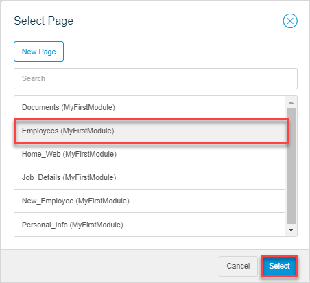
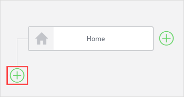
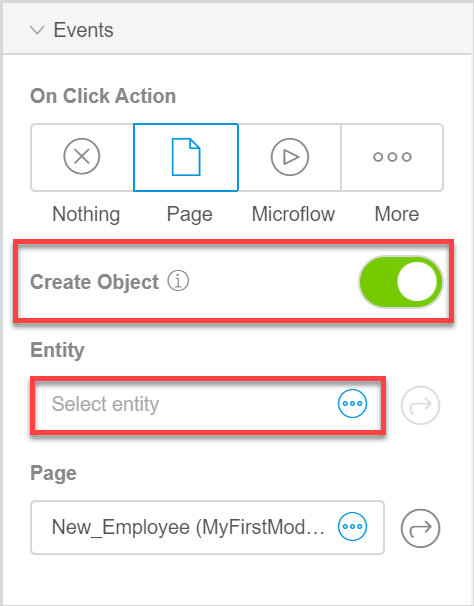
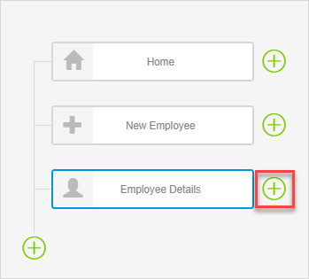
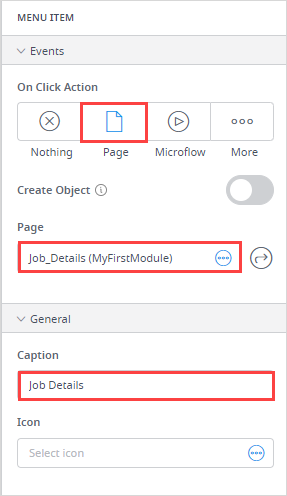

## 1 Introduction

This how-to explains how to configure a menu bar for your app such as creating menu items and sub-items. 

**This how-to will teach you how to do the following:**

* Change a page which is set as home page
* Create new menu bar items and sub-items

This how-to describes the following use case: 

You would like to configure a menu bar for your app. You have several pages that you would like to add to it:

* **Employees** – a page which lists all employees in your company and should be a home page
* **New_Employee** – a page for creating a new employee 
* **Job_Details** – contains a list with such details as employee's position, department, income; you would like to keep this page together with other two pages listed below under one menu item called  **Employee_Details** 
* **Personal_Info** – contains a list with personal employee information, such as full name, emergency contacts, address; should be a menu sub-item of the **Employee_Details** menu item
* **Documents** – contains a list with employee files, such as employment contract, medical insurance; should be a menu sub-item of the **Employee_Details** menu item

You also have a page called **Home_web** that is set as a home page by default. Your navigation document currently looks the following way:

## 2 Prerequisites

Before starting this how-to, make sure you have completed the following prerequisites:

* Familiarize yourself with page terms and how to perform basic functions on pages. For more information, see [Pages](/studio/page-editor). 
* Familiarize yourself with navigation document terms. For more information, see [Navigation Document](/studio/navigation). 
* Familiarize yourself with the domain model terms and learn how to perform basic functions. For more information, see [Domain Model](/studio/domain-models).

## 3 Creating Menu Items and Sub-Items

### 3.1 Setting the Employees Page as the Home Page {#employees-page}

Currently the **Home_web** page is set as the home page for your app. However, you would like to set the **Employees** page as the home page instead. Do the following:

1. Click the **Navigation Document** icon in the left menu bar. 

2. Select the **Home** menu item, go to its properties and do the following:

    1.  Click the **Page** property to change the page that is currently set as home page:
    
        
    
    3. In the **Select Page** dialog box, choose **Employees** and click **Select**. 

        

Now the **Employees** page is the new how page for your app.

### 3.2 Creating Menu Item for the New Employee Page

The **New_Employee** page contains a form with the details of the new employee, this means that it contains a data view that expects an *Employee* object. Thus, when creating a menu item for it, you need to pass this object.

To create the menu item for the **New_Employee** page, do the following:

1. Click a plus at the bottom of the navigation tree to create a menu item:

    

2. Open the new menu item properties and do the following:

    1.  Set the **On Click Action** to **Page**.
        
    2. Toggle the **Create Object** option to pass the *Employee* object to the page.

    3. Click the **Entity** property to set the needed entity.

        

    4. In the **Select Entity** dialog box, choose **Employee** and click **Select**.

    5. Click the **Page** property.

    6. In the **Select Page** dialog box, choose **New_Employee** page and click **Select**:

         
    
    7. In the **Caption** property, delete the *Navigation item* caption and type in *New Employee*. 
    
    8. Click the **Icon** property to set the icon for the menu item.
    
    9. In the **Select icon** dialog box, search for the *plus* icon and click **Select**:
    
         

Good job! You have added a menu item for the **New Employee** page to your navigation:

### 3.3 Create a Menu Item for the Employee_Details Page and Configuring Its Sub-Items

You would like to place **Job_Details**, **Personal_Info**, and **Documents** pages under one menu-item named **Employee Details**, which means that they will be opened by menu sub-items. 

First, you need to create the menu-item that will encompass three menu sub-items. Do the following:

1. Click a plus at the bottom of the navigation tree to create a menu item.

2. Open the new menu item properties and do the following:

    1. In the **Caption** property, delete the *Navigation item* caption and type in *Employee Details*. 
    2. Click the **Icon** property to set the icon for the menu item.
    3. In the **Select icon** dialog box, search for the *user* icon and click **Select**.

3. Click a plus *next to* the **Employee Details** menu item to create a sub-item for it:

    

4. Open its properties and do the following:

    1. Set the **On Click Action** to **Page**.
    
    2. Click the **Page** property.
    
    3. In the **Select Page** dialog box, choose **Job_Details** page and click **Select**.
    
    4. In the **Caption** property, delete the *Navigation item* caption and type in *Job Details*:
    
        
    
    5. Repeat steps 1-4 to create a menu sub-item to open the **Personal_Info** page and name this sub-item *Personal Info*.  
    
    6. Repeat steps 1-4 to create a menu sub-item to open the **Documents** page and name this sub-item *Documents*. 
    
    7. The order of sub-items looks the following way now: **Documents**, **Personal Info**, **Job Details**. Drag and drop them to rearrange the order in the following way: **Job Details**, **Personal Info**, **Documents**.  

You have configured the sub-menu items for the **Employee Details** menu item.

Congratulations! You created and configured navigation for your app:

[Preview your app](/studio/publishing-app) to see how the navigation displays:

