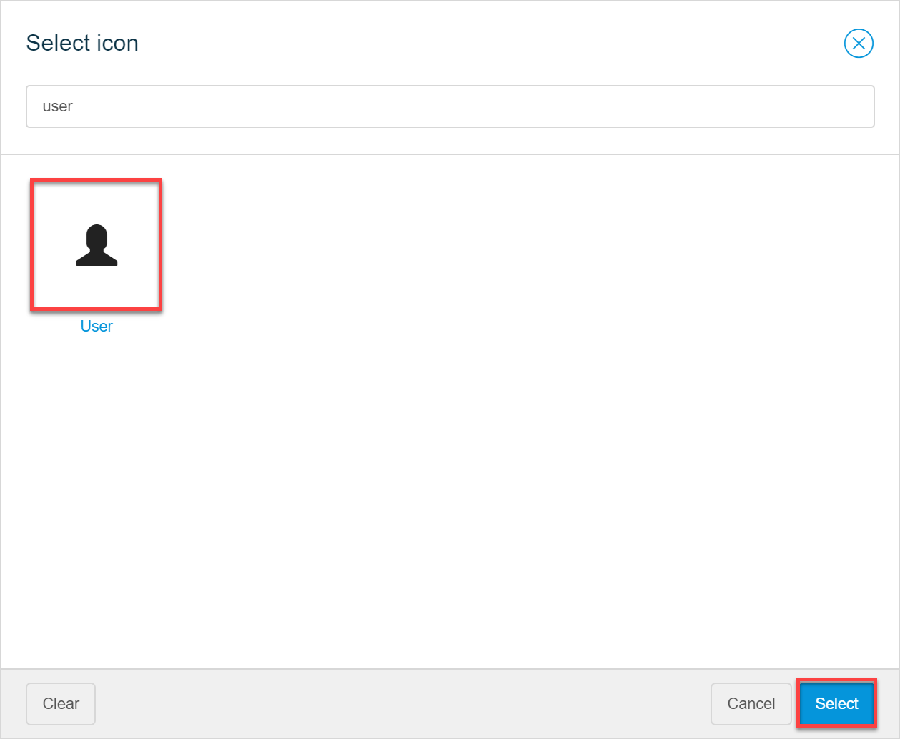
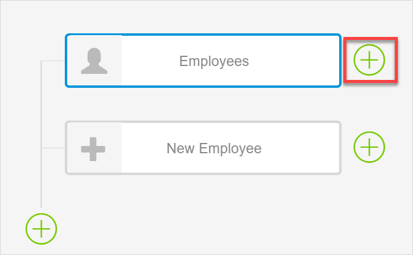

## 1 Introduction

This how-to explains . 

**This how-to will teach you how to do the following:**

* Create new menu bar items and sub-items
* Set one of the pages as a home page

This how-to describes the following use case: 

You would like to configure a navigation bar for your app. You have four pages that you would like to add to it:

* Employees – a page which lists all employees in your company and should be a home page
* Employee_Details – gives details on the selected employee, should be a sub-item of the Employee menu item
* New_Employee – a page for creating a new employee 

## 2 Prerequisites

Before starting this how-to, make sure you have completed the following prerequisites:

* Familiarize yourself with page terms and how to perform basic functions on pages. For more information, see [Pages](/studio/page-editor). 
* Familiarize yourself with navigation document terms. For more information, see [Navigation Document](/studio/navigation). 
* Familiarize yourself with the domain model terms and learn how to perform basic functions. For more information, see [Domain Model](/studio/domain-models).

## 3 Creating Menu Items and Sub-Items

### Creating a Menu Item for the Employees Page {#employees-page}

To create a menu item for the Employees page, do the following:

1. Click the **Navigation Document** icon in the left menu bar to open the **Navigation**. Be default, you have a Home menu item there.

2. Click a plus at the bottom of the navigation tree to create a menu item:

    

3. Go to the new menu item properties and do the following:

    1.  In the **On Click Action** property, select **Page**.
      
    2.  Click the **Page** property to select the page that the menu item will open:
      
        
      
    3. In the **Select Page** dialog box, choose **Employees** and click **Select**. 

       

   4. In the **Caption** property, delete the *Navigation item* caption and type in *Employees*. 

    5. Click the **Icon** property to set the icon for the menu item.

    6. In the Select icon dialog box, search for the *user* icon, choose it, and click **Select**:

       

   
   Good job! You have added a new menu item to your navigation.
   
### Creating Menu Item for the New Employee Page

The **New_Employee** page contains a form with the details of the new employee, this means that it contains a data view that expects an *Employee* object. Thus, when creating a menu item for it, you need to pass this object.

   To create the menu item for the **New_Employee** page, do the following:

   1. Repeat steps 1-3 of the [Creating a Menu Item for the Employees Page](#employees-page) section to add a new menu item, set its on-click action to *Page*, and to choose the *New_Employee* page.
   
   2. In properties, toggle the **Create Object** option to pass the *Employee* object to the page.
   
   3. Click the **Entity** property to set the needed entity.
   
      
   
   4. In the **Select Entity** dialog box, choose **Employee** and click  **Select**.
   
   5. Repeat step 4 of the [Creating a Menu Item for the Employees Page](#employees-page) section and rename the navigation item to *New Employee*.
   
   6. Repeat steps 5-6 of the [Creating a Menu Item for the Employees Page](#employees-page) section and choose the *plus* icon for the **New_Employee** menu item. 

   You have configured the new menu item that will pass an object to the page.

   ### Create a Menu Sub-Item for the Employee_Details Page

The **Employee_Details** page can be opened from the **Employees** page, so you would like to make it a sub-item of the **Employees** menu item. The Employee_Details page contain a form (a data view), which means this page expects an *Employee* object. Thus, when creating a menu item for it, you need to pass this object to a page. 

To create the menu sub-item for the **Employee_Details** page, do the following:

   1. Click the **Navigation Document** icon in the left menu bar to open the **Navigation**. 

2. Click a plus *next to* the **Employees** menu item to create a sub-item for it:

   

   3. Repeat steps 2-3 of the [Creating a Menu Item for the Employees Page](#employees-page) section to add a new menu item, set its on-click action to *Page*, and to choose the *Employee_Details* page.

   4. In properties, toggle the **Create Object** option to pass the *Employee* object to the page.

   5. Click the **Entity** property to set the needed entity.

   6. In the **Select Entity** dialog box, choose **Employee** and click  **Select**.

   7. Repeat step 4 of the [Creating a Menu Item for the Employees Page](#employees-page) section and rename the navigation item to *Employee Details*.

   8. Repeat steps 5-6 of the [Creating a Menu Item for the Employees Page](#employees-page) section and choose the *user* icon for the **New_Employee** menu item. 