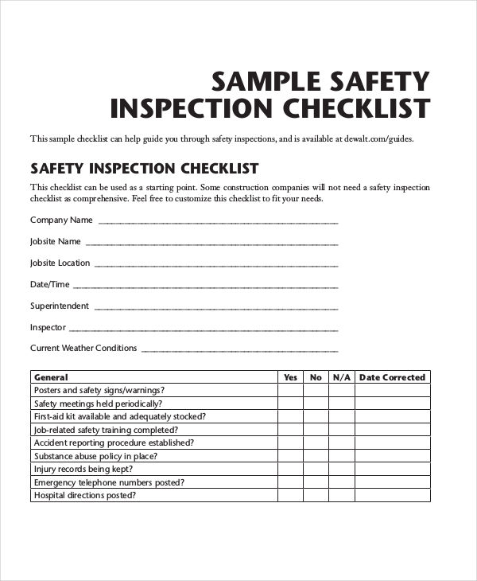

## 1 Introduction 

This how-to explains how you can configure a list of items in Mendix Studio. 

**This how-to will teach you how to do the following:**

* 

The how-to describes the following use case: 

The HSE department of your company has the following inspection report:

Your company has an application that is used by superintendents who travel to different companies and inspect whether they comply with safety regulations. You would like to display details of an inspection report and a checklist for it on one page in this app.

## 2 Prerequisites

Before starting this how-to, make sure you have completed the following prerequisites:

* You domain model is configured the following way:

    

## 3 Adding a Master Detail Page

You would like to open a page with inspection report details from your home page. Do the following:

1. Open your home page and navigate to **Toolbox** > **Building Blocks**.

2. Search for **Card Action** and drag and drop it to the page.

    

3. Select the button from the card to configure it open a new page.

4. Open button properties and follow the steps below:

    1. Select 

 

## Read More

* [Widgets](page-editor-widgets)
