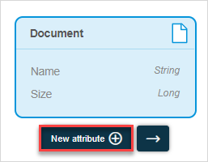
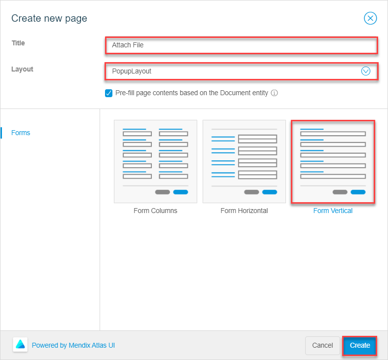
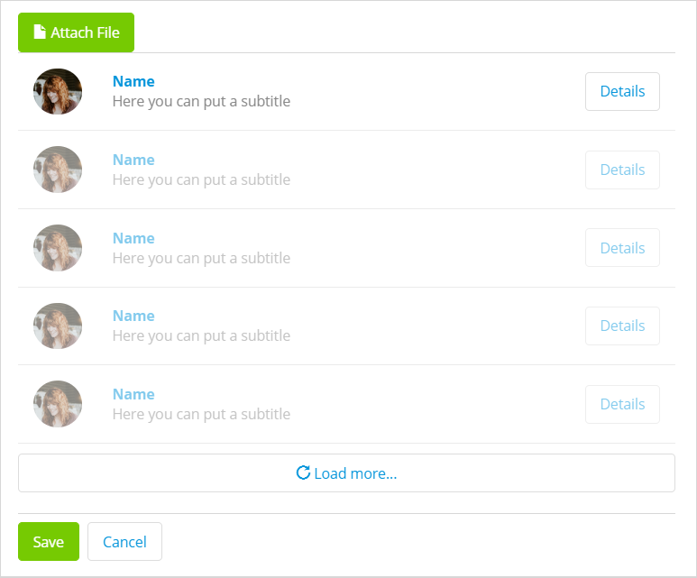
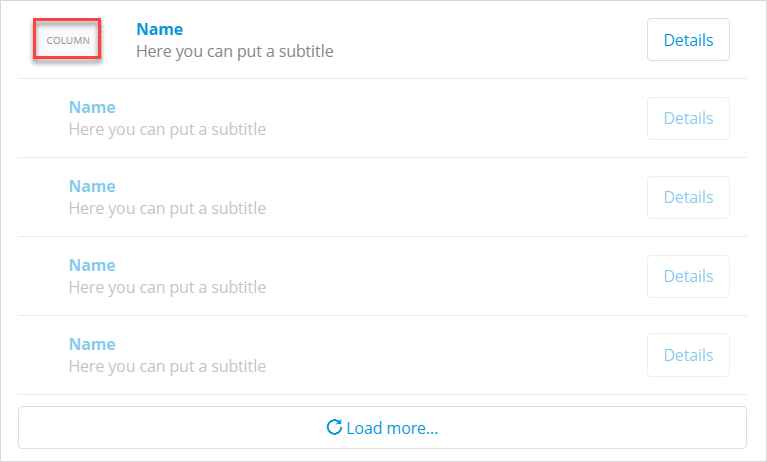
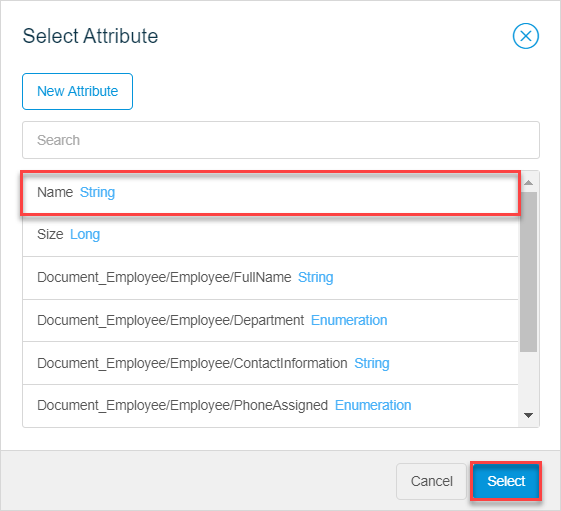
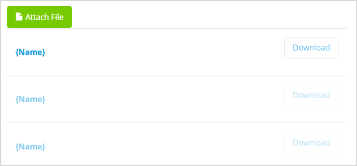

## 1 Introduction 

This how-to explains how you can enable your attach and download files. They will be able to attach files from different devices: phone, tablet, or desktop; as well as download attached files from a list.

**This how-to will teach you how to do the following:**

* Create file entities
* Create a page with a form that allows your end-users to upload files
* Display attached files in a list
* Download files

The how-to describes the following use case: 

You have a company application where company's IT department keep track of assets assigned to employees. You have the **Employee Profile** page with a form (a data view) that has such details as employee's name, department, their email, phone, title, and assets assigned to them (for example, a mobile phone or laptop). This information is filled in and updated by IT administrators:

Your domain model looks the following way:

You would like to add a new functionality: IT administrators should be able to attach files to employee profile, for example, to attach a device's warranty, phone or laptop policy signed by the employee.  

You also would like to enable IT Administrators to download attached file from a list of files, and to delete files from the list if needed. 

## 2 Prerequisites

Before starting this how-to, make sure you have completed the following prerequisites:

* Familiarize yourself with page terms and how to perform basic functions on pages. For more information, see [Pages](/studio/page-editor). 
* Familiarize yourself with the domain model terms and learn how to perform basic functions. For more information, see [Domain Model](/studio/domain-models).

## 3 Creating a File Entity

First of all, to be able to attach and download files you need to add a special type of entity to your domain model: a [file entity](/studio/domain-models#entity-types). Do the following:

1. Open your domain model and open the **Toolbox** tab.

2. Select the **File Entity** and drag and drop it to your domain model.

3. In the **Create New File Entity** dialog box, set **Name** to *Document* and click **Create**.

    

4. Now you need to create an association from the **File** entity to the **Employee** entity. Do one of the following:

    1. Hover over the **File** entity, click the dot icon, and drag the dot to the **Employee** entity:

		

    2. Select the **File** entity, click the arrow icon, and select **Employee** as a second entity for the association:

		

Good job! You have created the file entity and associations from it to the **Employee** entity:

## 4 Adding a File Manager

A **File Manager** is a widget that allows your end-users to attach and/or download files. However, it can only function inside a data container (a list view or data view) and can only have a file entity as its data source. If you just drag and drop the file manager to your employee profile form, it will not work correctly, because your current data view has the **Employee** entity as its data source, which is not a file entity:

{}{}

To solve this, you can add a button which will open a pop-up page where your end-users can upload images. This page will be connected to your current report form over the *Image_Report* association and will upload images as **Image** entity and associated to this specific report. 

Follow the steps below:

1. Open the **Employee Profile** page where IT administrators create and edit information on employees and assets assigned to them. 

2. Open the **Toolbox** and search for **Create Object** button.

3. Drag and drop the button above **Save** and **Cancel** buttons:

    {}{}

4. Open button properties > the **Caption** property and rename it from *New* to *Attach File*.

5. Click the **Icon** property. 

6. In the **Select icon** dialog box, search for the *file* icon and select it.

7. In the button properties, click the **Style** property and change it from **Default** to **Success**. After your changes, the button will look the following way:

    {}{}

8. In the button properties, click the **Entity** property.

9. In the **Select Entity** dialog box, choose the **Document** entity and click **Select**:

    {}{}

10. In the button properties, click **Page**.

11. In the **Select Page** dialog box, click **New Page**.

12. In the **Create new page** dialog box, do the following:

     1. Set the **Title** to *Attach_File*.

     2. Set the **Layout** to *PopupLayout*.

     3. The **Pre-fill page contents based on the Document entity** option is on, so the page template (Forms) is selected automatically for you. Choose **Form Vertical** and click **Create**.

         {}{}

13. A new pop-up page with a preconfigured form (a data view) is created:

     {}{}

     As you only need your end-users to attach files on this page, delete **Name** and **Size** text boxes from the data view. 

14. Open the **Toolbox**, search for an **File Uploader**, drag and drop it inside the data view. 

You have created a pop-up page that will allow IT administrators to attach files to the employee profile form:

{}{}

## 5 Downloading Files

After your end-users attach the files, it would be nice to display files in a list and give users an opportunity to download attached files if needed. To do so, you need to add a list:

1. Open the **Employee_Profile** page.

2. In the **Building Blocks**, search for **List 4** and drag and drop it under the **Attach File** button (make sure you drop it *inside* the data view, this way you will be able to list only files associated with a selected employee instead of all files that were attached to any employee profile). A list view with widgets inside it is added to your page:

    {}{}

3. Select the list view, open its properties, and do the following:

    1. Click the **Entity** property.
    2. In the **Select Entity** dialog box, choose **Document** and click **Select**. As the list view is placed inside the data view, only files associated with the selected employee will be displayed. :

    	{}{}

4. Delete an image and a column it is placed in from the list:

    

5. Delete a subtitle in the list saying *Here you can put a subtitle*.

6. Select the **Name** text in the list view and open its properties.

    1. In the **Content** property, delete the *Name* text and click **Add attribute**.
    2. In the **Select Attribute** dialog box, choose the **Name** attribute and click **Select** to display the name of the attached image.

    	{}{}

7. Delete the **Details** button in the list view.

8. Open the **Toolbox** and search for **File Downloader**, drag and drop it to the column where the **Details** button was placed. 

9. Open the **File Downloader** (**File Manager**) properties and delete the *File* text from the **Label** property.

Great job! Now you have the list that shows attached files and your users can download files from this list:

{}{}

Congratulations! You have configured the form that allows IT administrators to attach files and displays these files in the list.

[Preview your app](/studio/publishing-app) to test how the file uploading and downloading works. You can also configure a button to attach images instead of images. For more information on files, see [How to Enable End-Users to Attach Images](pages-how-to-attach-images).