## 1 Introduction 

This how-to explains how you can enable your end-users to attach images. They will be able to attach images from different devices: phone, tablet, or desktop; or they can take a new image on their phone camera. 

**This how-to will teach you how to do the following:**

* Create image entities
* Create a page with a form that allows your end-users to attach images
* Display attached images in a list

The how-to describes the following use case: 

You have the **New Report** page with a form (a data view) where employees submit a trip report for  reimbursement. They fill in their name, department, purpose and date of their trip, and total amount to be reimbursed:

{}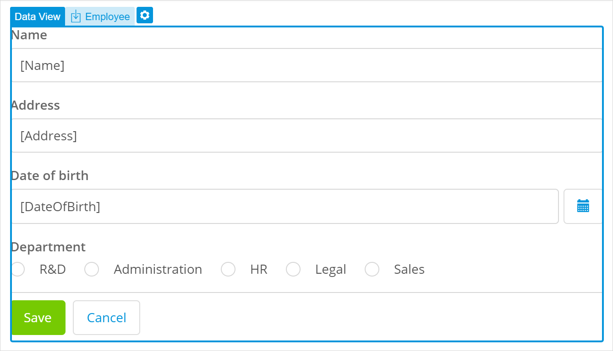{}

Your domain model looks the following way:

{}
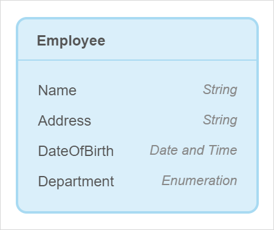
{}

You would like to add a new functionality: when creating a reimbursement report, employees need to attach receipts – screenshots or scanned images of what they paid for.  

You also would like to display attached images in a list below the report and to enable your end-users delete images from the list if needed.  

## 2 Prerequisites

Before starting this how-to, make sure you have completed the following prerequisites:

* Familiarize yourself with page terms and how to perform basic functions on pages. For more information, see [Pages](/studio/page-editor). 
* Familiarize yourself with the domain model terms and learn how to perform basic functions. For more information, see [Domain Model](/studio/domain-models).

## 3 Creating an Image Entity

First of all, to be able to attach and upload images you need to add a special type of entity to your domain model: an image entity. Do the following:

1. Open your domain model and open the **Toolbox** tab.

2. Select the **Image Entity** and drag and drop it to your domain model.

3. In the **Create New Image Entity** dialog box, set **Name** to *Receipt* and click **Create**.

    {}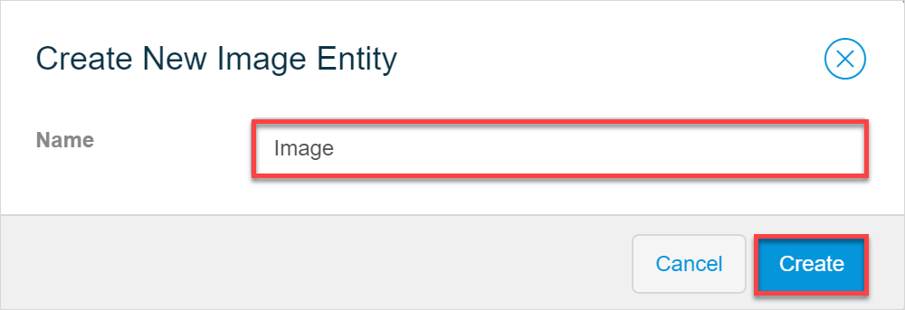{}

4. Now you need to create an association from the **Image** entity to the **Report** entity. Do one of the following:

    1. Hover over the **Image** entity, click the dot icon, and drag the dot to the **Report** entity:

		{}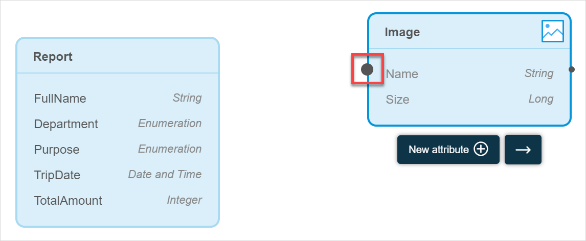{}

    2. Select the **Image** entity, click the arrow icon, and select **Report** as a second entity for the association:

		{}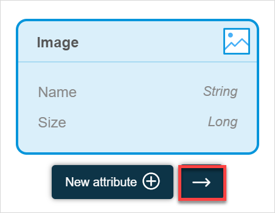{}

Good job! You have created the image entity and an association from it to the **Report** entity:

{}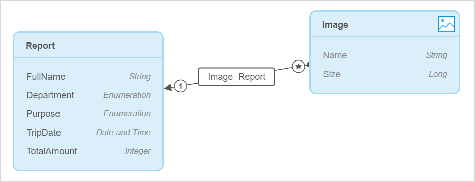{}

## 4 Adding an Image Uploader

An **Image Uploader** is a widget that allows your end-users to attach images. However, it can only function inside a data container (a list view or data view) and can only have an image entity as its data source. If you just drag and drop the image uploader to your report form, it will not work correctly, because your current data view has the **Report** entity as its data source, which is not an image entity:

{}{}

To solve this, you can add a button which will open a pop-up page where your end-users can attach images. This page will be connected to your current report form over the *Image_Report* association and will upload images as **Image** entity and associated to this specific report. 

Follow the steps below:

1. Open the **New Report** page where employees submit a new report. 

2. Open the **Toolbox** and search for **Create Object** button.

3. Drag and drop the button above **Save** and **Cancel** buttons:

    {}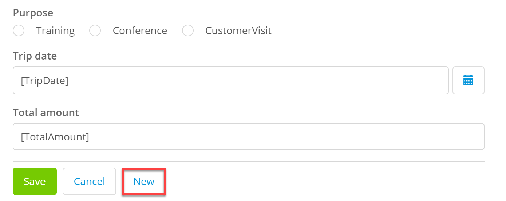{}

4. Open button properties > the **Caption** property and rename it from *New* to *Attach Images*.

5. Click the **Icon** property. 

6. In the **Select icon** dialog box, search for the *picture* icon and select it.

7. In the button properties, click the **Style** property and change it from **Default** to **Success**. After your changes, the button will look the following way:

    {}{}

8. In the button properties, click the **Entity** property.

9. In the **Select Entity** dialog box, choose the **Receipt** entity over **Receipt_Report** association (*Receipt_Report/Receipt*) and click **Select**: 

    {}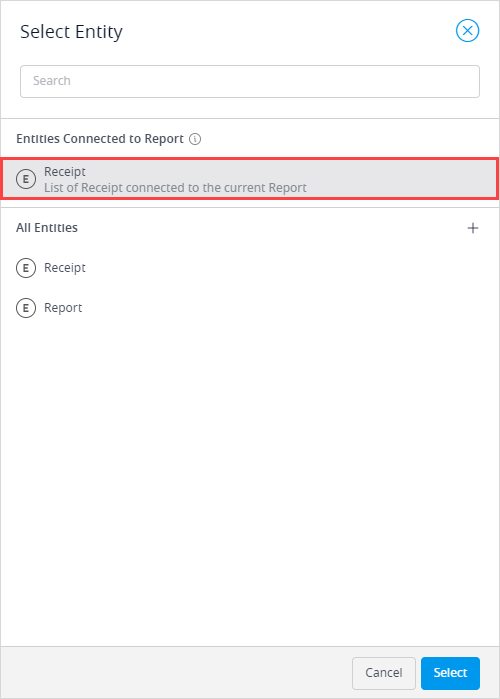{}

10. In the button properties, click **Page**.

11. In the **Select Page** dialog box, click **New Page**.

12. In the **Create new page** dialog box, do the following:

     1. Set the **Title** to *Attach Images*.

     2. Set the **Layout** to *PopupLayout*.

     3. The **Pre-fill page contents based on the Receipt entity** option is on, so the page template (Forms) is selected automatically for you. Choose **Form Vertical** and click **Create**.

         {}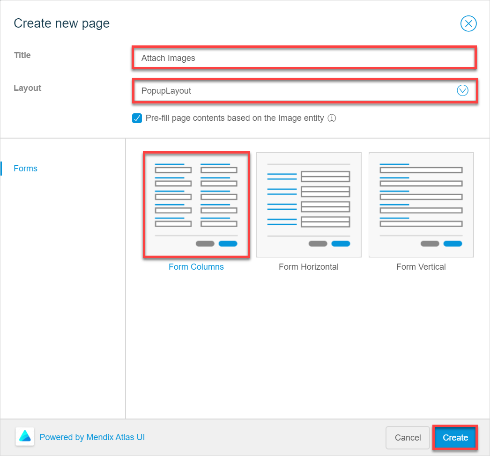{}

13. A new pop-up page with a preconfigured form (a data view) is created:

     {}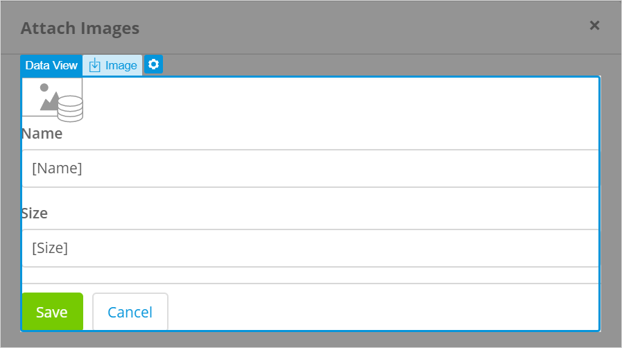{}

     As you only need your end-users to attach images on this page, delete the **Dynamic image** widget, **Name** and **Size** text boxes from the data view. 

14. Open the **Toolbox**, search for an **Image Uploader**, drag and drop it inside the data view. 

You have created a pop-up page that will allow employees to attach images to their reimbursement reports:

{}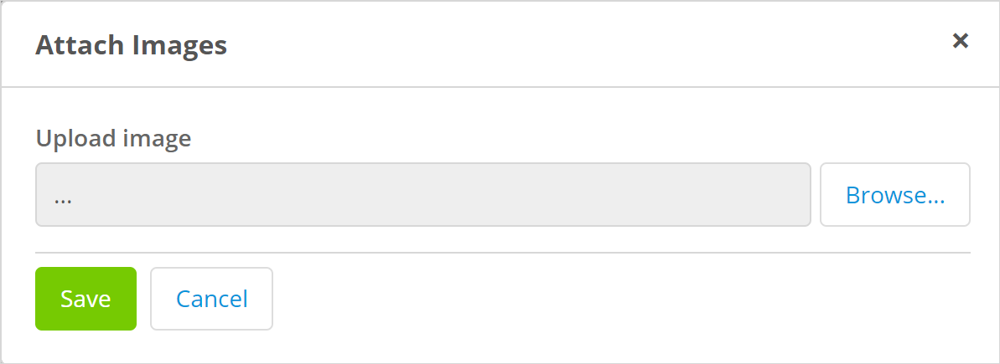{}

## 5 Displaying Attached Images

After users attach the images, it would be nice to display their attachments and give them an opportunity to delete the ones they do not need. To do so, you need to add a list with dynamic images:

1. Open the **New Report** page.

2. In the **Building Blocks**, search for **List 4** and drag and drop it under the **Attach Images** button (*inside* the data view). A list view with widgets inside it is added to your page:

    {}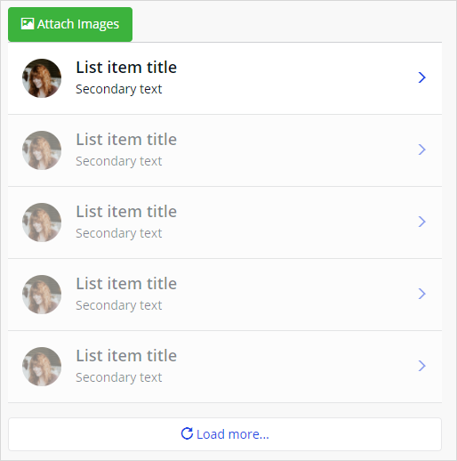{}

3. Open list view properties and do the following:

    1. Click the **Entity** property.
    2. In the **Select Entity** dialog box, choose the **Select Entity** dialog box, choose the **Receipt** entity over **Receipt_Report** association (*Receipt_Report/Receipt*) and click **Select**:

    	{}{}

4. Click the image in the list view, open its properties, and do the following.

    1. To display images which users attach, change the **Image Source** from **Static Image** to **Dynamic Image**. 
    2. Click the **Image Entity** property. 
    3. In the **Select Image Entity**, choose **Receipt** and click **Select**.
    4. In the **Default Image** property, click **Select image**, and in the **Select image** dialog box, click **Clear**.  

    	{}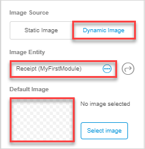{}

5. Delete a subtitle in the list view saying *Here you can put a subtitle*.

6. Select the **Name** text in the list view and open its properties.

    1. In the **Content** property, delete the *Name* text and click **Add attribute**.
    2. In the **Select Attribute** dialog box, choose the **Name** attribute and click **Select** to display the name of the attached image.

    	{}{}

7. Select the **Details** button in the list view, open its properties, and do the following:

    1. In the **Events** section > the **On Click Action** property, select **More**. 
    2. In the **Action** property, select **Delete Object**. 
    3. In the **General** section > the **Caption** property, change the button caption from *Details* to *Delete*. 
    4. In the **Style** property, change **Default** to **Danger**. 

    	{}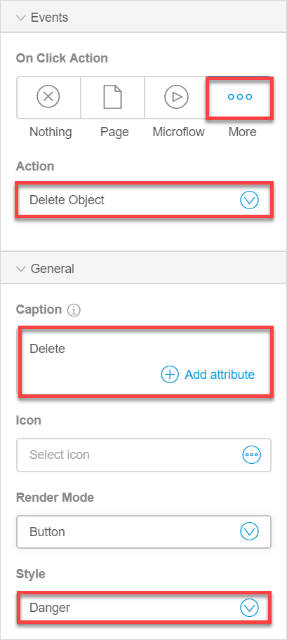{}

Great job! Now you have the image list that shows attached images and your users will be able to delete images from the list if necessary:

{}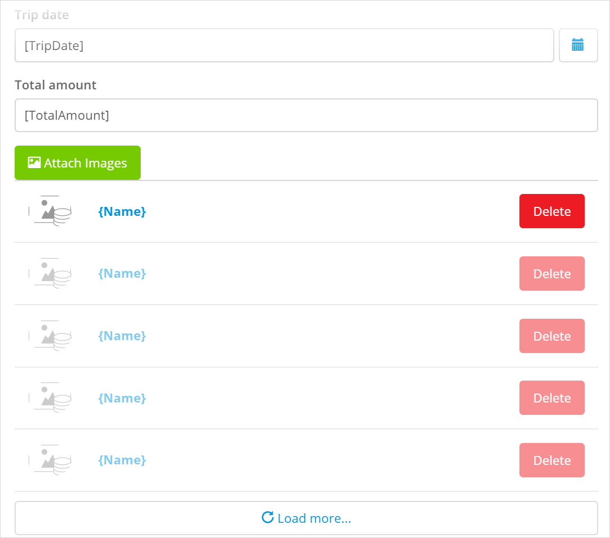{}

Congratulations! You have configured the report that allows your users to attach images and displays these images in the list.

[Preview your app](/studio/publishing-app) to test how the image uploading works. You can also configure a button to attach files instead of images. For more information on files, see [Images & Files](/studio/page-editor-widgets-images-and-files).