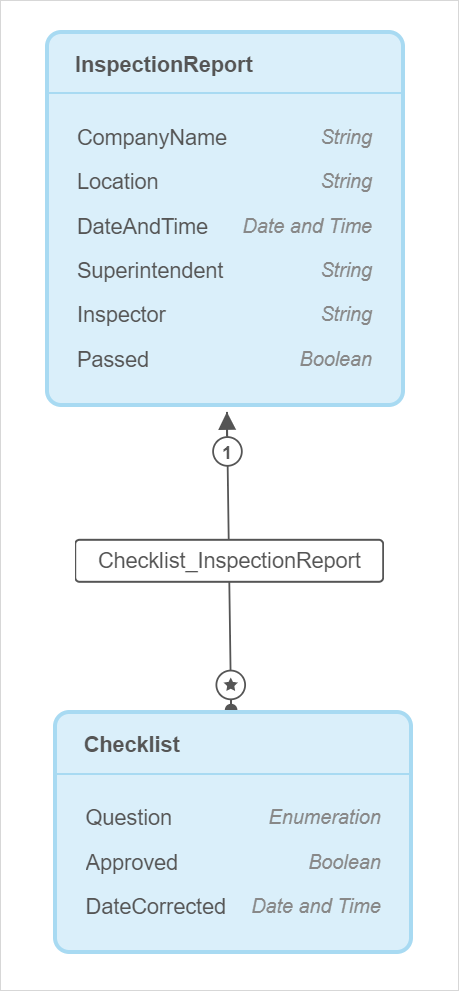
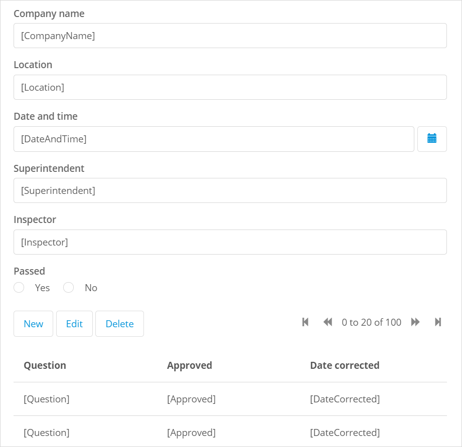

## 1 Introduction 

This how-to explains how you can configure a page with a form and how to show items related to this form on the same page. 

**This how-to will teach you how to do the following:**

* Configure a form (a data view)
* Show items related to this form in a table 

The how-to describes the following use case: 

The HSE department of your company has the following inspection report:

Your company has an application that is used by inspectors who travel to different companies and inspect whether these companies comply with safety regulations. They fill in their names, a company name, site location, date and time when the inspection was conducted, as well as full name of a superintendent who was present during the inspection. 

Inspectors also have a safety inspection *checklist*. Based on this checklist the inspector evaluates whether the company passed the inspection. They should check if requirements on the following *questions* are met:

* If emergency contact posters are displayed
* If safety training are held regularly
* If first-aid kits are available 
* If emergency exists are clear and not blocked

If any of the above requirements are not met, during the next inspection the inspector indicates the date when the safety violation was fixed. 

You have a list of all inspection reports:

You would like the **Details** button in this list to open a pop-up page showing the details of the selected report and a table with check list questions related to this report.  

## 2 Prerequisites

Before starting this how-to, make sure you have completed the following prerequisites:

* Familiarize yourself with page terms and how to perform basic functions on pages. For more information, see [Pages](/studio/pages). 

* Familiarize yourself with the domain model terms and learn how to perform basic functions. For more information, see [Domain Model](/studio/domain-models).

* Make sure your domain model is configured the following way:

    

    * Make sure you have configured the **Question** attribute as the following enumeration enumeration:

		

* Make sure you have a page with inspection reports list and the **Details** button:

  

## 3 Adding a Page with a Form

The **Details** button in the inspection report list should open a page with the inspection report details. To configure the page, do the following:

1. Click the **Details** button and go its properties.

2. Set **Page** as an on-click action and click the **Page** property.

	

3.  In the **Select Page** dialog box, click **New Page**.

1.  In the **Create new page** dialog box, fill in the page title. 

2.  The **Pre-fill page contents based on the InspectionReport entity** option is on, so the page template (Forms) is selected automatically for you. Choose **Forms Vertical**:

	

3. Click **Create**.
	
3. The page with a form (a data view) is created. However, the data view's data source was automatically set to **List widget**, you need to change that. Select the data view and go to its properties.

1. Change the data source from **List widget** to **Context**.

2. Click the **Entity** property and set the **InspectionReport** entity for it:

       

The form on the page is configured:

 

## 4 Showing Checklist Questions

An inspector has a list of *questions* and indicates with **Yes** or **No** whether the company meets the requirements: whether the company has posters with emergency contacts, whether it conducts safety trainings regularly, etc. You would like to show a table with the checklist questions and their results below the inspection report: 

To display checklist details in a table, you can add a data grid. It is important that you place it *inside* the data view: this way the data grid will access and display only checklist items associated with the current report rather than display all checklist items ever added to all reports. This means your data grid will get data over an association, in this case called *Checklist_InspectionReport*.

Follow the steps below:

1. Open **Toolbox** > **Data Containers**.

2. Drag and drop **Data Grid** *inside* the data view (you can view the breadcrumb at the bottom of the page to check if you placed the data grid correctly):

    

3. Go to the data grid properties and click **Entity**.  

4. To show only checklist items associated with the current inspection report, choose the **Checklist** entity over association (*Checklist_InspectionReport/Checklist*) in the **Select Entity** dialog box and click **Select**:

    

5. As the main purpose of the page is to display information, you do not need the **Search** section in the data grid. Open data grid properties > **Search** section and disable the **Enable Search** toggle:

    

6. To be able to add new checklist items to the report, select the **New** button in the data grid and open its properties.

7. Set the **On Click Action** to **Page**. 

8. Enable **Create Object** property. The Entity property is automatically set to **Checklist**:

    

9. Click the **Page** property.

10. In the **Select Page** dialog box, click **New Page**.

11. In the **Create new page** dialog box, set the page title to **Checklist_Details** and the **Layout** to **PopupLayout**. 

12. The **Pre-fill page contents based on the Checklist entity** option is on, so the page template (*Forms*) is selected automatically for you. Choose **Forms Columns**:

     

13. Click **Create**.

14. A pop-up page where end-users can add new checklist items is created. Now you can select the same page as an on-click action for the **Edit** button to edit the selected checklist. Click the **Edit** button in the data grid and open its properties.

15. Set the **On Click Action** to **Page**.

16. Set the **Page** property to **Manage_Checklist**.

     

Now checklist items are displayed in the table. You can add new checklist by clicking the **New** button in the table, and edit the selected checklist by clicking the **Edit** button.

Congratulations! You have the page that displays details of the selected report and checklist items of this report:

You can now preview your app and test your page. For more information on how to preview your page, see [Previewing & Publishing Your App](/studio/publishing-app).

You can also work on the page details, for example, add a dynamic image to the inspection report list to display a unique company logo next to its name. For more information on dynamic images, see [Images & Files](/studio/page-editor-widgets-images-and-files).