## 1 Introduction 

This how-to explains how you can configure a list of items and view the item details selected in this list. 

**This how-to will teach you how to do the following:**

* Create a new page
* Configure a list view
* Configure a data view that shows the details of an item selected in the list view

The how-to describes the following use case: 

Sales Representatives in your company would like to view a list of opportunity contacts – potential customers. When Sales Representatives click a row in this list, the details of the corresponding opportunity contact are displayed next to the list:

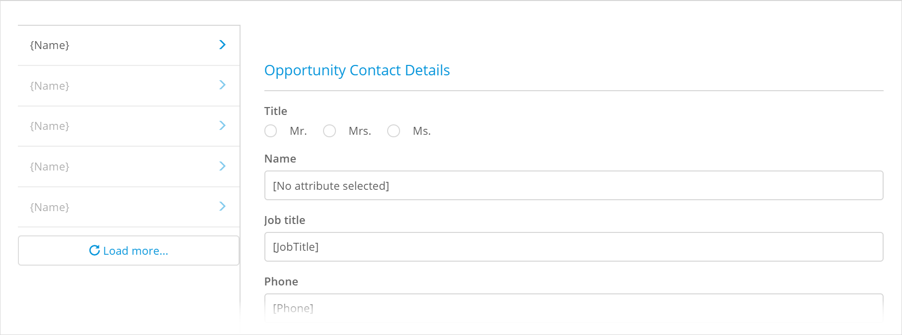

## 2 Prerequisites

Before starting this how-to, make sure you have completed the following prerequisites:

* Familiarize yourself with page terms and how to perform basic functions on pages. For more information, see [Pages](/studio/page-editor). 

* Familiarize yourself with the domain model terms and learn how to perform basic functions. For more information, see [Domain Model](/studio/domain-models).

* Make sure your domain model is configured the following way:

    {}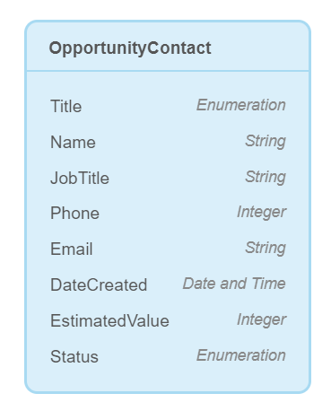{} 

## 3 Adding the Master Detail Page

You would like to open a page with opportunity contact list and its details from your home page. Do the following:

1. Open your home page and navigate to the **Toolbox** > **Widgets**.

2. Search for **Open Page** button and drag and drop it to the page.

	{}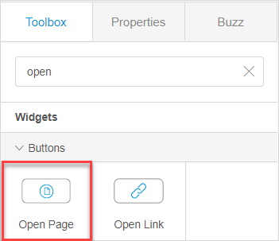{}

3. Open the button properties and follow the steps below:

    1. Set **Page** as an on-click action and click the **Page** property.

    	{}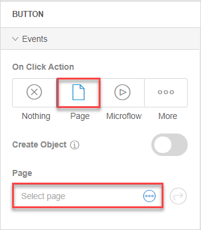{}

    2.  In the **Select Page** dialog box, click the plus icon in the top right corner.

    3.  In the **Create new page** dialog box, fill in the page title. 

    4. Select the page template by clicking **Master Detail** in the side bar and choose **Master Detail**:

    	{}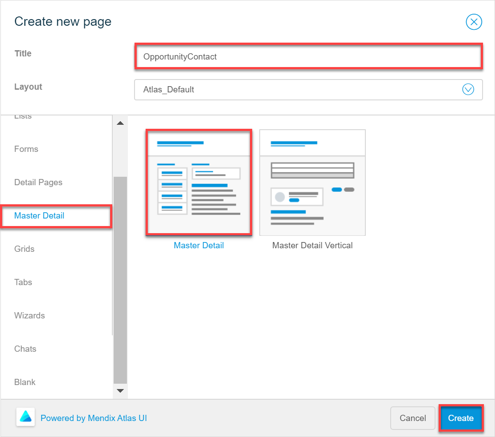{}

    5. Click **Create**.

The page is created. In the responsive (Desktop) view, a list is displayed on the left and list item details are displayed on the right:

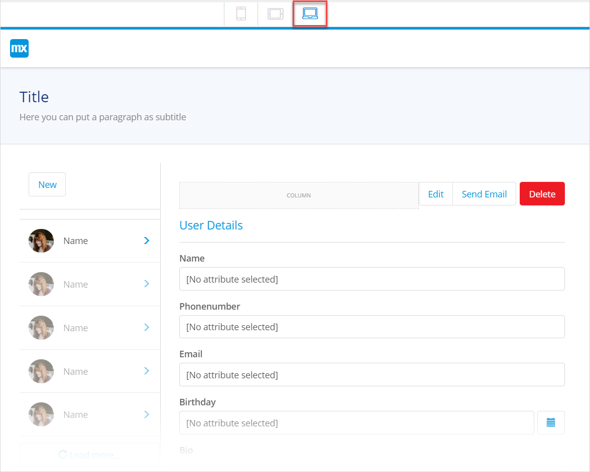 

## 4 Configuring the List

The page is created, now you need to configure it. First of all, you need to connect data to the list. Do the following:

1. Select the list view and click the **Entity** option in its properties:

	{}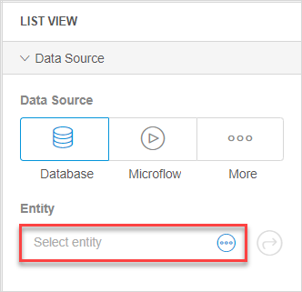{}

2. In the **Select Entity** dialog box, select **OpportunityContact** and confirm your choice by clicking **Select**. Now the list is connected to the **OpportunityContact** entity. 

3. To display the name of each report per company, do the following:

    1. Select the **Name** text in the list view and open the **Properties** tab.

    	{}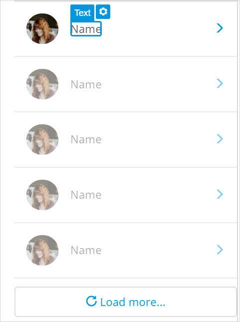{}

    2. In the **Content** property, delete *Name* and click **Add** > **Attribute**:

    	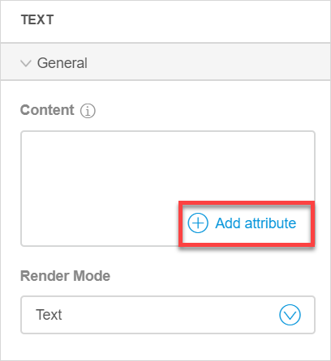

    3. In the **Select Attribute** dialog box, choose **Name** and click **Select**. 

4. Delete the image from the list and the column where this image is placed, as now the image displays a a user image that does not correspond to opportunity contacts you are displaying.
    {}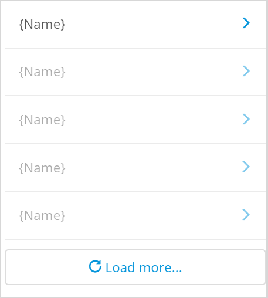{}

5. As the goal of the new page is to merely display data, delete the **New** button above the list view together with the container it is placed in:

    {}{}

Now the list view will display the list of opportunity contacts by their name:

{}{} 

## 5 Configuring Report Details

Now you need to configure opportunity contact details displayed next to the list. The idea is when you select the name from the list, the details of the selected contact will be displayed. 

The Master Details page template which your page is based on has a preconfigured data view that listens to the list view. That means that the data view shows data of the opportunity contact selected in the list view . 

Now you need to configure widgets inside the data view to show attributes of the *InspectionReport* entity, or in other words to show all the details that an opportunity contact has, such as title, name, job title, phone, email. 

To displayed all the details that a contact has, do the following:

1. Delete the empty column and **Edit**, **Send Email**, and **Delete** buttons inside the data view as you will only display data, not change it:

    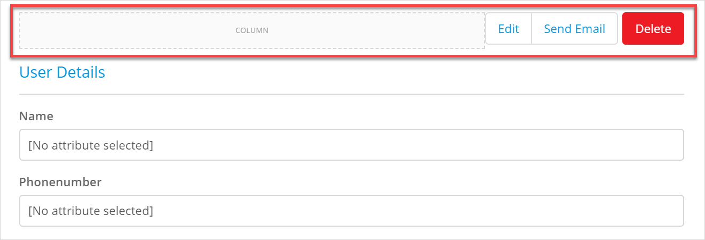

2. Double-click the *User Details* text widget (which is displayed as a data view heading) and rename it to *Opportunity Contact Details*. 

3. Open the **Toolbox** and search for **Radio Buttons**, drag and drop it *inside* the data view above the **Name** text box.

    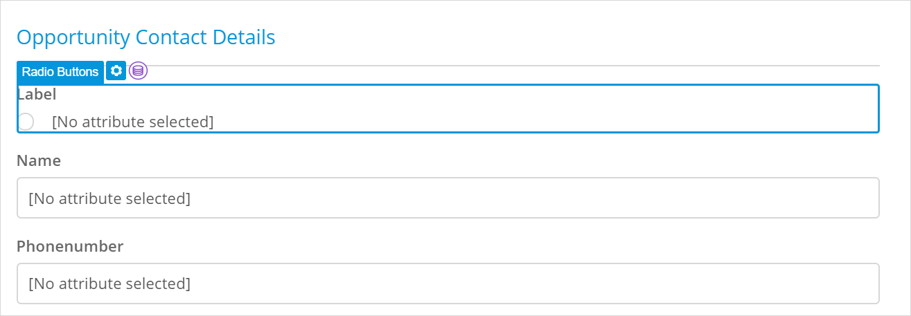

4. Open radio buttons properties and click **Data Source** > **Attribute**.

5. In the **Select Attribute** dialog box, choose **Title** and click **Select**:

    {}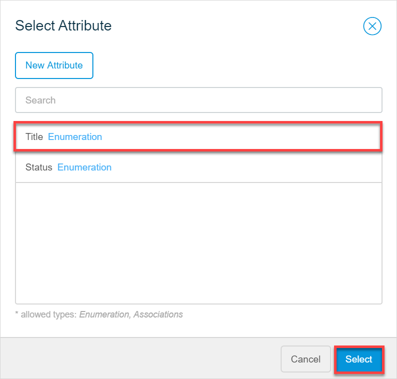{}

6. Select the **Name** text box and click **Data Source** > **Attribute** in its properties. 

7. In the **Select Attribute** dialog box, choose **Name** and click **Select**.

8. Repeat steps 6 and 7 to set the **Phone** attribute for the **Phonenumber** text box, the **Email** attribute for the **Email** text box, **DateCreated**  for the **Birthday** text box, and **EstimatedValue** for the **Bio** text box. 

    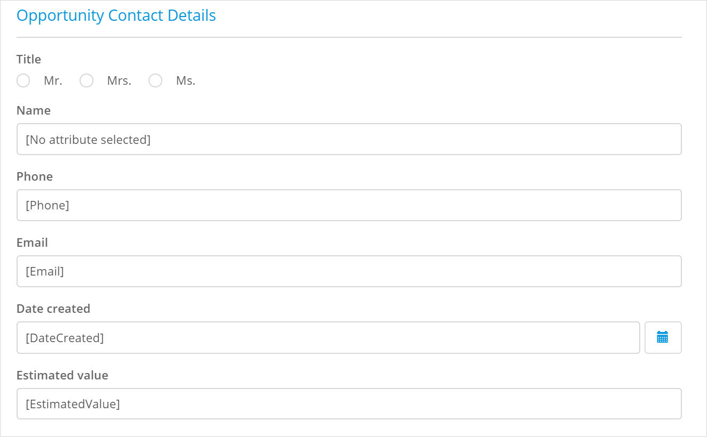

9. You lack information on the contact's job title and status. To add the job title information, open the **Toolbox**, search for a **Text Box**, drag and drop it inside the data view below the **Name** text box:

    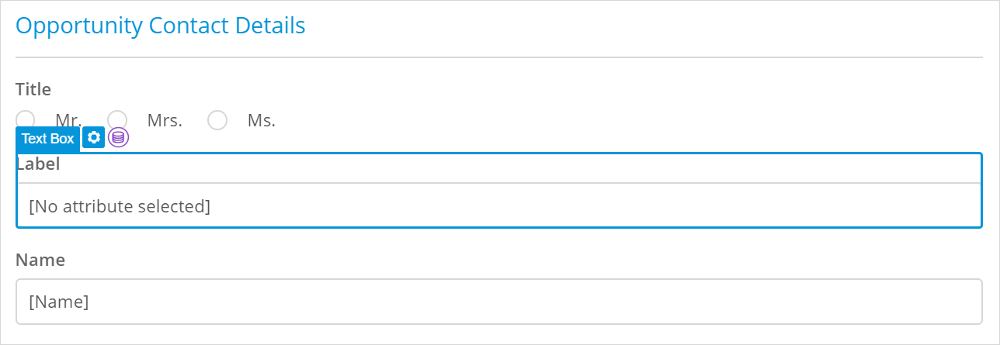

10. Open text box properties and click **Data Source** > **Attribute**. 

11. In the **Select Attribute** dialog box, choose **JobTitle** and click **Select**.

12. To add the information on the opportunity contact's status, open the **Toolbox**, search for for **Radio Buttons**, drag and drop it inside the data view below the **Estimated Value** text box.

13. Open the radio buttons properties and click **Data Source** > **Attribute**.

14. In the **Select Attribute** dialog box, choose **Status** and click **Select**.

Congratulations! You have a page that displays a list of opportunity contacts and the details of the selected contact:

You can now preview your app and test your page. For more information on how to preview your page, see [Previewing & Publishing Your App](/studio/publishing-app).

You can also work on the page details, for example, add a dynamic image to the list to display a profile picture of an opportunity contact next to their name. For more information on dynamic images, see [Images, Videos & Files](/studio/page-editor-widgets-images-and-files).