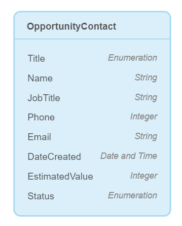
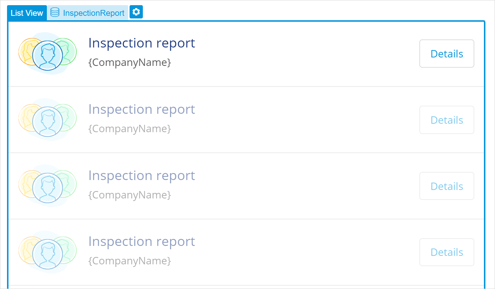
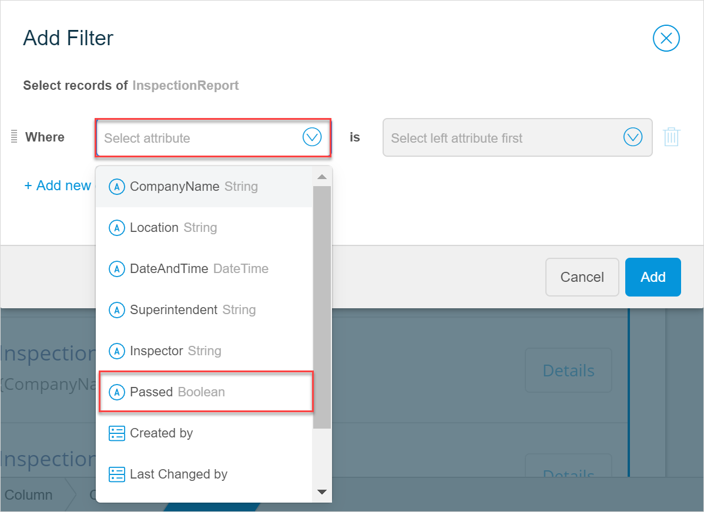
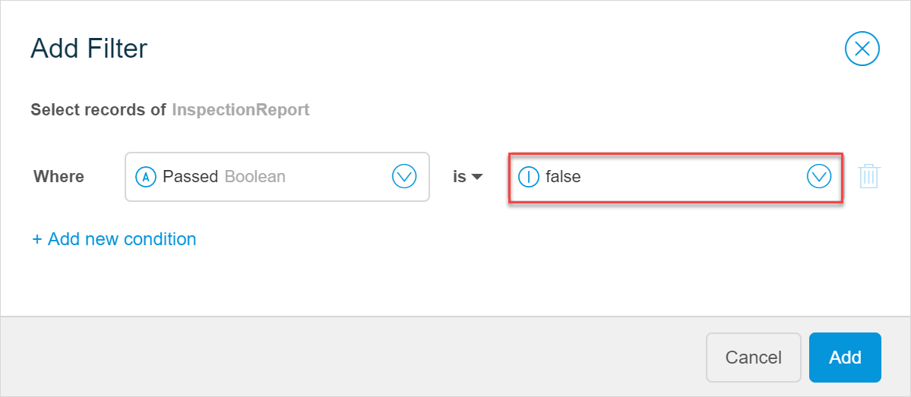

## 1 Introduction 

This how-to explains how you can filter and sort items in a list in Mendix Studio. 

**This how-to will teach you how to do the following:**

* Filter items in a list
* Sort items in a list

The how-to describes the following use case: 

You have a list of inspection reports displayed by company name. You would like to display only companies that failed the report. You also would like to display reports for February 2020 only. The items in list should be sorted by date and time starting from the earliest one.  

Domain model is configured the following way in this use-case:

A list of inspection reports is displayed on a separate page and looks the following way:

## 2 Prerequisites

Before starting this how-to, make sure you have completed the following prerequisites:

* Familiarize yourself with the domain model terms and learn how to perform basic functions. For more information, see [Domain Model](/studio/domain-models).
* Familiarize yourself with page terms and how to perform basic functions on pages. For more information, see [Pages](/studio/pages). 

## 3 Adding a Filter

First, you need to add a filter to your list.  As you would like to show only failed, that means the **Passed** attribute (see the domain model example above) should have been marked in the report as *No*. You also would like to show reports only a certain period, that means the Date and Time should fall into a range from February1st, 2020 to February 29th, 2020. 

Do the following:

1. Select the list view and open its properties.

2. In the **Data Source** section, click **Filter**.

3. In the **Add Filter** dialog box, add conditions for the filter by following the steps below:

    1. Click **Where** and select the **Passed** attribute:

		

	2. Once you select the first part of the condition, you can select the other part of it to complete it. Select *false*:
	
	   
	
	3. The first condition is complete, it reading: *Select records of InspectionReport where Passed is false*. Click **Add new condition** to create a condition for a date.
	
	4. 